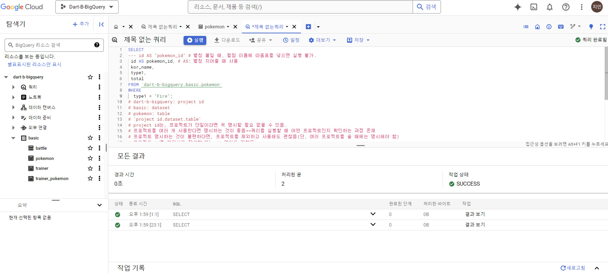
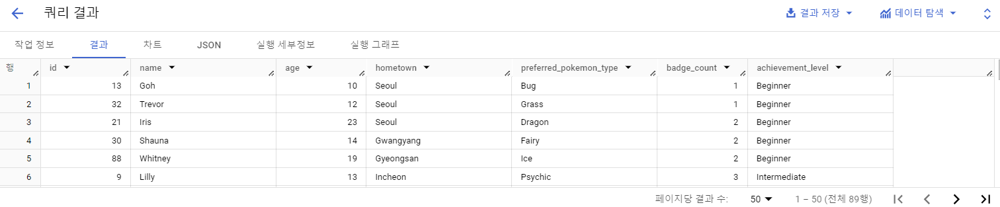
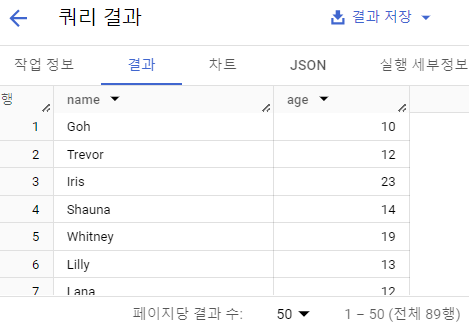
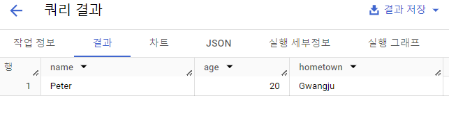
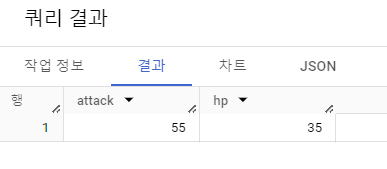
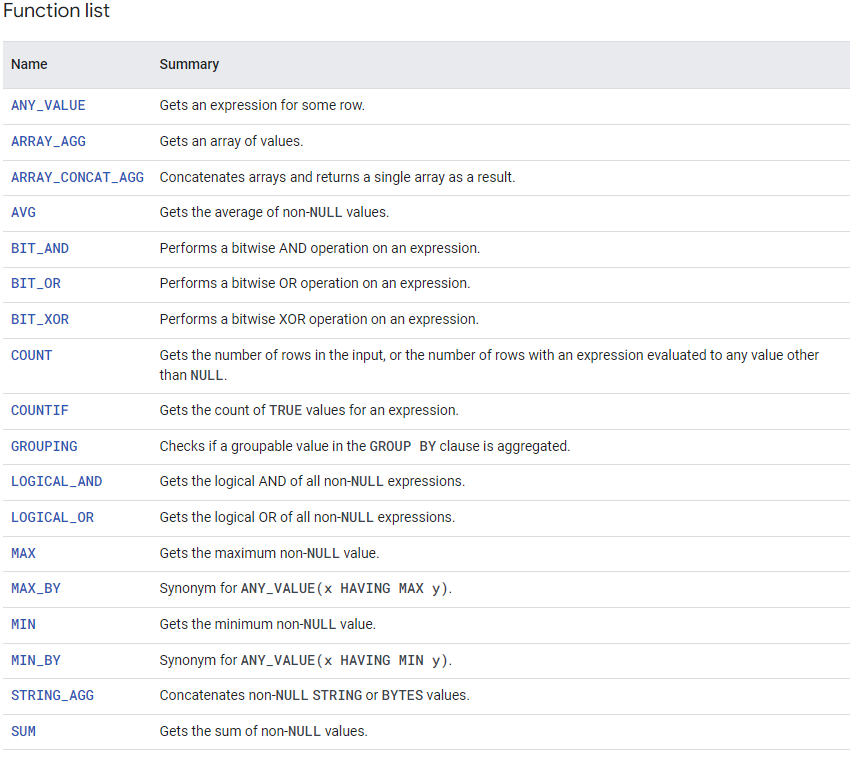
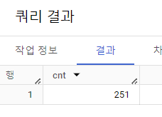
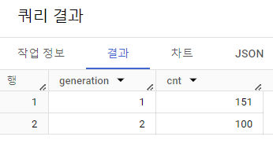
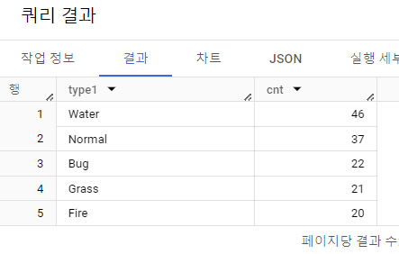

> # 2-3. 데이터 탐색(SELECT, FROM, WHERE)
---
### SELECT 이해하기
SQL 쿼리문은 아래와 같은 문법으로 작성  
SELECT, FROM, WHERE
```
SELECT  
    Col AS new_name,  
    Col2,  
    Col3  
FROM Dataset.Table #: 어떤 테이블에서 데이터를 확인할 것인가?
WHERE
    Col1 = 1
```
```
SELECT
*
FROM basic.pokemon
WHERE
type1="Fire"
```
* : 모든 컬럼을 출력하겠다.
```
SELECT
* EXCEPT (제외할 컬럼)
```

각 테이블을 집합처럼 생각해보기. 

### Google BigQuery에서 쿼리 실행하기
: 쿼리-새 탭에서 열기

```
SELECT  
--- id AS "pokemon_id" # 별칭 붙일 때, 컬럼 이름에 따옴표를 넣으면 실행 불가.
 id AS pokemon_id, # AS: 별칭 지어줄 때 사용
 kor_name,
 type1,
 total
FROM `dart-b-bigquery.basic.pokemon`
WHERE
  type1 = "Fire";
# dart-b-bigquery: project id
# basic: dataset
# pokemon: table
# 'project id.dataset.table'
# project id는, 프로젝트가 단일이라면 꼭 명시할 필요 없을 수 있음.
# 프로젝트를 여러 개 사용한다면 명시하는 것이 좋음=>쿼리를 실행할 때 어떤 프로젝트인지 확인하는 과정 존재
# 프로젝트 명시하는 것이 불편하다면, 프로젝트를 제외하고 사용해도 괜찮음(단, 여러 프로젝트를 쓸 때에는 명시해야 함)
# 프로젝트 id를 제외하고 작성할 떄는 '' 없어도 괜찮음.
# 데이터를 활용하고 싶은 목적이 있어야, 어떤 컬럼을 선택할지 알 수 있게 됨.

# 가독성 있는 쿼리: 협업 시 중요.

# ; 는 하나의 쿼리문이 끝났다는 의미. 복수의 쿼리를 입력하고 실행하면 각각의 쿼리가 실행된다.
SELECT
  id
FROM basic.pokemon;

# 해당 쿼리만 드래그+선택하여 실행하면 그 쿼리만 실행된다.
```
### SQL 문법 핵심 정리: 쿼리 엔진 실행 순서
- FROM: 데이터를 확인할 Table 명시, 이름이 너무 길다면 AS "별칭"으로 별칭 지정 가능.  
FROM Table AS t1

- WHERE: FROM에 명시된 Table에 저장된 데이터를 필터링(조건 설정). Table에 있는 컬럼을 조건 설정.

- SELECT: Table에 저장되어 있는 컬럼 선택, 여러 컬럼 명시 가능.  
col1 AS "별칭"으로 컬럼의 이름도 별칭 지정 가능.

* 쓸 때에는 SELECT - FROM - WHERE 순서대로 써야 함!

## 수행 인증


># 2-4. SELECT 연습 문제

> **1. trainer 테이블에 있는 모든 데이터를 보여주는 SQL 쿼리를 작성해주세요.**
```
# 1) trainer 테이블에 어떤 데이터가 있는지 확인해보자.
# 2) trainer 테이블을 어디에 명시해야 할까? => FROM
# 3) 필터링 조건이 있을까? => 모든 데이터 => 필터링할 필요 없음
# 4) 모든 데이터 = 모든 컬럼일 것이다. (애매하면 '모든 데이터'의 정의가 무엇인지 물어보기)

SELECT 
  *
FROM `basic.trainer`;
```


> **2. trainer 테이블에 있는 트레이너의 name을 출력하는 쿼리를 작성해주세요.**
```
SELECT
  name
FROM `basic.trainer`;
```


> **3. trainer 테이블에 있는 트레이너의 name, age를 출력하는 쿼리를 작성해주세요.**
```
SELECT
  name,
  age
FROM `basic.trainer`;
```



> **4. trainer의 테이블에서 id가 3인 트레이너의 name, age, hometown을 출력하는 쿼리를 작성해주세요.**
```
# 1) trainer 테이블 사용
# 2) 조건 설정 => id가 3인
# 3) 컬럼: name, age, hometown

SELECT
  name,
  age,
  hometown
FROM `basic.trainer`
WHERE 
  id = 3
```

현업에서는 정확한 컬럼명(name, age 등)이 아닌 컬럼의 의미를 파악해야 하는 경우(이름, 나이 등)가 많음. 어떤 컬럼을 요구하는지, 어떤 컬럼을 보아야 하는지를 알아야 함!

> **5. pokemon 테이블에서 "피카츄"의 공격력과 체력을 확인할 수 있는 쿼리를 작성해주세요.**
```
SELECT
  attack,
  hp
FROM basic.pokemon
WHERE 
  kor_name = '피카츄';
```



> # 2-5. 집계(GROUP BY + HAVING + SUM/COUNT)
### 집계와 그룹화
- 집계: 그룹화해서 계산.
- 계산
    * 더하기, 빼기
    * 최댓값, 최솟값
    * 평균
    * 개수 세기
- GROUP BY: 같은 값끼리 모아서 그룹화한다.  
    * 특정 컬럼 기준으로 모으면서 다른 컬럼에서는 집계 가능(합, 평균, MAX, MIN 등)

    * "타입"을 기준으로 그룹화해서 "평균 공격력" 집계하기 + "타입"을 기준으로 그룹화해서 "타입변 포켓몬 수" 집계하기

    * 평균 공격력이 제일 높은 타입이 궁금한 경우: 평균 공격력 내림차순(큰 것부터 작은 것으로 내려감)으로 정렬




- DISTINCT: Unique 조회 시 사용
```
ex)
SELECT
    집계할 컬럼,
    COUNT(DISTINCT count할_컬럼)
FROM table
GROUP BY
    집계할_컬럼
```

### GROUP BY 연습 문제
> 1. pokemon 테이블에 있는 포켓몬 수를 구하는 쿼리를 작성해주세요.
```
# 그룹화할 때 사용할 컬럼: 없을 수 있음
# 집계할 때 사용할 계산: 수를 구한다 = COUNT

SELECT
  COUNT(id) AS cnt
FROM basic.pokemon
```


> 2. 포켓몬의 수가 세대별로 얼마나 있는지 알 수 있는 쿼리를 작성해주세요.
```
# 그룹화할 때 사용할 컬럼: 세대(generation)
# 집계할 때 사용할 계산: 얼마나 있는지 = 수를 구한다 = COUNT

SELECT
  generation,
  COUNT(id) AS cnt
FROM basic.pokemon
GROUP BY
  generation;
```


### 그룹화(집계) 활용 포인트
데이터 분석 중 그룹화하는 경우(예시)
- 일자별 집계(원본 데이터는 특정 시간에 어떤 유저가 한 행동이 기록, 일자별로 집계)
- 연령대별 집계(특정 연령대에서 더 많이 구매했는가?)
- 특정 타입별 집계(특정 제품 타입을 많이 구매했는가?)
- 앱 화면별 집계(어떤 화면에 유저가 많이 접근했는가?)
=> 조합할 수도 있음.

### 조건을 설정하는 경우: WHERE
- WHERE: 테이블에 바로 조건을 설정하고 싶은 경우.   
Raw Data인 테이블 데이터에서 조건 설정
```
SELECT
    컬럼1, 컬럼2
    COUNT(컬럼1) AS col1_count
FROM <table>
WHERE
    컬럼1 >= 3
```
### 조건을 설정하는 경우: HAVING
- HAVING: GROUP BY한 후 조건을 설정하고 싶은 경우 사용.  
새롭게 만든 컬럼에 대해 조건을 걸 수 있음.

```
SELECT
    컬럼1, 컬럼2
    COUNT(컬럼1) AS col1_count
FROM <table>
GROUP BY 컬럼1, 컬럼2
HAVING
    col1_count > 3
```


#### WHERE과 HAVING을 함께 쓸 수도 있음.
```
SELECT
    컬럼1, 컬럼2
    COUNT(컬럼1) AS col1_count
FROM <table>
WHERE
    컬럼1 >= 3
GROUP BY 컬럼1, 컬럼2
HAVING
    col1_count > 3
```

### 서브쿼리
- SELECT문 안에 존재하는 SELECT 쿼리.
- FROM 절에 또다른 SELECT문을 넣을 수 있음
- 괄호로 묶어서 사용.
- 서브쿼리를 작성하고, 서브쿼리 바깥에서 WHERE 조건 설정하는 것 = 서브쿼리에서 HAVING으로 하는 것.


### 정렬하기: ORDER BY
```
SELECT
    col
FROM
ORDER BY <컬럼> <순서>
```
- 순서: DESC(내림차순), OSC(오름차순-보통 Default임)
- ORDER BY는 보통 쿼리의 마지막에 작성.

### 출력 개수 제한하기: LIMIT
- 쿼리문의 결과 Row 수를 제한하고 싶은 경우 사용.
- 쿼리문의 제일 마지막에 작성
```
SELECT
    col
FROM Table
LIMIT 10
```
ORDER BY와 함께 맨 아래에 위치.

> 3. 포켓몬의 수를 타입별로 집계하고, 포켓몬의 수가 10 이상인 타입만 남기는 쿼리를 작성해주세요. 포켓몬의 수가 많은 순으로 정렬해주세요.
```
# 타입별 => SELECT type1
# 포켓몬의 수 => COUNT(id)
# 집계 => GROUP BY type1
# 조건(WHERE) => 테이블 원본 => 없음
# 집계 후 조건(HAVING) cnt => 10 이상
# 포켓몬의 수가 많은 순으로 정렬(ORDER BY 포켓몬 수 DESC)
SELECT
  type1,
  COUNT(id) AS cnt
FROM basic.pokemon
GROUP BY type1
HAVING cnt >= 10
ORDER BY cnt DESC;
```


### 요약, 집계, 그룹화 정리
- 집계: GROUP BY + 집계 함수(AVG, MAX 등)
- 고유값: DISTINCT
- 조건: WHERE/HAVING
- 정렬: ORDER BY
- 출력 개수 제한: LIMIT
