# 5-1. Intro
다량의 자료를 연결하기: JOIN


# 5-2. JOIN 이해하기
- JOIN: 서로 다른 테이블을 연결하는 것.

- 테이블들을 연결할 수 있는 공통 컬럼(Key)를 찾아야 함. ex) trainer_id, id

- JOIN을 해야하는 이유: 데이터가 저장되는 형태에 대한 이해
    - 관계형 데이터베이스(RDBMS) 설계시 정규화 과정을 거침.
        - 정규화는 중복을 최소화하게 데이터를 구조화
        (User Table은 유저 데이터만, Order Table은 주문 데이터만...)
        -> 데이터를 다양한 테이블에 저장하고, 필요할 때 JOIN하여 사용.
    - 데이터 웨어하우스에서 JOIN+필요한 연산으로 "데이터 마트" 만들어 활용함.


# 5-3. 다양한 JOIN 방법

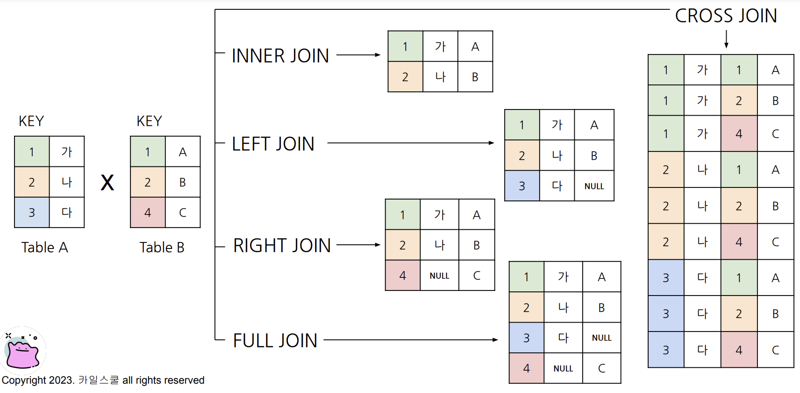

- (INNER) JOIN: 두 테이블의 공통 요소만 연결
- LEFT/RIGHT (OUTER) JOIN: 왼쪽/오른쪽 테이블 기준으로 연결, 없는 요소는 NULL값
- FULL (OUTER) JOIN: 양쪽 기준으로 연결, 없는 요소는 NULL값
- CROSS JOIN: 두 테이블의 각각의 요소를 곱함. 데이터가 매우 커지므로 주의.

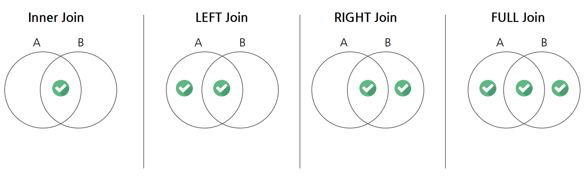


# 5-4. JOIN 쿼리 작성하기
JOIN 쿼리 작성 흐름
    1. 테이블 확인: 데이터, 컬럼 확인
    2. 기준 테이블 정의: 가장 많이 참고할 기준(base) 테이블 정의. 보통 LEFT JOIN 사용->LEFT에 둠.
    3. JOIN Key 찾기: 여러 테이블과 연결할 Key(ON) 정리.
    4. 결과 예상하기: 결과 테이블을 예상하여, 실제 작성한 쿼리 결과와 동일한지 확인하는 용도로 사용
    5. 쿼리 작성/검증: 예상한 결과(4)와 동일한 결과가 나오는지 확인

```
SELECT
    A.col1.
    A.col2,
    B.col1 1,
    B.col1 2
FROM table1 AS A
LEFT JOIN table2 AS B
ON A.key = B.key # 테이블 이름이 길다면, Alias(별칭)을 사용할 수 있음.


# ON: JOIN 키를 입력하겠다는 의미. A의 키와 B의 키가 같은 것만 가지고 오겠다.
# INNER, LEFT, RIGHT, FULL JOIN: ON 사용 가능. 위의 형식에서 단어만 바꿈
# CROSS JOIN: JOIN 키가 없어도 연산되어, ON이 필요하지 않음.
```

```
SELECT
  tp.*,
  t.*
FROM basic.trainer_pokemon AS tp
LEFT JOIN basic.trainer AS t
ON tp.trainer_id=t.id;
```
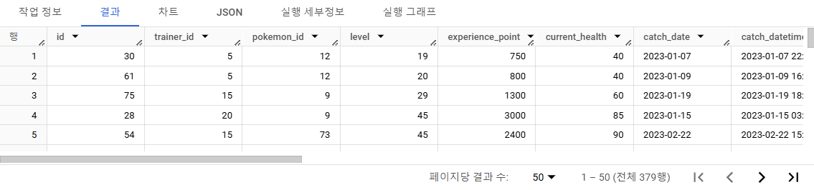
```
SELECT
  tp.*,
  t.*,
  p.*
FROM basic.trainer_pokemon AS tp
LEFT JOIN basic.trainer AS t
ON tp.trainer_id=t.id
LEFT JOIN basic.pokemon AS p
ON tp.pokemon_id = p.id;
```

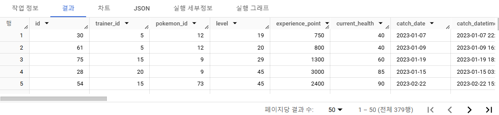

```
# LEFT: trainer_pokemon
# RIGHT: trainer
# RIGHT: pokemon
# id가 중복되므로, tp에 있는 trainer_id, pokemon id를 대신 사용하기로 함.

SELECT
  tp.*,
  t.* EXCEPT(id), # trainer_id: tp에 있는 것으로 활용
  p.* EXCEPT(id) # pokemon_id: tp에 있는 것으로 활용
FROM basic.trainer_pokemon AS tp
LEFT JOIN basic.trainer AS t
ON tp.trainer_id=t.id
LEFT JOIN basic.pokemon AS p
ON tp.pokemon_id = p.id;

SELECT
  tp.id,
  tp.trainer_id,
  tp.pokemon_id,
  t.age,
  t.hometown,
  p.*
FROM basic.trainer_pokemon AS tp
LEFT JOIN basic.trainer AS t
ON tp.trainer_id = t.id

LEFT JOIN basic.pokemon AS p
ON tp.pokemon_id = p.id;
```


# 5-5. JOIN을 처음 공부할 때 헷갈렸던 부분

1. 여러 JOIN 중 어떤 것을 사용해야 하는가
- 하려고 하는 작업의 목적에 따라 JOIN을 선택해야 함
    - 교집합: INNER
    - 모두 조합: CROSS
    - 그 외: LEFT/RIGHT(LEFT 추천) (LEFT JOIN 후 IS NOT NULL=INNER JOIN)
- 쿼리 작성 템플릿에 예상하는 결과를 작성, 중간 결과도 생각하며 찾아보기.


2. 어떤 테이블을 왼쪽에 두어야 하는가
- 기준이 되는 테이블(기준값이 존재하는 테이블)을 왼쪽에 두기
    - 기준값: 데이터 요소가 빠짐없이 존재
- 그 후, 우측에 필요한 데이터를 계속 추가하는 방식

3. 여러 테이블을 연결할 수 있는가
- JOIN 개수에 한계는 없으나, 너무 많이 JOIN하지 않도록 하자.
- WITH문 사용(추후 강의에서 다룸)


4. 컬럼을 모두 다 선택해야 하는가
- 데이터 추출로 무엇을 하고자 하느냐에 따라 다름
- JOIN이 잘 되었는지를 확인하기 위해 처음에 많은 컬럼을 선택하는 것은 괜찮음
- 큰 데이터를 다룰 때(현업)에는 사용하는 컬럼만 선택하기(비용)
참고) id값은 Unique 확인에 자주 사용


5. NULL
- NULL: 값이 없음, 알 수 없음
- 0, 공백과는 다른 개념임
- JOIN시 연결할 값이 없는 경우, NULL값으로 나타남


# 5-6. JOIN 연습문제 1~5번

> 🔎 **1. 트레이너가 보유한 포켓몬들은 얼마나 있는지 알 수 있는 쿼리를 작성해주세요.(보유=status가 Active, Training인 경우를 의미, Released는 방출했다는 것을 의미)**
```
# 쿼리 작성 목표, 확인할 지표: 포켓몬 수
# 쿼리 계산 방법: trainer_pokemon(status가 Active, Training)+pokemon JOIN -> 그 후 GROUP BY 집계(COUNT)
# 데이터의 기간: X
# 사용할 테이블: trainer_pokemon, pokemon
# Join KEY: trainer_pokemon.pokemon_id, pokemon.id
# 데이터 특징: 보유=status가 Active, Training인 경우를 의미, Released는 방출했다는 것을 의미

-- trainer_pokemon에서 status 먼저 필터링(Row 수 줄이기) 후 JOIN

SELECT
  id,
  trainer_id,
  pokemon_id,
  status
FROM basic.trainer_pokemon
WHERE status IN ('Active', 'Training')
```
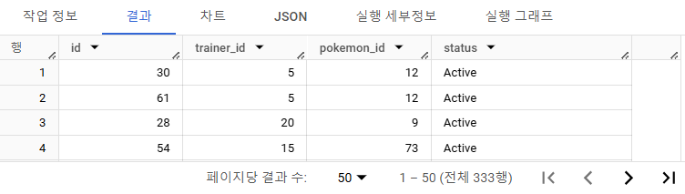

```
SELECT
  tp.*,
  p.kor_name
FROM( # 서브쿼리로 만듦, 'tp'로 이름 설정
SELECT 
  id,
  trainer_id,
  pokemon_id,
  status
FROM basic.trainer_pokemon
WHERE status IN ('Active', 'Training')
) AS tp
LEFT JOIN basic.pokemon AS p
ON tp.trainer_id = p.id
```
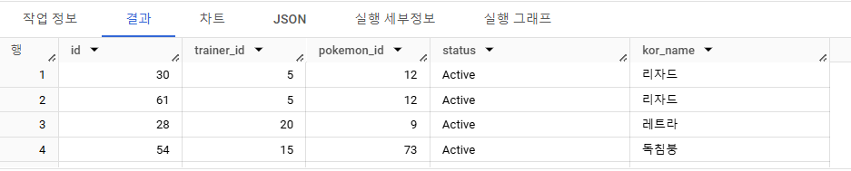

```
SELECT
  -- tp.*,
  -- p.kor_name
  kor_name,
  COUNT(id) AS pokemon_cnt
FROM(
SELECT
  id,
  trainer_id,
  pokemon_id,
  status
FROM basic.trainer_pokemon
WHERE status IN ('Active', 'Training')
) AS tp
LEFT JOIN basic.pokemon AS p
ON tp.trainer_id = p.id
GROUP BY
  kor_name

# Column name id is ambiguous at [5:9]
# id가 여러 테이블에서 중복된 이름이기 때문에 뜨는 오류. 테이블명을 붙여주면 해결됨
```
```
SELECT
  kor_name,
  COUNT(tp.id) AS pokemon_cnt
FROM(
SELECT
  id,
  trainer_id,
  pokemon_id,
  status
FROM basic.trainer_pokemon
WHERE status IN ('Active', 'Training')
) AS tp
LEFT JOIN basic.pokemon AS p
ON tp.trainer_id = p.id
GROUP BY
  kor_name
ORDER BY
  pokemon_cnt DESC
```
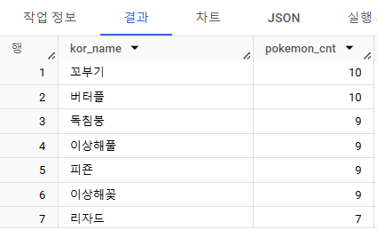

> 🔎 **2. 각 트레이너가 가진 포켓몬 중 'Grass' 타입의 포켓몬 수를 계산해주세요. (단, 편의를 위해 type1 기준으로 계산해주세요.)**
```
# 쿼리 작성 목표, 확인할 지표: 트레이너가 보유한 포켓몬 중 Grass 타입 포켓몬의 수
# 쿼리 계산 방법: 트레이너가 보유한 포켓몬 조건->Grass 타입으로 WHERE 조건 걸어서 COUNT
# 데이터의 기간: X
# 사용할 테이블: trainer_pokemon, pokemon
# Join KEY: trainer_pokemon.pokemon_id = pokemon.id
# 데이터 특징: 1번과 동일

# 보유한 포켓몬
SELECT
  tp.*,
  p.type1
FROM(
SELECT
  id,
  trainer_id,
  pokemon_id,
  status
FROM basic.trainer_pokemon
WHERE status IN ('Active', 'Training')
) AS tp
LEFT JOIN basic.pokemon AS p
ON tp.trainer_id = p.id

```
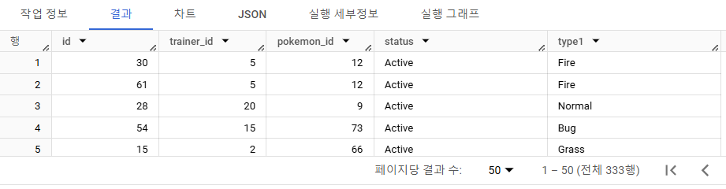

```
# Grass 타입만 WHERE 조건으로
SELECT
  p.type1,
  COUNT(tp.id) AS pokemon_cnt
FROM(
SELECT
  id,
  trainer_id,
  pokemon_id,
  status
FROM basic.trainer_pokemon
WHERE status IN ('Active', 'Training')
) AS tp
LEFT JOIN basic.pokemon AS p
ON tp.trainer_id = p.id
WHERE
  type1 = 'Grass'
GROUP BY
  type1
ORDER BY
  2 DESC # 두 번째 열 기준 내림차순
```


> 🔎 **3. 트레이너의 고향(hometown)과 포켓몬을 포획한 위치(location)을 비교하여, 자신의 고향에서 포켓몬을 포획한 트레이너의 수를 계산해주세요. (status와 상관없이 구해주세요.)**
```
# 쿼리 작성 목표, 확인할 지표: 트레이너 고향과 포켓몬 포획 위치가 같은 트레이너 수 계산
# 쿼리 계산 방법: trainer(hometown), trainer_pokemon(location) JOIN -> hometown=location -> 트레이너 수 COUNT
# 데이터의 기간: X
# 사용할 테이블: trainer, trainer_pokemon
# Join KEY: trainer.id = trainer_pokemon.trainer_id
# 데이터 특징: status 상관없이 구하기

SELECT
  COUNT(DISTINCT tp.trainer_id) AS trainer_uniq # DISTINCT를 사용해야 '트레이너 수'를 구할 수 있음
FROM basic.trainer AS t
LEFT JOIN basic.trainer_pokemon AS tp
ON t.id = tp.trainer_id
WHERE
  location IS NOT NULL
  AND t.hometown = tp.location 
```
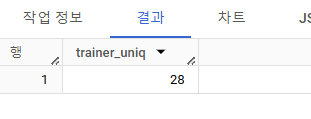

> 🔎 **4. Master 등급인 트레이너들은 어떤 타입의 포켓몬을 제일 많이 보유하고 있을까요?**
```
# 쿼리 작성 목표, 확인할 지표: Master 등급의 트레이너들이 가장 많이 보유하고 있는 타입
# 쿼리 계산 방법: trainer+pokemon+trainer_pokemon -> Master 조건 설정 (WHERE) -> type1 GROUP BY + COUNT
# 데이터의 기간: X
# 사용할 테이블: trainer, pokemon, trainer_pokemon
# Join KEY: trainer.id = trainer_pokemon.trainer_id, pokemon.id = trainer_pokemon.pokemon_id
# 데이터 특징: 1번과 동일(보유의 정의)

SELECT
  type1,
  COUNT(tp.id) AS pokemon_cnt
FROM(
SELECT
  id,
  trainer_id,
  pokemon_id,
  status
FROM basic.trainer_pokemon
WHERE status IN ('Active', 'Training')
) AS tp
LEFT JOIN basic.trainer AS t
ON tp.trainer_id = t.id
LEFT JOIN basic.pokemon AS p
ON tp.pokemon_id = p.id
WHERE
  t.achievement_level = "Master" # 마스터 등급 트레이너만
GROUP BY
  type1
ORDER BY # 포켓몬 수 기준 내림차순
  2 DESC
LIMIT 1 # 가장 많이 보유한 타입 하나만 출력

```
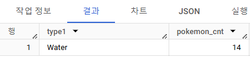

> 🔎 **5. Incheon 출신 트레이너들은 1세대, 2세대 포켓몬을 각각 얼마나 보유하고 있나요?**
```
# 쿼리 작성 목표, 확인할 지표: Incheon 출신 트레이너들이 보유한 포켓몬 세대 구분
# 쿼리 계산 방법: trainer+pokemon+trainer_pokemon -> Incheon 조건(WHERE) -> 세대(generation)로 GROUP BY COUNT
# 데이터의 기간: X
# 사용할 테이블: trainer, pokemon, trainer_pokemon
# Join KEY: trainer.id = trainer_pokemon.trainer_id, pokemon.id = trainer_pokemon.pokemon_id
# 데이터 특징: 1번과 동일(보유의 정의)

SELECT
  generation,
  COUNT(tp.id) AS pokemon_cnt
FROM(
SELECT
  *
FROM basic.trainer_pokemon
WHERE status IN ('Active', 'Training')
) AS tp
LEFT JOIN basic.trainer AS t
ON tp.trainer_id = t.id
LEFT JOIN basic.pokemon AS p
ON tp.pokemon_id = p.id
WHERE
  t.hometown = "Incheon"
GROUP BY
  generation
```
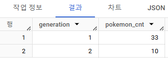


# 5-7. 정리
- JOIN: 여러 테이블 연결 시 사용
- Key: 공통 컬럼
```
SELECT
    A.col1.
    A.col2,
    B.col1 1,
    B.col1 2
FROM table1 AS A
LEFT JOIN table2 AS B
ON A.key = B.key
```
JOIN 종류
- (INNER) JOIN
- LEFT/RIGHT (OUTER) JOIN
- FULL (OUTER) JOIN
- CROSS JOIN:

