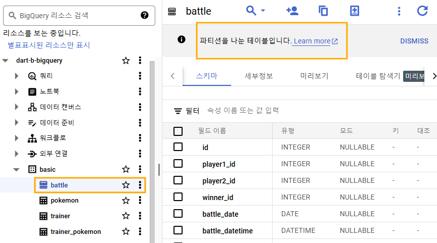
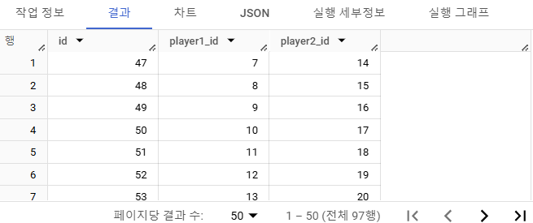
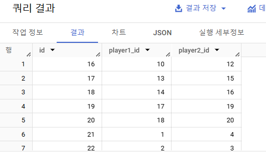
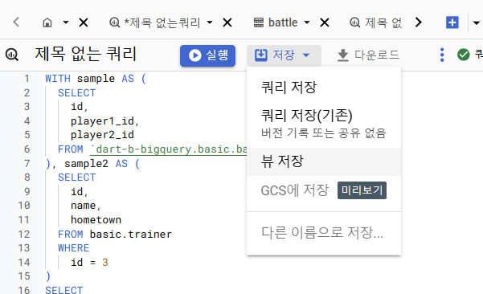
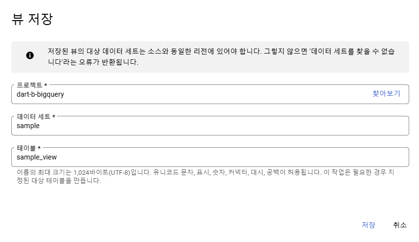
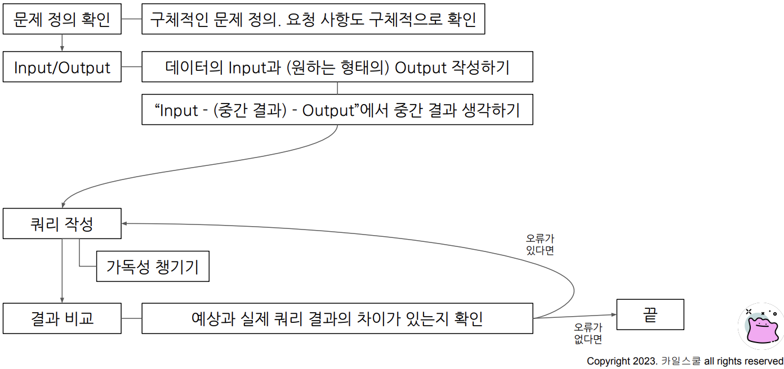
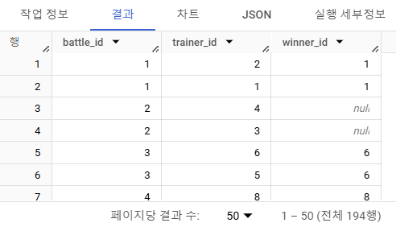
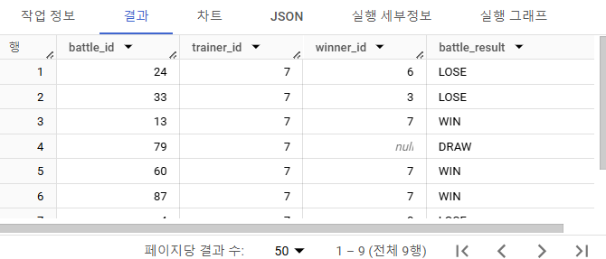
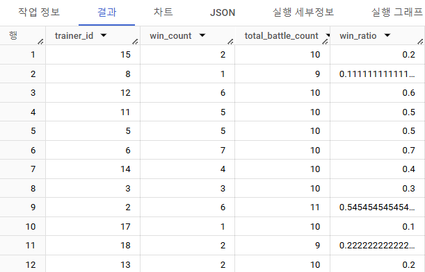

# 6-1. Intro

- 데이터 결과 검증
- SQL 스타일 가이드: 복잡한 쿼리문, 가독성이 중요함.
- 데이터 검증: 경험론적인 내용 공유
- 데이터 결과 검증: 어떻게 데이터를 잘 검증할 것인가


# 6-2. 가독성을 챙기기 위한 SQL 스타일 가이드
- 데이터 검증 전, 실수는 언제 발생하는가:
    - 문법을 잘못 알고 있는 경우: 문법 공부나 에러메세지를 보고 수정
    - 데이터를 파악하지 않고 쿼리를 작성하는 경우: 메타데이터 보기. 데이터를 꼭 파악해야 한다.
    - 쿼리가 복잡한 경우: 복잡한 쿼리를 단순화해서 보기 쉽게 만들어ㅑㅇ 한다.
- 다른 사람의 쿼리를 보는 경우 또는 내 쿼리를 보여주는 경우,
    - 쿼리를 가독성 있게 작성시 별도 설명 없이도 이해 가능
    - 매번 설명을 해야함->시간낭비.
    - 쿼리 변경 시에도 변경한 부분 파악이 쉬움
- SQL 스타일 가이드가 존재하며, 조직마다 다른 가이드를 사용하기도 함.

1. 예약어는 대문자로 작성
SQL에서 문법적인 용도로 사용하는 문자들은 대문자로 작성. 복잡한 쿼리에서도 구분이 쉬움.
ex. SELECT, FROM, WHERE, 각종 함수

2. 컬럼명은 snake_case로 작성
CamelCase, snake_case 등, 컬럼명에는 일관성이 중요

3. Alias로 별칭을 지을 떄는 명시적인 이름을 적용
의미를 고민하게 만드는 이름이 아닌, 명시적인 것을 사용하도록 함.  
JOIN시 테이블 이름도 명시적으로 하면 좋음.  
AS를 생략하지 않고 사용하는 것도 명시적인 표현임.  

4. 왼쪽 정렬을 기준으로 작성.

5. 예약어나 컬럼은 한 줄에 하나씩 권장
바로 주석처리할 수 있도록, 한 줄에 하나씩 작성

6. 쉼표의 위치
의견이 갈리는 부분: 쉼표 앞 vs. 뒤


# 6-3. 가독성을 챙기기 위한 WITH 문 & 파티션
SQL 쿼리를 작성하다, 반복되는 서브쿼리문 등으로 쿼리가 복잡해지면 가독성이 떨어짐.

-> WITH문을 사용해서 쿼리를 정의해 재사용 가능.
- WITH문: 쿼리의 최상단(SELECT 위)에 배치
    - CTE(Common Table Expression)라고 표현
    - SELECT 구문에 이름을 정해주는 것과 유사
    - 쿼리 내에서 반복적으로 사용할 수 있음
```
WITH temp_table AS(
    SELECT
        col1, col2
    FROM
        Table
    ), temp_table2 AS(
        SELECT
            col3
        FROM Table2
    )

SELECT
    col1, col2
FROM temp_table

```
---
- PARTITION
Table에는 Partition이라는 것이 존재할 수 있음.

PARTITION을 사용하면 좋은 점
1) 쿼리 성능 향상  
전체 데이터를 스캔하는 것보다 파티션을 설정한 곳만 스캔하는 것이 더 빠름.
2) 데이터 관리 용이성  
특정 일자의 데이터를 모두 변경하거나 삭제해야 하면 파티션을 설정해서 삭제할 수 있음
3) 비용  
파티션에 해당되는 데이터만 스캔해서 비용을 줄일 수 있음(빅쿼리의 경우)




PARTITION Table에서 쿼리하기:  
WHERE절에 파티션 컬럼에 대해 조건을 설정해서 사용,
- DATETIME_ADD: 지정된 시간 간격을 추가

```
SELECT 
  id,
  player1_id,
  player2_id
FROM `dart-b-bigquery.basic.battle` 
WHERE battle_datetime BETWEEN DATETIME("2022-01-07") AND DATETIME_ADD("2024-11-07", INTERVAL 1 DAY) 
;
```


```
WITH sample AS (
  SELECT 
    id,
    player1_id,
    player2_id
  FROM `dart-b-bigquery.basic.battle` 
), sample2 AS (
  SELECT
    id,
    name,
    hometown
  FROM basic.trainer
  WHERE
    id = 3
)
SELECT
  *
FROM sample2
;
```
FROM sample:  


FROM sample2:  


- 결과 저장  


계속 실행하여 데이터를 실시간 업데이트하거나, 뷰로 만듦.






이후, 새로운 쿼리를 만들어서,
```
SELECT
    *
FROM sample.sample_view
```
실행하면 뷰에 있는 쿼리가 동일하게 실행됨.

# 6-4. 데이터 결과 검증 정의

- 데이터 결과 검증을 어떻게 할 수 있을까?  
: 실무에서 급하게 데이터를 추출하고 결과를 내야하는 경우 실수가 있을 수 있음.  
-> 체크하는 프로세스가 필요!

- 데이터 결과 검증(Data Result Validation)의 정의  
    - SQL 쿼리 후 얻은 결과가 예상과 일치하는지 확인하는 과정.  
    - 목적: 분석 결과의 정확성, 신뢰성 확보  
    - 내가 기대하는 예상 결과 정의
    - 쿼리 작성
    - 두 개가 일치하는지 비교
- 중요한 부분
    - 문제를 잘 정의하고 미리 작성해보기
    - 도메인 특수성 잘 파악하기
    - SQL 쿼리 템플릿과 맥락이 유사함.



- 데이터 결과 검증시 자주 활용하는 SQL 쿼리
1) COUNT(*): 행 수를 확인. 의도한 데이터의 행 개수가 맞는가.
2) NOT NULL: 특정 컬럼에 NULL이 존재하는가, 필수 필드가 비어있지 않은가
3) DISTINCT: 데이터의 고유값을 확인해 중복 여부 확인
4) IF문, CASE WHEN: 의도와 같다면 TRUE, 아니면 FALSE

강사님의 데이터 결과 검증 방법!
1) 특정 user_id로 필터링을 걸어서 확인
- 1명의 데이터 확인(ex. WHERE user_id = 402)
- 결과를 예상할 때 Raw 데이터에서 하나씩 눈으로 세고 적어둠(예상 결과)
- 1명의 데이터의 예상 결과와 쿼리 결과가 동일한지 확인
- 다른 user_id 3~4건 더 추가해서 확인(여러 케이스가 존재할 수 있음)  
 -> 동일한 결과가 나오면 user_id 조건 삭제

2) 샘플 데이터 생성
- WITH문으로 예시 데이터 생성-결과 예상-쿼리 작성
- 복잡한 데이터 다루기 전, 쿼리 자체가 올바른지 확인할 때 주로 사용(문법이 익숙하지 않을 때 사용해보기)
    - UNION ALL: row 단위를 합친다, 아래에 붙인다.


# 6-5. 데이터 결과 검증 예시

포켓몬 트레이너들의 배틀 성적 분석 작업. 각 트레이너가 진행한 배틀의 승리 비율을 계산해야 하며, 배틀에 참여한 횟수가 9회 이상인 경우만 계산.
검증 프로세스 흐름
1) 전체 데이터 파악
테이블을 쭉 보면서, 컬럼 및 데이터 타입 등을 파악해본다.


2) 특정 user_id 선정
```
SELECT
    *
FROM basic.battle
WHERE
    player1_id = 7
```
-> 테이블을 다시 확인해보면, player2_id에도 7이 있음.
```
SELECT
    *
FROM basic.battle
WHERE
    (player1_id = 7) OR (player2_id)
```

3) 승률 직접 COUNT: 결과 예상
player+id가 7인 유저의 승률은   
총 9회 중 5회=0.55556 : 주석이나 노트 등에 별도로 기록


4) 쿼리 작성
트레이너가 승리한 비율 구하기
- 트레이너가 참여한 배틀의 수
- 트레이너가 승리한 배틀의 수
- 둘을 조합하여 승리한 비율 구할 수 있음
- 배틀의 수가 9 이상만 추출.
- 예상 정답: player_id가 7인 유저의 승리 비율은 0.55556이 나와야 함.

- player1, 2 구분을 하지 않아도 되는 테이블 만들기: 통합 데이터 생성(trainer_id)
```
SELECT
  *
FROM (
  SELECT
    id AS battle_id,
    player1_id AS trainer_id,
    winner_id
  FROM basic.battle
  UNION ALL
  SELECT
    id AS battle_id,
    player2_id AS trainer_id,
    winner_id
  FROM basic.battle
)
ORDER BY battle_id
```
  
battle_id마다, trainer_id와 winner_id가 같으면 승리, 다르면 패배, null이면 비겼다고 해석

- trainer_id=7의 총 배틀 횟수를 구하는 쿼리
``` 
WITH battle_basic AS (
  SELECT
    id AS battle_id,
    player1_id AS trainer_id,
    winner_id
  FROM basic.battle
  UNION ALL
  SELECT
    id AS battle_id,
    player2_id AS trainer_id,
    winner_id
  FROM basic.battle
)
SELECT
  trainer_id,
  COUNT(*) AS total_battles,
  COUNT(DISTINCT battle_id) AS unique_battles
FROM battle_basic
WHERE trainer_id = 7
GROUP BY
  trainer_id;
```
  
중복 확인: total_battles와 unique_battles이 둘 다 9인 것을 확인.

- trainer_id와 winner_id를 조합해서 WIN, LOSE, DRAW를 만들어보기
: CASE WHEN 활용
```
WITH battle_basic AS (
  SELECT
    id AS battle_id,
    player1_id AS trainer_id,
    winner_id
  FROM basic.battle
  UNION ALL
  SELECT
    id AS battle_id,
    player2_id AS trainer_id,
    winner_id
  FROM basic.battle
)
SELECT
  *,
  CASE
    WHEN trainer_id = winner_id THEN "WIN"
    WHEN winner_id IS NULL THEN "DRAW"
    ELSE "LOSE"
  END AS battle_result
FROM battle_basic
WHERE trainer_id = 7
;
```


5) 실제와 비교

- COUNTIF를 사용해 값 구하기
```
WITH battle_basic AS (
  SELECT
    id AS battle_id,
    player1_id AS trainer_id,
    winner_id
  FROM basic.battle
  UNION ALL
  SELECT
    id AS battle_id,
    player2_id AS trainer_id,
    winner_id
  FROM basic.battle
), battle_with_result AS (
  SELECT
  *,
  CASE
    WHEN trainer_id = winner_id THEN "WIN"
    WHEN winner_id IS NULL THEN "DRAW"
    ELSE "LOSE"
  END AS battle_result
FROM battle_basic
WHERE trainer_id = 7
)
SELECT
  trainer_id,
  COUNTIF(battle_result = "WIN") AS win_count,
  COUNT(battle_id) AS total_battle_count,
  COUNTIF(battle_result = "WIN")/COUNT(DISTINCT battle_id) AS win_ratio
FROM battle_with_result
GROUP BY
  trainer_id
;
```


6) 맞다면 특정 유저 조건 제외
```
WITH battle_basic AS (
  SELECT
    id AS battle_id,
    player1_id AS trainer_id,
    winner_id
  FROM basic.battle
  UNION ALL
  SELECT
    id AS battle_id,
    player2_id AS trainer_id,
    winner_id
  FROM basic.battle
), battle_with_result AS (
  SELECT
  *,
  CASE
    WHEN trainer_id = winner_id THEN "WIN"
    WHEN winner_id IS NULL THEN "DRAW"
    ELSE "LOSE"
  END AS battle_result
FROM battle_basic
--WHERE trainer_id = 7
)
SELECT
  trainer_id,
  COUNTIF(battle_result = "WIN") AS win_count,
  COUNT(battle_id) AS total_battle_count,
  COUNTIF(battle_result = "WIN")/COUNT(DISTINCT battle_id) AS win_ratio
FROM battle_with_result
GROUP BY
  trainer_id
HAVING
total_battle_count >= 9
;
```


- 예상한 결과
    trainer_id = 7일 때 배틀의 횟수: 9
    승리한 횟수: 5
    승리한 비율: 0.55556
- 예상한 결과가 맞는지 확인하면서 쿼리를 짜는 게 검증에 있어 중요하다.


# 6-6. 정리

- 검증 흐름
    - 문제 정의
    - 인풋/아웃풋 확인, 중간 결과가 필요하면 만들기
    - 쿼리 작성(가독성 챙기기)
    - 예상한 결과와 실제 결과 비교
    - 오류가 없으면 끝내기

- 데이터 결과 검증시 자주 활용하는 SQL 쿼리
1) COUNT(*)
2) NOT NULL
3) DISTINCT
4) IF문, CASE WHEN

- 데이터 검증 방법(흐름)
1) 전체 데이터 파악
2) 특정 user_id 선정
3) 승률 직접 COUNT, 결과 예상
4) 쿼리 작성
5) 실제와 비교
6) 맞다면 특정 유저 조건 제외

