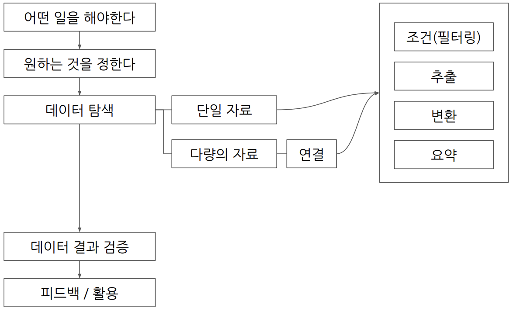

# 7. BigQuery 입문 연습 문제

> 🔎 **1. 각 트레이너별로 가진 포켓몬의 평균 레벨을 계산하고, 그 중 평균 레벨이 높은 TOP3 트레이너의 이름과 보유한 포켓몬의 수, 평균 레벨을 출력해주세요.**  

#### 내 풀이
```
# TOP3 트레이너의 ID와 보유한 포켓몬의 수, 평균 레벨
SELECT
  trainer_id,
  COUNT(pokemon_id) AS pk_cnt,
  AVG(level) AS avg_lv
FROM `basic.trainer_pokemon`
GROUP BY
  trainer_id
ORDER BY
  avg_lv DESC
LIMIT 3
;

# 트레이너 이름 조인하여 가져옴
SELECT
  t.name AS trainer_name,
  COUNT(tp.pokemon_id) AS pk_cnt,
  AVG(tp.level) AS avg_lv
FROM basic.trainer_pokemon tp
JOIN
  basic.trainer t
ON 
  t.id = tp.trainer_id
GROUP BY
  t.name
ORDER BY
  avg_lv DESC
LIMIT 3
;
```


#### 정답 풀이
```
WITH trainer_avg_level AS (
# 1) 트레이너가 보유한 포켓몬의 평균 레벨, 포켓몬의 수
SELECT
  DISTINCT -- SELECT문 내 모든 컬럼 중복 제거하여 출력
    trainer_id,
    ROUND(AVG(level),2) AS avg_level,
    COUNT(id) AS pk_cnt
FROM basic.trainer_pokemon
WHERE
  status != "Released" -- '보유한'='방출되지 않은'
GROUP BY
  trainer_id
)
# 2) 1)에서 만든 테이블+trainer 테이블을 합쳐 trainer name 출력
SELECT
  t.name,
  tal.avg_level,
  tal.pk_cnt
FROM basic.trainer AS t
LEFT JOIN trainer_avg_level AS tal
ON t.id=tal.trainer_id
ORDER BY
  avg_level DESC
LIMIT 3
;

# WITH 구문을 잘 활용하자.
# 중복에 신경쓰자(DISTINCT 활용하기).
# 문제를 잘 읽자(ㅋㅋ)
```


> 🔎 **2. 각 포켓몬 타입1을 기준으로 가장 많이 포획된(방출 여부 상관없음) 포켓몬의 타입1, 포켓몬의 이름과 포획 횟수를 출력해주세요.**

#### 내 풀이
```
# 가장 많이 포획된 포켓몬의 id와 포획 횟수
SELECT
  tp.pokemon_id,
  COUNT(tp.pokemon_id) AS cap_cnt
FROM basic.trainer_pokemon tp
GROUP BY
  tp.pokemon_id
ORDER BY
  cap_cnt DESC
;

# 포켓몬의 타입1, 포켓몬의 한국 이름과 포획 횟수
SELECT 
  p.type1,
  p.kor_name,
  tp_cap_cnt.cap_cnt
FROM
  (
  SELECT
    tp.pokemon_id,
    COUNT(tp.pokemon_id) AS cap_cnt
  FROM basic.trainer_pokemon tp
  GROUP BY
    tp.pokemon_id
  ) tp_cap_cnt
JOIN
  basic.pokemon p
ON
  tp_cap_cnt.pokemon_id = p.id
ORDER BY
  tp_cap_cnt.cap_cnt DESC
;
```


#### 정답 풀이
```
SELECT
  type1,
  kor_name,
  COUNT(tp.id) AS cnt
FROM basic.trainer_pokemon AS tp
LEFT JOIN basic.pokemon AS p
ON tp.pokemon_id=p.id
GROUP BY
  type1,
  kor_name
ORDER BY
  cnt DESC
LIMIT 3 -- 최다 카운트 동률이 3개임
;

# 불필요한 서브쿼리를 사용했음. 직접 조인 후 그룹바이를 해도 됨.
```


> 🔎 **3. 전설의 포켓몬을 보유한 트레이너들은 전설의 포켓몬과 일반 포켓몬을 얼마나 보유하고 있을까요? (트레이너의 이름을 같이 출력해주세요)**


#### 내 풀이
```
# 전설의 포켓몬 ID
SELECT
  id AS legendary_id
FROM basic.pokemon
WHERE
  is_legendary=True
;

# 전설의 포켓몬을 보유한 트레이너 ID 및 보유한 전설의 포켓몬 수
SELECT
  tp.trainer_id,
  COUNT(tp.pokemon_id) AS lgd_cnt
FROM(
  SELECT
    id AS legendary_id
  FROM basic.pokemon
  WHERE
    is_legendary=True
    ) lgd_pk_id
JOIN
  basic.trainer_pokemon tp
ON
  tp.pokemon_id=lgd_pk_id.legendary_id
GROUP BY
  tp.trainer_id
; -- 모두 전설의 포켓몬은 1마리만 보유했음을 알 수 있음.

# 트레이너 ID별 일반 포켓몬, 전설 포켓몬 보유 수
SELECT
  tp.trainer_id,
  SUM(CASE
    WHEN p.is_legendary=True THEN 1 ELSE 0 END) lgd_cnt,
  SUM(CASE
    WHEN p.is_legendary=False THEN 1 ELSE 0 END) nml_cnt
FROM basic.trainer_pokemon tp
JOIN
  basic.pokemon p
ON
  tp.pokemon_id=p.id
GROUP BY
  tp.trainer_id
;

# 트레이너 이름 추가하기
SELECT
  t.name,
  tp_cnt.lgd_cnt,
  tp_cnt.nml_cnt
FROM(
  SELECT
    tp.trainer_id,
    SUM(CASE
      WHEN p.is_legendary=True THEN 1 ELSE 0 END) lgd_cnt,
    SUM(CASE
      WHEN p.is_legendary=False THEN 1 ELSE 0 END) nml_cnt
  FROM basic.trainer_pokemon tp
  JOIN
    basic.pokemon p
  ON
    tp.pokemon_id=p.id
  GROUP BY
    tp.trainer_id
) tp_cnt
JOIN
  basic.trainer t
ON
  tp_cnt.trainer_id=t.id
WHERE
  tp_cnt.lgd_cnt = 1 -- 또는 >0
;
```


#### 정답 풀이
```
WITH legendary_cnts AS (
  SELECT
    tp.trainer_id,
    SUM(CASE WHEN p.is_legendary IS True THEN 1 ELSE 0 END) AS lgd_cnt,-- 'IS True' 생략 가능, '= True'로도 표현 가능
    SUM(CASE WHEN p.is_legendary IS False THEN 1 ELSE 0 END) AS nml_cnt -- 'IS NOT TRUE', 'CASE WHEN NOT~THEN'도 가능
  FROM basic.trainer_pokemon AS tp
  LEFT JOIN basic.pokemon AS p
  ON tp.pokemon_id=p.id
  GROUP BY tp.trainer_id
)
# legendary_cnts + trainer
SELECT
  t.name AS trainer_name,
  lc.lgd_cnt,
  lc.nml_cnt
FROM basic.trainer AS t
LEFT JOIN legendary_cnts AS lc
ON t.id = lc.trainer_id
WHERE
  lc.lgd_cnt >= 1
;

# WITH 구문 잘 쓰기
```


> 🔎 **4. 가장 승리가 많은 트레이너 ID, 트레이너의 이름, 승리한 횟수, 보유한 포켓몬의 수, 평균 포켓몬의 레벨을 출력해주세요. 단, 포켓몬의 레벨은 소수점 둘째 자리에서 반올림해주세요. (참고: 반올림 함수 ROUND)**

#### 내 풀이

```
# 승리한 트레이너 ID와 승리 횟수
SELECT
  b.winner_id,
  COUNT(b.winner_id) AS win_cnt
FROM basic.battle b
GROUP BY
  b.winner_id
;
# 트레이너 테이블 조인. 가장 승리가 많은~이므로 트레이너 테이블에 배틀 테이블 left join
SELECT
  t.id,
  t.name,
  COUNT(b.winner_id) AS win_cnt
FROM basic.trainer t
JOIN
  basic.battle b
ON 
  t.id=b.winner_id
GROUP BY
  t.id,
  t.name
ORDER BY
  win_cnt DESC
;

# 가장 승리가 많은 트레이너 ID, 트레이너의 이름, 승리한 횟수, 보유한 포켓몬의 수, 평균 포켓몬의 레벨
SELECT
  wincnt.id,
  wincnt.name,
  wincnt.win_cnt,
  COUNT(tp.pokemon_id) AS pk_cnt,
  ROUND(AVG(tp.level),2) AS avg_lv
FROM(
  SELECT
    t.id,
    t.name,
    COUNT(b.winner_id) AS win_cnt
  FROM basic.trainer t
  JOIN
    basic.battle b
  ON 
    t.id=b.winner_id
  GROUP BY
    t.id,
    t.name
  ORDER BY
    win_cnt DESC
) wincnt
JOIN
  basic.trainer_pokemon tp
ON
  wincnt.id=tp.trainer_id
GROUP BY
  wincnt.id,
  wincnt.name,
  wincnt.win_cnt
ORDER BY
  wincnt.win_cnt DESC
LIMIT 1
;
```


#### 정답 풀이
```
WITH winner_counts AS (
  # 1) winner_id, COUNT(승리 횟수)
  SELECT
    winner_id,
    COUNT(winner_id) AS win_count
  FROM basic.battle
  WHERE
    winner_id IS NOT NULL
  GROUP BY
    winner_id
), 

top_winner AS (
  # 2) 이름 추가
  SELECT
    wc.winner_id AS trainer_id,
    wc.win_count,
    t.name AS trainer_name
  FROM winner_counts AS wc
  LEFT JOIN basic.trainer AS t
  ON wc.winner_id = t.id
  ORDER BY
    win_count DESC
  LIMIT 1
)

# 3) 평균 포켓몬 레벨, 포켓몬 수 추가
SELECT
  tw.trainer_id,
  tw.trainer_name,
  tw.win_count,
  COUNT(tp.pokemon_id) AS pk_cnt,
  ROUND(AVG(tp.level),2) AS avg_level
FROM top_winner AS tw
LEFT JOIN basic.trainer_pokemon AS tp
ON tw.trainer_id = tp.trainer_id
WHERE
  tp.status IN ("Active", "Training")
GROUP BY
  tw.trainer_id,
  tw.trainer_name,
  tw.win_count

# 문제를 잘 읽자~(보유한......)
```


> 🔎 **5. 트레이너가 잡았던 포켓몬의 총 공격력(attack)과 방어력(defense)의 합을 계산하고, 이 합이 가장 높은 트레이너를 찾으세요.**

#### 내 풀이

```
# 트레이너 ID와 총 공격+방어력 합, 높은 순서대로 정렬
SELECT
  tp.trainer_id,
  SUM(p.attack+p.defense) AS total_physical
FROM basic.trainer_pokemon tp
JOIN
  basic.pokemon p
ON
  tp.pokemon_id=p.id
GROUP BY
  tp.trainer_id
ORDER BY total_physical DESC
;

# 트레이너 이름 추가
SELECT
  phy.trainer_id,
  t.name,
  phy.total_physical
FROM(
  SELECT
    tp.trainer_id,
    SUM(p.attack+p.defense) AS total_physical
  FROM basic.trainer_pokemon tp
  JOIN
    basic.pokemon p
  ON
    tp.pokemon_id=p.id
  GROUP BY
    tp.trainer_id
  ) phy
JOIN 
  basic.trainer t
ON
  phy.trainer_id=t.id
ORDER BY phy.total_physical DESC
LIMIT 1
;
```


#### 정답 풀이
```
WITH total_stats AS (
  # 트레이너가 보유한 포켓몬들의 attack, defense
  SELECT
    tp.trainer_id,
    SUM(p.attack+p.defense) AS total_stat
  FROM basic.trainer_pokemon AS tp
  LEFT JOIN basic.pokemon p
  ON tp.pokemon_id=p.id
  GROUP BY
    tp.trainer_id
)

SELECT
  t.name,
  ts.trainer_id,
  ts.total_stat
FROM total_stats AS ts
LEFT JOIN basic.trainer AS t
ON ts.trainer_id = t.id
ORDER BY total_stat DESC
LIMIT 1
;
```


> 🔎 **6. 각 포켓몬의 최고 레벨과 최저 레벨을 계산하고, 레벨 차이가 가장 큰 포켓몬의 이름을 출력하세요.**

#### 내 풀이

```
# 포켓몬별 최고, 최저 레벨
SELECT
  pokemon_id,
  MAX(level) AS max_lv,
  MIN(level) AS min_lv
FROM basic.trainer_pokemon
GROUP BY
  pokemon_id
;

# 레벨 차이 추가
SELECT
  pokemon_id,
  MAX(level) AS max_lv,
  MIN(level) AS min_lv,
  (MAX(level)-MIN(level)) AS lv_diff
FROM basic.trainer_pokemon
GROUP BY
  pokemon_id
;

# 포켓몬 이름 추가, 레벨 차이 가장 큰 포켓몬 출력
SELECT
  p.kor_name,
  lv.max_lv,
  lv.min_lv,
  lv.lv_diff
FROM(
  SELECT
    pokemon_id,
    MAX(level) AS max_lv,
    MIN(level) AS min_lv,
    (MAX(level)-MIN(level)) AS lv_diff
  FROM basic.trainer_pokemon
  GROUP BY
    pokemon_id
  ) lv
JOIN
  basic.pokemon p
ON
  lv.pokemon_id=p.id
ORDER BY lv.lv_diff DESC
LIMIT 1
;
```


#### 정답 풀이
```
WITH level_diff AS (
  # 1) 포켓몬의 레벨 차이를 구하는 쿼리
  SELECT
    tp.pokemon_id,
    p.kor_name,
    MAX(level) AS max_level,
    MIN(level) AS min_level,
    MAX(level)-MIN(level) AS level_difference
  FROM basic.trainer_pokemon as tp
  LEFT JOIN basic.pokemon AS p
  ON tp.pokemon_id=p.id
  GROUP BY
    tp.pokemon_id,
    p.kor_name
)

SELECT
  kor_name,
  level_difference
FROM level_diff
ORDER BY
  level_difference DESC
LIMIT 1
;
```


> 🔎 **7. 각 트레이너가 가진 포켓몬 중에서 공격력(attack)이 100 이상인 포켓몬과 100 미만인 포켓몬의 수를 각각 계산해주세요. 트레이너의 이름과 두 조건에 해당하는 포켓몬의 수를 출력해주세요.**

#### 내 풀이

```
# 트레이너 ID, 공격력 100 이상 포켓몬 수, 공격력 100 미만 포켓몬 수
SELECT
  tp.trainer_id,
  SUM(CASE WHEN p.attack>=100 THEN 1 ELSE 0 END) AS atk_100ormore,
  SUM(CASE WHEN p.attack<100 THEN 1 ELSE 0 END) AS atk_below100
FROM basic.trainer_pokemon tp
JOIN
  basic.pokemon p
ON
  tp.pokemon_id=p.id
GROUP BY
  tp.trainer_id
;

# 트레이너 이름 추가
SELECT
  t.name,
  atk.atk_100ormore,
  atk.atk_below100
FROM(
  SELECT
    tp.trainer_id,
    SUM(CASE WHEN p.attack>=100 THEN 1 ELSE 0 END) AS atk_100ormore,
    SUM(CASE WHEN p.attack<100 THEN 1 ELSE 0 END) AS atk_below100
  FROM basic.trainer_pokemon tp
  JOIN
    basic.pokemon p
  ON
    tp.pokemon_id=p.id
  GROUP BY
    tp.trainer_id
) atk
JOIN
  basic.trainer t
ON
  atk.trainer_id=t.id
;
```


#### 정답 풀이
```
WITH active_and_training_pokemon AS (
  SELECT
    *
  FROM basic.trainer_pokemon
  WHERE
    status IN ("Active", "Training")
),
trainer_high_and_low_attack_cnt AS (
  SELECT
    atp.trainer_id,
    COUNTIF(p.attack >= 100) AS high_attack_cnt,
    COUNTIF(p.attack < 100) AS low_attack_cnt
  FROM active_and_training_pokemon AS atp
  LEFT JOIN basic.pokemon AS p
  ON atp.pokemon_id = p.id
  GROUP BY
    atp.trainer_id
)
SELECT
  t.name,
  thala.*
FROM trainer_high_and_low_attack_cnt AS thala
LEFT JOIN basic.trainer AS t
ON thala.trainer_id=t.id
;

# 불필요한 서브쿼리보다는 WITH 구문을 잘 활용하는 연습을 해야 할 듯함.
```


# 8. 앞으로

## 총 정리
- 데이터 활용 과정
- 데이터 탐색: 조건과 추출(SELECT문 FROM, WHERE)
- 데이터 탐색: 요약, 집계(GROUP BY, 집계함수)
- 데이터 탐색: 변환(데이터 타입, 타입별 함수)
- 다양한 자료를 연결(JOIN+ON)
- 데이터 결과 검증

```
# Query문 기본 구조
WITH CTE AS (
    SELECT
        col1,
        col2,
    FROM Table
)

SELECT
    a.col3,
    b.col4,
    COUNT(DISTINCT a.id) AS cnt -- unique값
FROM table_a AS a
LEFT JOIN table_b AS b
ON a.id=b.id
WHERE -- FROM 절 테이블에 바로 조건 걸기
    a.col3 >= 3
GROUP BY
    a.col3,
    b.col4
HAVING -- 집계화 후 결과에 조건 걸기
    cnt >= 2
ORDER BY cnt DESC
LIMIT 10
```
- Query문 작성 흐름


- 데이터 타입
    - 숫자
    - 문자(문자열 추출, 자르기)
    - 시간, 날짜(시간-TIMESTAMP, DATETIME)(KST=UTC+9h)(EXTRACT(~ FROM절))
    - 부울(Bool)
- JOIN
    - INNER
    - LECT
    - RIGHT
    - FULL
    - CROSS

- JOIN 쿼리 작성 흐름
    - 테이블 확인
    - 기준 테이블 정의
    - JOIN키 찾기
    - 결과 예상하기
    - 쿼리 작성/검증

- 데이터 결과 검증 흐름


끝~