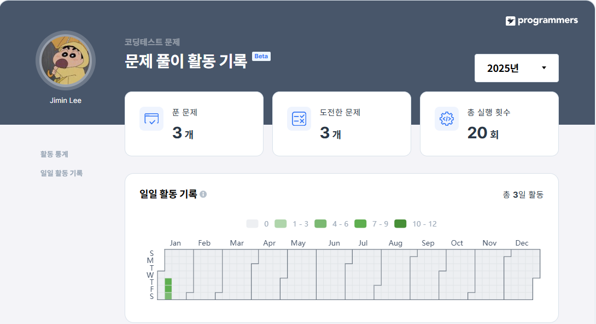

[25-W SQL 스터디] 1주차 과제
=========

> 🔍 **1. 잡은 물고기 중 가장 큰 물고기의 길이 구하기**  
사용 함수: SUM, MAX, MIN

문제 링크: [programmers](https://school.programmers.co.kr/learn/courses/30/lessons/298515)

날짜: 25/01/09(목)

### 문제 설명
낚시앱에서 사용하는 FISH_INFO 테이블은 잡은 물고기들의 정보를 담고 있습니다. FISH_INFO 테이블의 구조는 다음과 같으며 ID, FISH_TYPE, LENGTH, TIME은 각각 잡은 물고기의 ID, 물고기의 종류(숫자), 잡은 물고기의 길이(cm), 물고기를 잡은 날짜를 나타냅니다.


단, 잡은 물고기의 길이가 10cm 이하일 경우에는 LENGTH 가 NULL 이며, LENGTH 에 NULL 만 있는 경우는 없습니다.

### 문제
FISH_INFO 테이블에서 잡은 물고기 중 가장 큰 물고기의 길이를 'cm' 를 붙여 출력하는 SQL 문을 작성해주세요.

이 때 컬럼명은 'MAX_LENGTH' 로 지정해주세요.

### SQL 쿼리(정답)
```SQL
SELECT
    CONCAT(max(LENGTH), 'cm') AS MAX_LENGTH
FROM FISH_INFO
```
### 실행 결과(정답)
```SQL
MAX_LENGTH
---------
50.00cm
```

### 풀이 과정 및 고민한 점
```SQL
1. 가장 큰 물고기의 길이를 먼저 출력

SELECT
    max(LENGTH) AS MAX_LENGTH
FROM FISH_INFO

2. 최대 길이에 'cm'를 붙여야 하므로 CONCAT 사용

SELECT
    CONCAT(max(LENGTH), 'cm') AS MAX_LENGTH
FROM FISH_INFO
```

---

> 🔍 **2. 잡은 물고기의 평균 길이 구하기**  
사용 함수: IS NULL

문제 링크: [programmers](https://school.programmers.co.kr/learn/courses/30/lessons/293259)

날짜: 25/01/10(금)


### 문제 설명
낚시앱에서 사용하는 FISH_INFO 테이블은 잡은 물고기들의 정보를 담고 있습니다. FISH_INFO 테이블의 구조는 다음과 같으며 ID, FISH_TYPE, LENGTH, TIME은 각각 잡은 물고기의 ID, 물고기의 종류(숫자), 잡은 물고기의 길이(cm), 물고기를 잡은 날짜를 나타냅니다.


단, 잡은 물고기의 길이가 10cm 이하일 경우에는 LENGTH 가 NULL 이며, LENGTH 에 NULL 만 있는 경우는 없습니다.

### 문제
잡은 물고기의 평균 길이를 출력하는 SQL문을 작성해주세요.

평균 길이를 나타내는 컬럼 명은 AVERAGE_LENGTH로 해주세요.
평균 길이는 소수점 3째자리에서 반올림하며, 10cm 이하의 물고기들은 10cm 로 취급하여 평균 길이를 구해주세요.

### SQL 쿼리(정답)
```SQL
SELECT
    ROUND(avg(CASE WHEN LENGTH IS NULL THEN 10
            ELSE LENGTH
        END),2) AS AVERAGE_LENGTH
FROM FISH_INFO
```
### 실행 결과(정답)
```SQL
AVERAGE_LENGTH
--------------
26.67
```

### 풀이 과정 및 고민한 점
```SQL
1. NULL값을 10으로 바꾸기: CASE WHEN

SELECT
    CASE WHEN LENGTH IS NULL THEN 10
        ELSE LENGTH
    END
FROM FISH_INFO

NULL값이 채워짐을 확인.

2. 평균을 내고 컬럼명을 AVERAGE_LENGTH로 변경

SELECT
    avg(CASE WHEN LENGTH IS NULL THEN 10
            ELSE LENGTH
        END) AS AVERAGE_LENGTH
FROM FISH_INFO

26.666667이 나옴.

3. 소수점 셋째 자리에서 반올림

SELECT
    ROUND(avg(CASE WHEN LENGTH IS NULL THEN 10
            ELSE LENGTH
        END),2) AS AVERAGE_LENGTH
FROM FISH_INFO

26.67이 나옴.
소수점 함수는 찍어서 맞춤. 함수에 대한 공부가 필요할 듯함...
```

---

> 🔍 **3-A. 특정 옵션이 포함된 자동차 리스트 구하기**  
사용 함수: String, Date

문제 링크: [programmers](https://school.programmers.co.kr/learn/courses/30/lessons/157343)

날짜: 25/01/11(토)

### 문제 설명

다음은 어느 자동차 대여 회사에서 대여중인 자동차들의 정보를 담은 CAR_RENTAL_COMPANY_CAR 테이블입니다. CAR_RENTAL_COMPANY_CAR 테이블은 아래와 같은 구조로 되어있으며, CAR_ID, CAR_TYPE, DAILY_FEE, OPTIONS 는 각각 자동차 ID, 자동차 종류, 일일 대여 요금(원), 자동차 옵션 리스트를 나타냅니다.

자동차 종류는 '세단', 'SUV', '승합차', '트럭', '리무진' 이 있습니다. 자동차 옵션 리스트는 콤마(',')로 구분된 키워드 리스트(옵션 리스트 값 예시: '열선시트', '스마트키', '주차감지센서')로 되어있으며, 키워드 종류는 '주차감지센서', '스마트키', '네비게이션', '통풍시트', '열선시트', '후방카메라', '가죽시트' 가 있습니다.

### 문제

CAR_RENTAL_COMPANY_CAR 테이블에서 '네비게이션' 옵션이 포함된 자동차 리스트를 출력하는 SQL문을 작성해주세요. 결과는 자동차 ID를 기준으로 내림차순 정렬해주세요.

### SQL 쿼리(정답)
```SQL
SELECT
    *
FROM CAR_RENTAL_COMPANY_CAR
WHERE OPTIONS LIKE '%네비게이션%'
ORDER BY CAR_ID DESC
```
### 실행 결과(정답)
```SQL
car_id	car_type daily_fee options
----------------------------------
28	    리무진	 298000	   주차감지센서,스마트키,네비게이션,열선시트,후방카메라,가죽시트
23	    세단	 50000	   스마트키,네비게이션,열선시트
13	    승합차	 144000    네비게이션
```

### 풀이 과정 및 고민한 점
```SQL
1. OPTIONS 열에 '네비게이션' 문자열이 포함되어야 하므로 LIKE 사용
SELECT
    *
FROM CAR_RENTAL_COMPANY_CAR
WHERE OPTIONS LIKE '%네비게이션%'

2. 자동차 ID 기준 내림차순 정렬
SELECT
    *
FROM CAR_RENTAL_COMPANY_CAR
WHERE OPTIONS LIKE '%네비게이션%'
ORDER BY CAR_ID DESC
```
---

> 🔍 **3-B. 특정 옵션이 포함된 자동차 리스트 구하기**  
사용 함수: GROUP BY

문제 링크: [programmers](https://school.programmers.co.kr/learn/courses/30/lessons/151139)

날짜: YY/MM/DD()

### 문제 설명


### 문제


### SQL 쿼리(정답)
```SQL

```
### 실행 결과(정답)
```SQL

```

### 풀이 과정 및 고민한 점
```SQL

```
---
## 수행 인증

