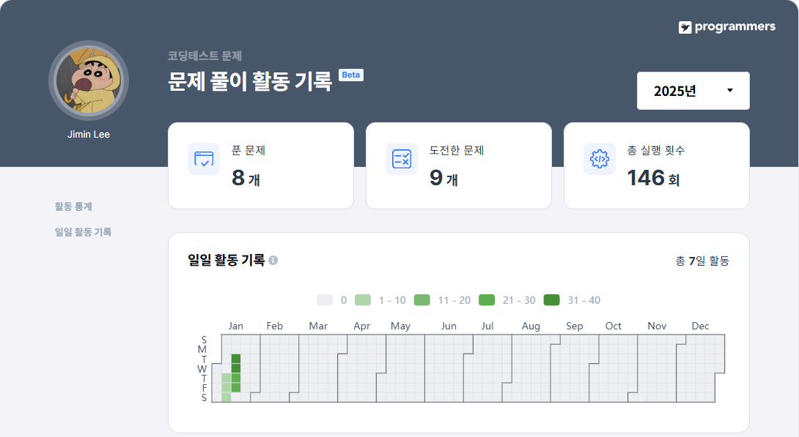
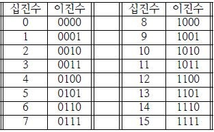
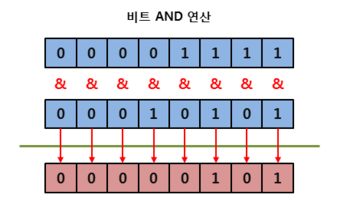

[25-W SQL 스터디] 2주차 과제
=========

> 🔍 **1. 과일로 만든 아이스크림 고르기**  
사용 함수: SELECT

문제 링크: [programmers](https://school.programmers.co.kr/learn/courses/30/lessons/133025)

날짜: 25/01/15(수)

### 문제 설명
다음은 아이스크림 가게의 상반기 주문 정보를 담은 FIRST_HALF 테이블과 아이스크림 성분에 대한 정보를 담은 ICECREAM_INFO 테이블입니다. FIRST_HALF 테이블 구조는 다음과 같으며, SHIPMENT_ID, FLAVOR, TOTAL_ORDER 는 각각 아이스크림 공장에서 아이스크림 가게까지의 출하 번호, 아이스크림 맛, 상반기 아이스크림 총주문량을 나타냅니다. FIRST_HALF 테이블의 기본 키는 FLAVOR입니다.

|NAME|TYPE|NULLABLE|
|---|--------|---|
|SHIPMENT_ID|INT(N)|FALSE|
|FLAVOR|VARCHAR(N)|FALSE|
|TOTAL_ORDER|INT(N)|FALSE|

ICECREAM_INFO 테이블 구조는 다음과 같으며, FLAVOR, INGREDITENT_TYPE 은 각각 아이스크림 맛, 아이스크림의 성분 타입을 나타냅니다. INGREDIENT_TYPE에는 아이스크림의 주 성분이 설탕이면 sugar_based라고 입력되고, 아이스크림의 주 성분이 과일이면 fruit_based라고 입력됩니다. ICECREAM_INFO의 기본 키는 FLAVOR입니다. ICECREAM_INFO테이블의 FLAVOR는 FIRST_HALF 테이블의 FLAVOR의 외래 키입니다.

|NAME|TYPE|NULLABLE|
|---|--------|---|
|FLAVOR|VARCHAR(N)|FALSE|
|INGREDIENT_TYPE|VARCHAR(N)|FALSE|


### 문제
상반기 아이스크림 총주문량이 3,000보다 높으면서 아이스크림의 주 성분이 과일인 아이스크림의 맛을 총주문량이 큰 순서대로 조회하는 SQL 문을 작성해주세요.

### SQL 쿼리(정답)
```SQL
SELECT 
    F.FLAVOR
FROM FIRST_HALF AS F
    LEFT JOIN ICECREAM_INFO AS I
    ON I.FLAVOR = F.FLAVOR
WHERE TOTAL_ORDER >= 3000 AND INGREDIENT_TYPE = 'fruit_based'
ORDER BY TOTAL_ORDER DESC
```
### 실행 결과(정답)
```SQL
FLAVOR
----------
strawberry
```

### 풀이 과정 및 고민한 점
```SQL
1. 두 테이블 JOIN. 주문 정보가 주요 정보이므로 FIRST_HALF에 ICECREAM_INFO를 LEFT JOIN함.

SELECT 
    *
FROM FIRST_HALF AS F
    LEFT JOIN ICECREAM_INFO AS I
    ON I.FLAVOR = F.FLAVOR

2. '총주문량이 3,000보다 높으면서 아이스크림의 주 성분이 과일인 아이스크림의 맛' -> WHERE 절에서 AND로 두 조건을 연결

SELECT 
    *
FROM FIRST_HALF AS F
    LEFT JOIN ICECREAM_INFO AS I
    ON I.FLAVOR = F.FLAVOR
WHERE TOTAL_ORDER >= 3000 AND INGREDIENT_TYPE = 'fruit_based'

3. TOTAL_ORDER 내림차순 정렬, FLAVOR만 출력

SELECT 
    F.FLAVOR
FROM FIRST_HALF AS F
    LEFT JOIN ICECREAM_INFO AS I
    ON I.FLAVOR = F.FLAVOR
WHERE TOTAL_ORDER >= 3000 AND INGREDIENT_TYPE = 'fruit_based'
ORDER BY TOTAL_ORDER DESC

```
- JOIN을 간만에 보았다
- JOIN한 테이블을 SELECT문에 넣을 때 테이블을 지정하지 않으면 다음과 같은 오류 발생: 'Column 'FLAVOR' in field list is ambiguous'. 테이블명을 명시하자.

---

> 🔍 **2. 자동차 종류 별 특정 옵션이 포함된 자동차 수 구하기**  
사용 함수: GROUP BY

문제 링크: [programmers](https://school.programmers.co.kr/learn/courses/30/lessons/151137)

날짜: 25/01/15(수)


### 문제 설명
다음은 어느 자동차 대여 회사에서 대여중인 자동차들의 정보를 담은 CAR_RENTAL_COMPANY_CAR 테이블입니다. CAR_RENTAL_COMPANY_CAR 테이블은 아래와 같은 구조로 되어있으며, CAR_ID, CAR_TYPE, DAILY_FEE, OPTIONS 는 각각 자동차 ID, 자동차 종류, 일일 대여 요금(원), 자동차 옵션 리스트를 나타냅니다.

|Column name|Type|Nullable|
|---|--------|---|
|CAR_ID|INTEGER|FALSE
|CAR_TYPE|VARCHAR(255)|FALSE
|DAILY_FEE|INTEGER|FALSE
|OPTIONS|VARCHAR(255)|FALSE

자동차 종류는 '세단', 'SUV', '승합차', '트럭', '리무진' 이 있습니다. 자동차 옵션 리스트는 콤마(',')로 구분된 키워드 리스트(옵션 리스트 값 예시: '열선시트', '스마트키', '주차감지센서')로 되어있으며, 키워드 종류는 '주차감지센서', '스마트키', '네비게이션', '통풍시트', '열선시트', '후방카메라', '가죽시트' 가 있습니다.

### 문제

CAR_RENTAL_COMPANY_CAR 테이블에서 '통풍시트', '열선시트', '가죽시트' 중 하나 이상의 옵션이 포함된 자동차가 자동차 종류 별로 몇 대인지 출력하는 SQL문을 작성해주세요. 이때 자동차 수에 대한 컬럼명은 CARS로 지정하고, 결과는 자동차 종류를 기준으로 오름차순 정렬해주세요.

### SQL 쿼리(정답)
```SQL
1. LIKE: 쉬우나 비효율적

SELECT 
    CAR_TYPE,
    COUNT(CAR_ID) AS CARS
FROM CAR_RENTAL_COMPANY_CAR
WHERE OPTIONS LIKE '%통풍시트%' 
    OR OPTIONS LIKE '%열선시트%' 
    OR OPTIONS LIKE '%가죽시트%' 
GROUP BY CAR_TYPE
ORDER BY CAR_TYPE

2. REGEXP: 가독성을 챙김

SELECT 
    CAR_TYPE,
    COUNT(CAR_ID) AS CARS
FROM CAR_RENTAL_COMPANY_CAR 
WHERE OPTIONS REGEXP '(통풍시트|열선시트|가죽시트)'
GROUP BY CAR_TYPE
ORDER BY CAR_TYPE
```
### 실행 결과(정답)
```SQL
CAR_TYPE	CARS
----------------
SUV	        6
리무진	    2
세단	    6
승합차	    3
트럭	    3
```

### 풀이 과정 및 고민한 점
```SQL
1. '통풍시트', '열선시트', '가죽시트' 중 하나만 포함되어도 출력되도록 함.
LIKE문을 OR로 연결하는 것보다 쉬운 방법이 있는지 찾아봄. (=REGEXP)

SELECT 
    *
FROM CAR_RENTAL_COMPANY_CAR 
WHERE OPTIONS REGEXP '(통풍시트|열선시트|가죽시트)'

2. CAR_TYPE별 COUNT를 출력해야 하므로 GROUP BY 사용, SELECT문에 COUNT 함수 사용

SELECT 
    CAR_TYPE,
    COUNT(CAR_ID) AS CARS
FROM CAR_RENTAL_COMPANY_CAR 
WHERE OPTIONS REGEXP '(통풍시트|열선시트|가죽시트)'
GROUP BY CAR_TYPE

3. CAR_TYPE 오름차순 정렬

SELECT 
    CAR_TYPE,
    COUNT(CAR_ID) AS CARS
FROM CAR_RENTAL_COMPANY_CAR 
WHERE OPTIONS REGEXP '(통풍시트|열선시트|가죽시트)'
GROUP BY CAR_TYPE
ORDER BY CAR_TYPE
```
- **MySQL REGEXP 사용 방법: 여러 개의 특정 문자를 동시에 검색하고 싶을 때**  
WHERE 조건식에 특정 문자들이 검색될 열 입력, REGEXP('검색문자1|검색문자2|...')  
(따옴표는 어디에 넣어도 되는 것 같다)
---

> 🔍 **3. 가장 큰 물고기 10마리 구하기**  
사용 함수: SELECT

문제 링크: [programmers](https://school.programmers.co.kr/learn/courses/30/lessons/298517)

날짜: 25/01/16(목)

### 문제 설명
낚시앱에서 사용하는 FISH_INFO 테이블은 잡은 물고기들의 정보를 담고 있습니다. FISH_INFO 테이블의 구조는 다음과 같으며 ID, FISH_TYPE, LENGTH, TIME은 각각 잡은 물고기의 ID, 물고기의 종류(숫자), 잡은 물고기의 길이(cm), 물고기를 잡은 날짜를 나타냅니다.

|Column name|Type|Nullable|
|---|---|---|
ID|	INTEGER|	FALSE
FISH_TYPE|	INTEGER	|FALSE
LENGTH	|FLOAT	|TRUE
TIME	|DATE	|FALSE

단, 잡은 물고기의 길이가 10cm 이하일 경우에는 LENGTH 가 NULL 이며, LENGTH 에 NULL 만 있는 경우는 없습니다.

### 문제
FISH_INFO 테이블에서 가장 큰 물고기 10마리의 ID와 길이를 출력하는 SQL 문을 작성해주세요. 결과는 길이를 기준으로 내림차순 정렬하고, 길이가 같다면 물고기의 ID에 대해 오름차순 정렬해주세요. 단, 가장 큰 물고기 10마리 중 길이가 10cm 이하인 경우는 없습니다.

ID 컬럼명은 ID, 길이 컬럼명은 LENGTH로 해주세요.

### SQL 쿼리(정답)
```SQL
SELECT
    ID, 
    LENGTH
FROM FISH_INFO
ORDER BY LENGTH DESC, ID ASC
LIMIT 10
```
### 실행 결과(정답)
```SQL
ID	LENGTH
----------
8	73
9	73
6	60
7	55
1	50
2	40
0	30
10	22
3	20
11	17
```

### 풀이 과정 및 고민한 점
```SQL
1. ID, LENGTH 컬럼 출력, 길이 내림차순, ID 오름차순
SELECT
    ID, 
    LENGTH
FROM FISH_INFO
ORDER BY LENGTH DESC, ID ASC

2. 가장 큰 10마리 물고기->LIMIT 10
SELECT
    ID, 
    LENGTH
FROM FISH_INFO
ORDER BY LENGTH DESC, ID ASC
LIMIT 10

가장 큰 물고기 10마리 중 길이가 10cm 이하인 경우는 없으므로 따로 처리하지 않음.
```


---

> 🔍 **4. 조건에 부합하는 중고거래 상태 조회하기**  
사용 함수: String, Date

문제 링크: [programmers](https://school.programmers.co.kr/learn/courses/30/lessons/164672)

날짜: 25/01/16(목)


### 문제 설명
다음은 중고거래 게시판 정보를 담은 USED_GOODS_BOARD 테이블입니다. USED_GOODS_BOARD 테이블은 다음과 같으며 BOARD_ID, WRITER_ID, TITLE, CONTENTS, PRICE, CREATED_DATE, STATUS, VIEWS은 게시글 ID, 작성자 ID, 게시글 제목, 게시글 내용, 가격, 작성일, 거래상태, 조회수를 의미합니다.

|Column name|	Type|	Nullable|
|---|---|---|
|BOARD_ID	|VARCHAR(5)	|FALSE|
|WRITER_ID	|VARCHAR(50)	|FALSE|
|TITLE	|VARCHAR(100)	|FALSE|
|CONTENTS	|VARCHAR(1000)	|FALSE|
|PRICE	|NUMBER	|FALSE|
|CREATED_DATE	|DATE	|FALSE|
|STATUS	|VARCHAR(10)	|FALSE|
|VIEWS	|NUMBER	|FALSE|

### 문제
USED_GOODS_BOARD 테이블에서 2022년 10월 5일에 등록된 중고거래 게시물의 게시글 ID, 작성자 ID, 게시글 제목, 가격, 거래상태를 조회하는 SQL문을 작성해주세요. 거래상태가 SALE 이면 판매중, RESERVED이면 예약중, DONE이면 거래완료 분류하여 출력해주시고, 결과는 게시글 ID를 기준으로 내림차순 정렬해주세요.

### SQL 쿼리(정답)
```SQL
SELECT 
    BOARD_ID,
    WRITER_ID,
    TITLE,
    PRICE,
    CASE WHEN STATUS='SALE' THEN '판매중'
        WHEN STATUS='RESERVED' THEN '예약중'
        ELSE '거래완료'
    END AS STATUS
FROM USED_GOODS_BOARD
WHERE CREATED_DATE = '2022-10-05'
ORDER BY BOARD_ID DESC
```
### 실행 결과(정답)
```SQL
BOARD_ID WRITER_ID  TITLE                            PRICE   STATUS
----------------------------------------------------------------------
B0013   kwag98      삼성 65인치 led tv 팝니다         320000  예약중
B0012   hwahwa2     에어팟 프로 팔아요                125000  거래완료
B0011   sangyoung58 아이폰14프로 256기가 자급제팔아요 1500000 거래완료
B0010   keel1990    철제선반5단                       10000   판매중
B0009   yawoong67   선반 팝니다                       12000   거래완료

```

### 풀이 과정 및 고민한 점
```SQL
1. 2022-10-05 조건, BOARD_ID 기준 내림차순 정렬

SELECT 
    BOARD_ID,
    WRITER_ID,
    TITLE,
    PRICE,
    STATUS
FROM USED_GOODS_BOARD
WHERE CREATED_DATE = '2022-10-05'
ORDER BY BOARD_ID DESC

2. CASE WHEN을 사용하여 STATUS의 값 변경

SELECT 
    BOARD_ID,
    WRITER_ID,
    TITLE,
    PRICE,
    CASE WHEN STATUS='SALE' THEN '판매중'
        WHEN STATUS='RESERVED' THEN '예약중'
        ELSE '거래완료'
    END AS STATUS
FROM USED_GOODS_BOARD
WHERE CREATED_DATE = '2022-10-05'
ORDER BY BOARD_ID DESC
```

---

> 🔍 **5. 조건에 맞는 사용자 정보 조회하기**  
사용 함수:  String, Date

문제 링크: [programmers](https://school.programmers.co.kr/learn/courses/30/lessons/164670)

날짜: 25/01/17(금)

### 문제 설명
다음은 중고 거래 게시판 정보를 담은 USED_GOODS_BOARD 테이블과 중고 거래 게시판 첨부파일 정보를 담은 USED_GOODS_USER 테이블입니다. USED_GOODS_BOARD 테이블은 다음과 같으며 BOARD_ID, WRITER_ID, TITLE, CONTENTS, PRICE, CREATED_DATE, STATUS, VIEWS는 게시글 ID, 작성자 ID, 게시글 제목, 게시글 내용, 가격, 작성일, 거래상태, 조회수를 의미합니다.


USED_GOODS_USER 테이블은 다음과 같으며 USER_ID, NICKNAME, CITY, STREET_ADDRESS1, STREET_ADDRESS2, TLNO는 각각 회원 ID, 닉네임, 시, 도로명 주소, 상세 주소, 전화번호를 의미합니다.

### 문제
USED_GOODS_BOARD와 USED_GOODS_USER 테이블에서 중고 거래 게시물을 3건 이상 등록한 사용자의 사용자 ID, 닉네임, 전체주소, 전화번호를 조회하는 SQL문을 작성해주세요. 이때, 전체 주소는 시, 도로명 주소, 상세 주소가 함께 출력되도록 해주시고, 전화번호의 경우 xxx-xxxx-xxxx 같은 형태로 하이픈 문자열(-)을 삽입하여 출력해주세요. 결과는 회원 ID를 기준으로 내림차순 정렬해주세요.

### SQL 쿼리(정답)
```SQL
WITH BOARD_CNT AS (
        SELECT 
            WRITER_ID,
            COUNT(BOARD_ID) AS B_CNT
        FROM USED_GOODS_BOARD
        GROUP BY WRITER_ID
)

SELECT
    USER_ID,
    NICKNAME,
    CONCAT(CITY, ' ', STREET_ADDRESS1, ' ', STREET_ADDRESS2) AS 전체주소,
    CONCAT(SUBSTR(TLNO, 1, 3), '-', SUBSTR(TLNO, 4, 4), '-', SUBSTR(TLNO, 8, 4)) AS 전화번호
FROM USED_GOODS_USER AS U
LEFT JOIN BOARD_CNT AS B
ON U.USER_ID = B.WRITER_ID
WHERE B_CNT >= 3
ORDER BY USER_ID DESC
```
### 실행 결과(정답)
```SQL
USER_ID  NICKNAME 전체주소                               전화번호
------------------------------------------------------------------------
xlqpfh2  잉여킹   성남시 분당구 수내로 1 001-004          010-6453-4911
xlaortm1 투더문   성남시 분당구 내정로165번길 35 104-1202 010-3255-5431
spdlqj12 크크큭   성남시 분당구 수내로 206 2019동 801호   010-8723-4922
.
.
.
```

### 풀이 과정 및 고민한 점
```SQL
1. 게시물 수 집계: WITH문 사용

WITH BOARD_CNT AS (
        SELECT 
            WRITER_ID,
            COUNT(BOARD_ID) AS B_CNT
        FROM USED_GOODS_BOARD
        GROUP BY WRITER_ID
)

2. 두 테이블 JOIN, BOARD_ID 3건 이상 조건 설정, 회원ID 내림차순
SELECT
    USER_ID,
    NICKNAME,
    () AS 전체주소,
    () AS 전화번호
FROM USED_GOODS_USER AS U
LEFT JOIN BOARD_CNT AS B
ON U.USER_ID = B.WRITER_ID
WHERE B_CNT >= 3
ORDER BY BOARD_ID DESC

3. 전체주소: 시+도로명 주소+상세 주소, 띄어쓰기 추가

CONCAT(CITY, ' ', STREET_ADDRESS1, ' ', STREET_ADDRESS2) AS 전체주소

4. 전화번호 사이 하이픈 삽입

CONCAT(SUBSTR(TLNO, 1, 3), '-', SUBSTR(TLNO, 4, 4), '-', SUBSTR(TLNO, 8, 4)) AS 전화번호
```
- `CONCAT()`은 띄어쓰기 없이 연결됨
- `SUBSTR(문자열, 시작 위치, 길이)`
---

> 🔍 **5. 조건에 맞는 사용자와 총 거래금액 조회하기**  
사용 함수: GROUP BY

문제 링크: [programmers](https://school.programmers.co.kr/learn/courses/30/lessons/164668)

날짜: 25/01/21(화)

### 문제 설명
다음은 중고 거래 게시판 정보를 담은 USED_GOODS_BOARD 테이블과 중고 거래 게시판 사용자 정보를 담은 USED_GOODS_USER 테이블입니다. USED_GOODS_BOARD 테이블은 다음과 같으며 BOARD_ID, WRITER_ID, TITLE, CONTENTS, PRICE, CREATED_DATE, STATUS, VIEWS는 게시글 ID, 작성자 ID, 게시글 제목, 게시글 내용, 가격, 작성일, 거래상태, 조회수를 의미합니다.


USED_GOODS_USER 테이블은 다음과 같으며 USER_ID, NICKNAME, CITY, STREET_ADDRESS1, STREET_ADDRESS2, TLNO는 각각 회원 ID, 닉네임, 시, 도로명 주소, 상세 주소, 전화번호를 를 의미합니다.

### 문제
USED_GOODS_BOARD와 USED_GOODS_USER 테이블에서 완료된 중고 거래의 총금액이 70만 원 이상인 사람의 회원 ID, 닉네임, 총거래금액을 조회하는 SQL문을 작성해주세요. 결과는 총거래금액을 기준으로 오름차순 정렬해주세요.

### SQL 쿼리(정답)
```SQL
WITH BOARD AS (
        SELECT 
            WRITER_ID,
            SUM(PRICE) AS TOTAL_SALES
        FROM USED_GOODS_BOARD
        WHERE STATUS = 'DONE'
        GROUP BY WRITER_ID
)

SELECT
    USER_ID,
    NICKNAME,
    TOTAL_SALES
FROM USED_GOODS_USER AS U
LEFT JOIN BOARD AS B
ON U.USER_ID = B.WRITER_ID
WHERE TOTAL_SALES >= 700000
ORDER BY TOTAL_SALES
```
### 실행 결과(정답)
```SQL
USER_ID    NICKNAME   TOTAL_SALES
---------------------------------
zkzkdh1    후후후     700000
dhfkzmf09  찐찐       860000
sangyoung58 보라보라  1500000
```

### 풀이 과정 및 고민한 점
```SQL
1. WITH문에서 TOTAL_SALES, STATUS = 'DONE' 계산

WITH BOARD AS (
        SELECT 
            WRITER_ID,
            SUM(PRICE) AS TOTAL_SALES
        FROM USED_GOODS_BOARD
        WHERE STATUS = 'DONE'
        GROUP BY WRITER_ID
)

2. WITH문으로 계산한 테이블을 조인, TOTAL_SALES >= 700000 조건, TOTAL_SALES 오름차순 정렬

WITH BOARD AS (
        SELECT 
            WRITER_ID,
            SUM(PRICE) AS TOTAL_SALES
        FROM USED_GOODS_BOARD
        WHERE STATUS = 'DONE'
        GROUP BY WRITER_ID
)

SELECT
    USER_ID,
    NICKNAME,
    TOTAL_SALES
FROM USED_GOODS_USER AS U
LEFT JOIN BOARD AS B
ON U.USER_ID = B.WRITER_ID
WHERE TOTAL_SALES >= 700000
ORDER BY TOTAL_SALES
```

---


## 수행 인증



---

```SQL
SELECT
    COUNT(ID) AS COUNT
FROM ECOLI_DATA
WHERE ((GENOTYPE & 1) 
       OR (GENOTYPE & 4)) 
       AND !(GENOTYPE & 2)
```





- AND 연산자(&): 두 개의 비트가 모두 1일 때만 1(TRUE)을 반환함.

- ex) ID 4 : 1101₍₂₎  
형질 1 or 3을 가지고 있음+형질 2을 가지지 않음  
    - (GENOTYPE & 1) -> (1101 & 0001) -> 형질 1을 가지고 있다.
    - (GENOTYPE & 4) -> (1101 & 1000) -> 형질 3을 가지고 있다.
    - !(GENOTYPE & 2) -> !(1101 & 0100) -> 형질 2를 가지고 있지 않다.


```SQL
형질 1: 1 / 0001
형질 2: 2 / 0010
형질 3: 4 / 0100
형질 4: 8 / 1000
```