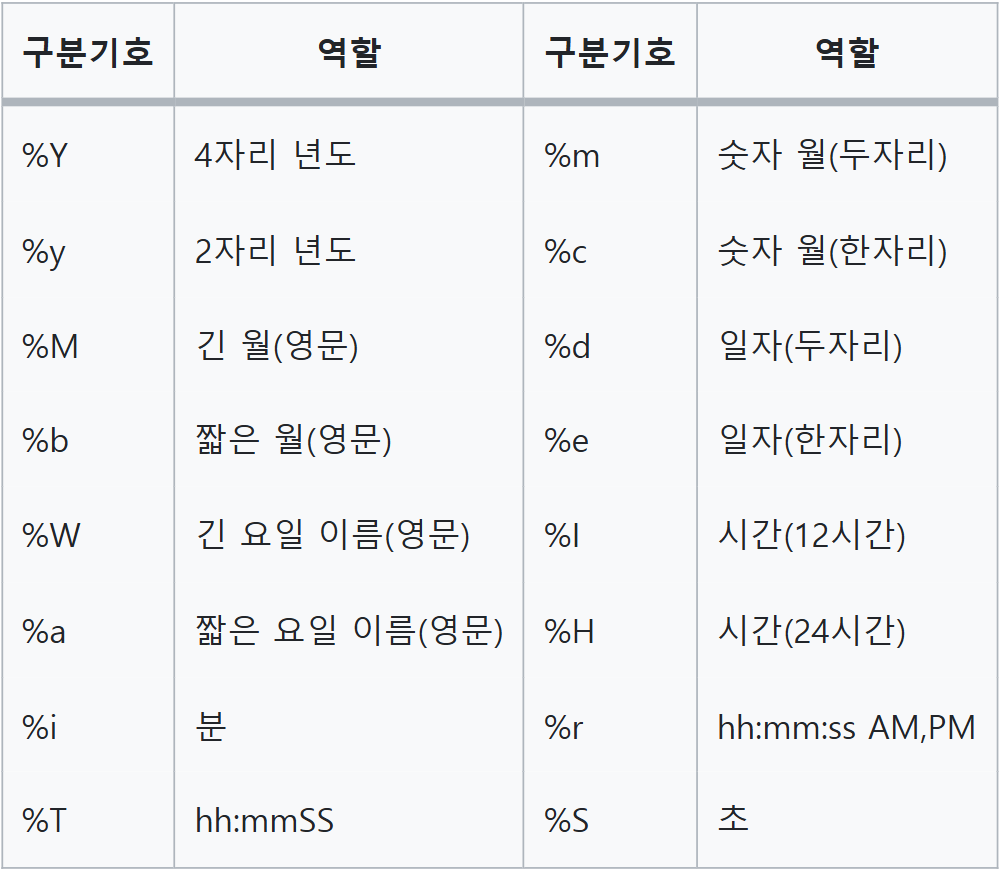
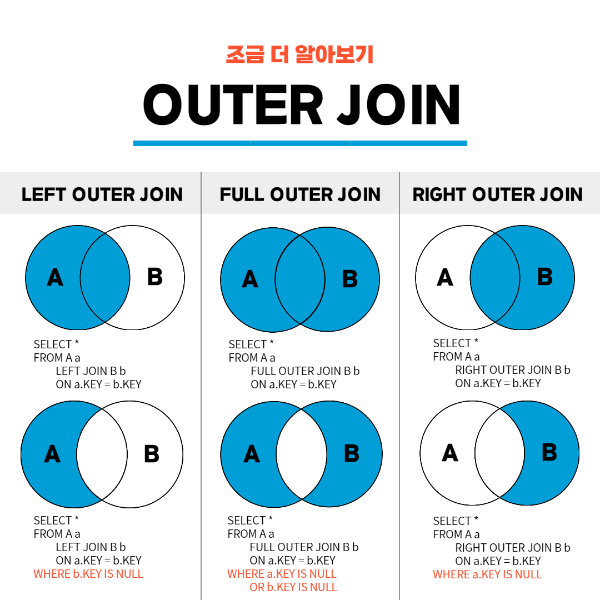

[25-W SQL 스터디] 3주차 과제
=========
목차

[1. 최솟값 구하기](#문제1)  
[2. 동명 동물 수 찾기](#문제2)  
[3. 이름에 el이 들어가는 동물 찾기](#문제3)  
[4. NULL 처리하기](#문제4)  
[5. DATETIME에서 DATE로 형 변환](#문제5)  
[6. 가격이 제일 비싼 식품의 정보 출력하기](#문제6)  
[7. 조건에 맞는 아이템들의 가격의 총합 구하기](#문제7)  
[8. 중복 제거하기](#문제8)  
[9. 동물 수 구하기](#문제9)  
[10. 카테고리 별 상품 개수 구하기](#문제10)  
[11. 진료과별 총 예약 횟수 출력하기](#문제11)  
[12. 고양이와 개는 몇 마리 있을까](#문제12)  
[13. 중성화 여부 파악하기](#문제13)  
[14. 입양 시각 구하기(1)](#문제14)  
[15. 조건에 맞는 도서와 저자 리스트 출력하기](#문제15)  
[16. 상품 별 오프라인 매출 구하기](#문제16)  
[17. 성분으로 구분한 아이스크림 총 주문량](#문제17)  
[18. 3월에 태어난 여성 회원 목록 출력하기](#문제18)  
[19. 루시와 엘라 찾기](#문제19)  
[20. 오랜 기간 보호한 동물(1)](#문제20)  

---
## 문제1
> 🔍 **1. 최솟값 구하기**  
사용 함수: SUM, MAX, MIN

문제 링크: [programmers](https://school.programmers.co.kr/learn/courses/30/lessons/59038)

날짜: 25/01/22(수)

### 문제
동물 보호소에 가장 먼저 들어온 동물은 언제 들어왔는지 조회하는 SQL 문을 작성해주세요.

### SQL 쿼리(정답)
```SQL
SELECT
    MIN(DATETIME) AS 시간
FROM ANIMAL_INS
```
### 실행 결과(정답)
```SQL
시간
-------------------
2013-10-14 15:38:00
```

### 풀이 과정 및 고민한 점
```SQL
동물 보호소에 가장 먼저 들어온 동물->MIN(DATETIME)
```

---
## 문제2
> 🔍 **2. 동명 동물 수 찾기**  
사용 함수: GROUP BY

문제 링크: [programmers](https://school.programmers.co.kr/learn/courses/30/lessons/59041)

날짜: 25/01/22(수)

### 문제
동물 보호소에 들어온 동물 이름 중 두 번 이상 쓰인 이름과 해당 이름이 쓰인 횟수를 조회하는 SQL문을 작성해주세요. 이때 결과는 이름이 없는 동물은 집계에서 제외하며, 결과는 이름 순으로 조회해주세요.

### SQL 쿼리(정답)
```SQL
SELECT
    NAME,
    COUNT(ANIMAL_ID) AS COUNT
FROM ANIMAL_INS
WHERE NAME IS NOT NULL
GROUP BY NAME
HAVING COUNT >= 2
ORDER BY NAME
```
### 실행 결과(정답)
```SQL
NAME	COUNT
-------------
Lucy	3
Raven	2
```

### 풀이 과정 및 고민한 점
```SQL
1. NAME으로 GROUP BY하여 NAME, COUNT 조회

SELECT
    NAME,
    COUNT(ANIMAL_ID) AS COUNT
FROM ANIMAL_INS
GROUP BY NAME

2. NAME이 NULL이면 제외
SELECT
    NAME,
    COUNT(ANIMAL_ID) AS COUNT
FROM ANIMAL_INS
WHERE NAME IS NOT NULL
GROUP BY NAME

3. COUNT >= 2, NAME 오름차순 정렬

SELECT
    NAME,
    COUNT(ANIMAL_ID) AS COUNT
FROM ANIMAL_INS
WHERE NAME IS NOT NULL
GROUP BY NAME
HAVING COUNT >= 2
ORDER BY NAME
```

---
## 문제3
> 🔍 **3. 이름에 el이 들어가는 동물 찾기**  
사용 함수: String, Date

문제 링크: [programmers](https://school.programmers.co.kr/learn/courses/30/lessons/59047)

날짜: 25/01/22(수)

### 문제
보호소에 돌아가신 할머니가 기르던 개를 찾는 사람이 찾아왔습니다. 이 사람이 말하길 할머니가 기르던 개는 이름에 'el'이 들어간다고 합니다. 동물 보호소에 들어온 동물 이름 중, 이름에 "EL"이 들어가는 개의 아이디와 이름을 조회하는 SQL문을 작성해주세요. 이때 결과는 이름 순으로 조회해주세요. 단, 이름의 대소문자는 구분하지 않습니다.

### SQL 쿼리(정답)
```SQL
SELECT
    ANIMAL_ID,
    NAME
FROM ANIMAL_INS
WHERE ANIMAL_TYPE='Dog' 
    AND NAME LIKE '%EL%'
ORDER BY NAME

```
### 실행 결과(정답)
```SQL
ANIMAL_ID	NAME
----------------
A355753	Elijah
A382192	Maxwell 2
A391858	Nellie
A414198	Shelly
```

### 풀이 과정 및 고민한 점
```SQL
1. 생물 종이 Dog이면서 이름에 'el' 포함->LIKE, 이름 기준 오름차순
SELECT
    ANIMAL_ID,
    NAME
FROM ANIMAL_INS
WHERE ANIMAL_TYPE='Dog' 
    AND NAME LIKE '%EL%'
ORDER BY NAME
```


---
## 문제4
> 🔍 **4. NULL 처리하기**  
사용 함수: IS NULL

문제 링크: [programmers](https://school.programmers.co.kr/learn/courses/30/lessons/59410)

날짜: 25/01/22(수)


### 문제
입양 게시판에 동물 정보를 게시하려 합니다. 동물의 생물 종, 이름, 성별 및 중성화 여부를 아이디 순으로 조회하는 SQL문을 작성해주세요. 이때 프로그래밍을 모르는 사람들은 NULL이라는 기호를 모르기 때문에, 이름이 없는 동물의 이름은 "No name"으로 표시해 주세요.

### SQL 쿼리(정답)
```SQL
1. IFNULL

SELECT
    ANIMAL_TYPE,
    IFNULL(NAME, "No name") AS NAME,
    SEX_UPON_INTAKE
FROM ANIMAL_INS
ORDER BY ANIMAL_ID

2. CASE WHEN

SELECT
    ANIMAL_TYPE,
    CASE 
        WHEN NAME IS NULL THEN "No name"
        ELSE NAME
    END AS NAME,
    SEX_UPON_INTAKE
FROM ANIMAL_INS
ORDER BY ANIMAL_ID

```
### 실행 결과(정답)
```SQL 
ANIMAL_TYPE NAME   SEX_UPON_INTAKE
-----------------------------------
Cat         Sugar  Neutered Male
Cat         Jewel  Spayed Female
.
.
.
```

### 풀이 과정 및 고민한 점
```SQL
NULL값이면 "No name"으로 대체

1. IFNULL(컬럼명, 'NULL인 경우 대체할 값')

IFNULL(NAME, "No name") AS NAME

2. CASE WHEN

CASE 
    WHEN NAME IS NULL THEN "No name"
    ELSE NAME
END AS NAME
```

---
## 문제5
> 🔍 **5. DATETIME에서 DATE로 형 변환**  
사용 함수: String, Date

문제 링크: [programmers](https://school.programmers.co.kr/learn/courses/30/lessons/59414)

날짜: 25/01/22(수)

### 문제
ANIMAL_INS 테이블에 등록된 모든 레코드에 대해, 각 동물의 아이디와 이름, 들어온 날짜1를 조회하는 SQL문을 작성해주세요. 이때 결과는 아이디 순으로 조회해야 합니다.

### SQL 쿼리(정답)
```SQL
SELECT
    ANIMAL_ID,
    NAME,
    DATE_FORMAT(DATETIME, "%Y-%m-%d") AS 날짜
FROM ANIMAL_INS
ORDER BY ANIMAL_ID
```
### 실행 결과(정답)
```SQL
ANIMAL_ID NAME   날짜
--------------------------
A349996	  Sugar	 2018-01-22
A350276	  Jewel	 2017-08-13
A350375	  Meo	 2017-03-06
```

### 풀이 과정 및 고민한 점
```SQL
날짜에서 연월일만 추출하는 방법을 고민함.

SELECT
    ANIMAL_ID,
    NAME,
    DATE_FORMAT(DATETIME, "%Y-%m-%d") AS 날짜
FROM ANIMAL_INS
ORDER BY ANIMAL_ID
```
- DATE_FORMAT(컬럼명,'%Y-%m-%d')
- DATE_FORMAT에서 사용하는 구분기호  


- MYSQL에서 사용하는 날짜 관련 함수들
    - dayofweek(date) : 날짜를 한 주의 몇번째 요일인지를 숫자로 (1 = 일, 2 = 월)
    - weekday(date) : 날짜를 한 주의 몇번째 요일인지를 숫자로 (0 = 월, 1 = 화)
    - dayofmonth(date) : 그 달의 몇 번째 날, 리턴값은 1~ 31
    - dayofyear(date) : 한 해의 몇 번째 날인지, 리턴값은 1 ~ 366
    - month(date) : 몇 월, 리턴값은 1~ 12
    - dayname(date) : 영어식 요일 이름
    - monthname(date) : 영어식 월 이름
    - quarter(date) : 분기
    - week(date) : 몇 번째 주일
    - week(date, first) : 주어진 인수로 한 주의 시작일을 지정 (0이면 일요일, 1이면 월요일을 시작으로 지정)
    - year(date) : 년도
    - hour(time) : 시간(0~23)
    - minute(time) : 분 (0~59)
    - second(time) : 초 (0~59)
    - period_add(p,n) : 주어진 달에 n개월을 더함 , 리턴값은 yyyymm
    - period_diff(p1,p2) : 주어진 두 기간 사이의 개월


---

## 문제6
> 🔍 **6. 가격이 제일 비싼 식품의 정보 출력하기**  
사용 함수: SUM, MAX, MIN

문제 링크: [programmers](https://school.programmers.co.kr/learn/courses/30/lessons/131115)

날짜: 25/01/22(수)

### 문제
FOOD_PRODUCT 테이블에서 가격이 제일 비싼 식품의 식품 ID, 식품 이름, 식품 코드, 식품분류, 식품 가격을 조회하는 SQL문을 작성해주세요.

### SQL 쿼리(정답)
```SQL
1. LIMIT

SELECT
    *
FROM FOOD_PRODUCT
ORDER BY PRICE DESC
LIMIT 1

2. MAX 함수+WHERE 서브쿼리

SELECT
    PRODUCT_ID,
    PRODUCT_NAME,
    PRODUCT_CD,
    CATEGORY,
    PRICE
FROM FOOD_PRODUCT
WHERE PRICE = (SELECT MAX(PRICE) AS PRICE FROM FOOD_PRODUCT)
```
### 실행 결과(정답)
```SQL
PRODUCT_ID	PRODUCT_NAME	PRODUCT_CD	CATEGORY	PRICE
------------------------------------------------------------------------
P0051	    맛있는배추김치	CD_KC00001	김치	    19000
```

### 풀이 과정 및 고민한 점
```SQL
1. LIMIT: PRICE 내림차순 정렬, 첫 행만 출력

SELECT
    *
FROM FOOD_PRODUCT
ORDER BY PRICE DESC
LIMIT 1

2. MAX 함수+WHERE 서브쿼리: 뭔가 MAX 함수를 써야할 것만 같았음.
WHERE절에서 PRICE 값이 MAX(PRICE)인 행만 선택.

SELECT
    PRODUCT_ID,
    PRODUCT_NAME,
    PRODUCT_CD,
    CATEGORY,
    PRICE
FROM FOOD_PRODUCT
WHERE PRICE = (SELECT MAX(PRICE) AS PRICE FROM FOOD_PRODUCT)
```

---
## 문제7
> 🔍 **7. 조건에 맞는 아이템들의 가격의 총합 구하기**  
사용 함수: SUM, MAX, MIN

문제 링크: [programmers](https://school.programmers.co.kr/learn/courses/30/lessons/273709)

날짜: 25/01/22(수)


### 문제
ITEM_INFO 테이블에서 희귀도가 'LEGEND'인 아이템들의 가격의 총합을 구하는 SQL문을 작성해 주세요. 이때 컬럼명은 'TOTAL_PRICE'로 지정해 주세요.

### SQL 쿼리(정답)
```SQL
SELECT
    SUM(PRICE) AS TOTAL_PRICE
FROM ITEM_INFO
WHERE RARITY = 'LEGEND'
```
### 실행 결과(정답)
```SQL
TOTAL_PRICE
-----------
32000
```

### 풀이 과정 및 고민한 점
```SQL
RARITY='LEGEND'인 행(WHERE 조건)의 PRICE 합계(SUM)
```

---
## 문제8
> 🔍 **8. 중복 제거하기**  
사용 함수: SUM, MAX, MIN

문제 링크: [programmers](https://school.programmers.co.kr/learn/courses/30/lessons/59408)

날짜: 25/01/22(수)

### 문제
동물 보호소에 들어온 동물의 이름은 몇 개인지 조회하는 SQL 문을 작성해주세요. 이때 이름이 NULL인 경우는 집계하지 않으며 중복되는 이름은 하나로 칩니다.

### SQL 쿼리(정답)
```SQL
SELECT
    COUNT(DISTINCT(NAME)) AS count
FROM ANIMAL_INS
WHERE NAME IS NOT NULL
```
### 실행 결과(정답)
```SQL
count
-----
96
```

### 풀이 과정 및 고민한 점
```SQL
1. 이름이 NULL이면 집계하지 않음

WHERE NAME IS NOT NULL

2. 중복되는 이름은 하나로 간주함: DISTINCT

COUNT(DISTINCT(NAME)) 
```


---
## 문제9
> 🔍 **9. 동물 수 구하기**  
사용 함수: SUM, MAX, MIN

문제 링크: [programmers](https://school.programmers.co.kr/learn/courses/30/lessons/59406)

날짜: 25/01/22(수)


### 문제
동물 보호소에 동물이 몇 마리 들어왔는지 조회하는 SQL 문을 작성해주세요.

### SQL 쿼리(정답)
```SQL
SELECT
    COUNT(ANIMAL_ID) AS count
FROM ANIMAL_INS
```
### 실행 결과(정답)
```SQL
count
-----
100
```

### 풀이 과정 및 고민한 점
```SQL
ANIMAL_ID는 Primary Key이므로 중복값 유무와 상관없이 COUNT 하고자 할 때 사용.
```

---
## 문제10
> 🔍 **10. 카테고리 별 상품 개수 구하기**  
사용 함수: String, Date

문제 링크: [programmers](https://school.programmers.co.kr/learn/courses/30/lessons/131529)

날짜: 25/01/22(수)


### 문제

PRODUCT 테이블에서 상품 카테고리 코드(PRODUCT_CODE 앞 2자리) 별 상품 개수를 출력하는 SQL문을 작성해주세요. 결과는 상품 카테고리 코드를 기준으로 오름차순 정렬해주세요.

### SQL 쿼리(정답)
```SQL
WITH C AS (
    SELECT
        SUBSTR(PRODUCT_CODE,1,2) AS CATEGORY,
        PRODUCT_ID
    FROM PRODUCT
)

SELECT
    CATEGORY,
    COUNT(PRODUCT_ID) AS PRODUCTS
FROM C
GROUP BY CATEGORY
ORDER BY CATEGORY
```
### 실행 결과(정답)
```SQL
CATEGORY  PRODUCTS
A2        3
A3        4
```

### 풀이 과정 및 고민한 점
```SQL
1. WITH문으로 CATEGORY 열 만들기

WITH C AS (
    SELECT
        SUBSTR(PRODUCT_CODE,1,2) AS CATEGORY,
        PRODUCT_ID
    FROM PRODUCT
)

2. COUNT(PRODUCT_ID), CATEGORY 기준 GROUP BY, 오름차순 정렬

SELECT
    CATEGORY,
    COUNT(PRODUCT_ID) AS PRODUCTS
FROM C
GROUP BY CATEGORY
ORDER BY CATEGORY
```

---

## 문제11
> 🔍 **11. 진료과별 총 예약 횟수 출력하기**  
사용 함수: GROUP BY

문제 링크: [programmers](https://school.programmers.co.kr/learn/courses/30/lessons/132202)

날짜: 25/01/24(금)

### 문제
APPOINTMENT 테이블에서 2022년 5월에 예약한 환자 수를 진료과코드 별로 조회하는 SQL문을 작성해주세요. 이때, 컬럼명은 '진료과 코드', '5월예약건수'로 지정해주시고 결과는 진료과별 예약한 환자 수를 기준으로 오름차순 정렬하고, 예약한 환자 수가 같다면 진료과 코드를 기준으로 오름차순 정렬해주세요.

### SQL 쿼리(정답)
```SQL
SELECT
    MCDP_CD AS 진료과코드,
    COUNT(PT_NO) AS 5월예약건수
FROM APPOINTMENT
WHERE MONTH(APNT_YMD) = 5
GROUP BY MCDP_CD
ORDER BY 5월예약건수, 진료과코드
```
### 실행 결과(정답)
```SQL
진료과코드	5월예약건수
FM	        2
GS	        2
```

### 풀이 과정 및 고민한 점
```SQL
1. APNT_YMD에서 월 추출

MONTH(APNT_YMD)

2. 진료과코드 별로 조회해야 하므로 MCDP_CD를 GROUP BY,
예약 건수는 PT_NO 카운트, MONTH=5 조건 설정, 5월예약건수, 진료과코드 오름차순 정렬

SELECT
    MCDP_CD AS 진료과코드,
    COUNT(PT_NO) AS 5월예약건수
FROM APPOINTMENT
WHERE MONTH(APNT_YMD) = 5
GROUP BY MCDP_CD
ORDER BY 5월예약건수, 진료과코드
```

---
## 문제12
> 🔍 **12. 고양이와 개는 몇 마리 있을까**  
사용 함수: GROUP BY

문제 링크: [programmers](https://school.programmers.co.kr/learn/courses/30/lessons/59040)

날짜: 25/01/24(금)


### 문제
동물 보호소에 들어온 동물 중 고양이와 개가 각각 몇 마리인지 조회하는 SQL문을 작성해주세요. 이때 고양이를 개보다 먼저 조회해주세요.

### SQL 쿼리(정답)
```SQL
SELECT
    ANIMAL_TYPE,
    COUNT(ANIMAL_ID) AS count
FROM ANIMAL_INS
WHERE ANIMAL_TYPE=('Cat'|'Dog')
GROUP BY ANIMAL_TYPE
ORDER BY ANIMAL_TYPE
```
### 실행 결과(정답)
```SQL
ANIMAL_TYPE	count
-----------------
Cat          15
Dog          85
```

### 풀이 과정 및 고민한 점
```SQL
1. ANIMAL_TYPE='Cat' 또는 'Dog'

SELECT
    ANIMAL_TYPE,
    COUNT(ANIMAL_ID) AS count
FROM ANIMAL_INS
WHERE ANIMAL_TYPE=('Cat'|'Dog')
GROUP BY ANIMAL_TYPE

2. 고양이를 개보다 먼저 조회 -> ANIMAL_TYPE 오름차순

ORDER BY ANIMAL_TYPE
```

---
## 문제13
> 🔍 **13. 중성화 여부 파악하기**  
사용 함수: String, Date

문제 링크: [programmers](https://school.programmers.co.kr/learn/courses/30/lessons/59409)

날짜: 25/01/24(금)


### 문제
보호소의 동물이 중성화되었는지 아닌지 파악하려 합니다. 중성화된 동물은 SEX_UPON_INTAKE 컬럼에 'Neutered' 또는 'Spayed'라는 단어가 들어있습니다. 동물의 아이디와 이름, 중성화 여부를 아이디 순으로 조회하는 SQL문을 작성해주세요. 이때 중성화가 되어있다면 'O', 아니라면 'X'라고 표시해주세요.

### SQL 쿼리(정답)
```SQL
1. CASE WHEN+LIKE
SELECT
    ANIMAL_ID,
    NAME,
    CASE 
        WHEN SEX_UPON_INTAKE LIKE '%Neutered%' THEN 'O'
        WHEN SEX_UPON_INTAKE LIKE '%Spayed%' THEN 'O'
        ELSE 'X'
    END AS 중성화
FROM ANIMAL_INS
ORDER BY ANIMAL_ID

2. 정규표현식
SELECT
    ANIMAL_ID,
    NAME,
    CASE 
        WHEN SEX_UPON_INTAKE REGEXP 'Neutered|Spayed' THEN 'O'
        ELSE 'X'
    END AS 중성화
FROM ANIMAL_INS
ORDER BY ANIMAL_ID
```
### 실행 결과(정답)
```SQL
ANIMAL_ID	NAME	중성화
--------------------------
A349996	Sugar	O
A350276	Jewel	O
.
.
.
```

### 풀이 과정 및 고민한 점
```SQL
1. Neutered 또는 Spayed가 들어가면 모두 'O'로, 들어가지 않으면 'X'로 변환

SELECT
    ANIMAL_ID,
    NAME,
    CASE 
        WHEN SEX_UPON_INTAKE REGEXP 'Neutered|Spayed' THEN 'O'
        ELSE 'X'
    END AS 중성화
FROM ANIMAL_INS
ORDER BY ANIMAL_ID
```
-> 정규표현식을 잘 활용할 수 있도록 공부해보자.


---
## 문제14
> 🔍 **14. 입양 시각 구하기(1)**  
사용 함수: GROUP BY

문제 링크: [programmers](https://school.programmers.co.kr/learn/courses/30/lessons/59412)

날짜: 25/01/24(금)

### 문제
보호소에서는 몇 시에 입양이 가장 활발하게 일어나는지 알아보려 합니다. 09:00부터 19:59까지, 각 시간대별로 입양이 몇 건이나 발생했는지 조회하는 SQL문을 작성해주세요. 이때 결과는 시간대 순으로 정렬해야 합니다.

### SQL 쿼리(정답)
```SQL
SELECT
    HOUR(DATETIME) AS HOUR,
    COUNT(ANIMAL_ID) AS COUNT
FROM ANIMAL_OUTS
WHERE HOUR(DATETIME) BETWEEN 9 AND 20
GROUP BY HOUR(DATETIME)
ORDER BY HOUR
```
### 실행 결과(정답)
```SQL
HOUR  COUNT
-------------
9     1
10    2
```

### 풀이 과정 및 고민한 점
```SQL
1. HOUR함수로 시간만 정수로 추출

HOUR(DATETIME) AS HOUR,

2. 9~20시 사이를 조건으로 설정, 시간 오름차순 정렬

SELECT
    HOUR(DATETIME) AS HOUR,
    COUNT(ANIMAL_ID) AS COUNT
FROM ANIMAL_OUTS
WHERE HOUR(DATETIME) BETWEEN 9 AND 20
GROUP BY HOUR(DATETIME)
ORDER BY HOUR
```

---
## 문제15
> 🔍 **15. 조건에 맞는 도서와 저자 리스트 출력하기**  
사용 함수: JOIN

문제 링크: [programmers](https://school.programmers.co.kr/learn/courses/30/lessons/144854)

날짜: 25/01/24(금)


### 문제
'경제' 카테고리에 속하는 도서들의 도서 ID(BOOK_ID), 저자명(AUTHOR_NAME), 출판일(PUBLISHED_DATE) 리스트를 출력하는 SQL문을 작성해주세요.
결과는 출판일을 기준으로 오름차순 정렬해주세요.

### SQL 쿼리(정답)
```SQL
SELECT
    BOOK_ID,
    AUTHOR_NAME,
    DATE_FORMAT(PUBLISHED_DATE, '%Y-%m-%d') AS PUBLISHED_DATE
FROM BOOK AS B
JOIN AUTHOR AS A
ON B.AUTHOR_ID = A.AUTHOR_ID
WHERE CATEGORY = '경제'
ORDER BY PUBLISHED_DATE
```
### 실행 결과(정답)
```SQL
BOOK_ID	AUTHOR_NAME	PUBLISHED_DATE
----------------------------------
1	    홍길동	    2020-01-10
2	    홍길동	    2021-06-10
```

### 풀이 과정 및 고민한 점
```SQL
1. BOOK 테이블에 AUTHOR 테이블 조인, 카테고리가 '경제' 조건 설정

SELECT
    *
FROM BOOK AS B
JOIN AUTHOR AS A
ON B.AUTHOR_ID = A.AUTHOR_ID
WHERE CATEGORY = '경제'

2. PUBLISHED_DATE의 형식이 '%Y-%m-%d'여야 함. 출판일 기준 오름차순 정렬

SELECT
    BOOK_ID,
    AUTHOR_NAME,
    DATE_FORMAT(PUBLISHED_DATE, '%Y-%m-%d') AS PUBLISHED_DATE
FROM BOOK AS B
JOIN AUTHOR AS A
ON B.AUTHOR_ID = A.AUTHOR_ID
WHERE CATEGORY = '경제'
ORDER BY PUBLISHED_DATE
```

---

## 문제16
> 🔍 **16. 상품 별 오프라인 매출 구하기**  
사용 함수: JOIN

문제 링크: [programmers](https://school.programmers.co.kr/learn/courses/30/lessons/131533)

날짜: 25/01/25(토)


### 문제
PRODUCT 테이블과 OFFLINE_SALE 테이블에서 상품코드 별 매출액(판매가 * 판매량) 합계를 출력하는 SQL문을 작성해주세요. 결과는 매출액을 기준으로 내림차순 정렬해주시고 매출액이 같다면 상품코드를 기준으로 오름차순 정렬해주세요.

### SQL 쿼리(정답)
```SQL
SELECT
    PRODUCT_CODE,
    SUM(PRICE * SALES_AMOUNT) AS SALES
FROM PRODUCT AS P
JOIN OFFLINE_SALE AS O
ON P.PRODUCT_ID = O.PRODUCT_ID
GROUP BY PRODUCT_CODE
ORDER BY SALES DESC, PRODUCT_CODE ASC
```
### 실행 결과(정답)
```SQL
PRODUCT_CODE  SALES
---------------------
D1000000	  504000
D3000001	  425000
.
.
.
```

### 풀이 과정 및 고민한 점
```SQL
1. PRODUCT 테이블, OFFLINE_SALE 테이블 조인

FROM PRODUCT AS P
JOIN OFFLINE_SALE AS O
ON P.PRODUCT_ID = O.PRODUCT_ID

2. 상품코드 별 매출액 합계 => 상품코드 GROUP BY, SUM(매출액) 
매출액 내림차순+상품코드 오름차순 정렬

SELECT
    PRODUCT_CODE,
    SUM(PRICE * SALES_AMOUNT) AS SALES
FROM PRODUCT AS P
JOIN OFFLINE_SALE AS O
ON P.PRODUCT_ID = O.PRODUCT_ID
GROUP BY PRODUCT_CODE
ORDER BY SALES DESC, PRODUCT_CODE ASC
```

---
## 문제17
> 🔍 **17. 성분으로 구분한 아이스크림 총 주문량**  
사용 함수: GROUP BY

문제 링크: [programmers](https://school.programmers.co.kr/learn/courses/30/lessons/133026)

날짜: 25/01/25(금)

### 문제
상반기 동안 각 아이스크림 성분 타입과 성분 타입에 대한 아이스크림의 총주문량을 총주문량이 작은 순서대로 조회하는 SQL 문을 작성해주세요. 이때 총주문량을 나타내는 컬럼명은 TOTAL_ORDER로 지정해주세요.

### SQL 쿼리(정답)
```SQL
SELECT
    INGREDIENT_TYPE,
    SUM(TOTAL_ORDER) AS TOTAL_ORDER
FROM ICECREAM_INFO AS I
JOIN FIRST_HALF AS F
ON I.FLAVOR = F.FLAVOR
GROUP BY INGREDIENT_TYPE
ORDER BY TOTAL_ORDER
```

### 실행 결과(정답)
```SQL
INGREDIENT_TYPE  TOTAL_ORDER
----------------------------
fruit_based      5550
sugar_based      13400
```

### 풀이 과정 및 고민한 점
```SQL
1. ICECREAM_INFO 테이블, FIRST_HALF 테이블 조인

FROM ICECREAM_INFO AS I
JOIN FIRST_HALF AS F
ON I.FLAVOR = F.FLAVOR

2. 성분타입별 총주문량 => 성분타입 GROUP BY, SUM(총주문량)
총주문량 오름차순 정렬

SELECT
    INGREDIENT_TYPE,
    SUM(TOTAL_ORDER) AS TOTAL_ORDER
FROM ICECREAM_INFO AS I
JOIN FIRST_HALF AS F
ON I.FLAVOR = F.FLAVOR
GROUP BY INGREDIENT_TYPE
ORDER BY TOTAL_ORDER
```

---
## 문제18
> 🔍 **18. 3월에 태어난 여성 회원 목록 출력하기**  
사용 함수: SELECT

문제 링크: [programmers](https://school.programmers.co.kr/learn/courses/30/lessons/131120)

날짜: 25/01/25(금)


### 문제
MEMBER_PROFILE 테이블에서 생일이 3월인 여성 회원의 ID, 이름, 성별, 생년월일을 조회하는 SQL문을 작성해주세요. 이때 전화번호가 NULL인 경우는 출력대상에서 제외시켜 주시고, 결과는 회원ID를 기준으로 오름차순 정렬해주세요.

### SQL 쿼리(정답)
```SQL
SELECT
    MEMBER_ID,
    MEMBER_NAME,
    GENDER,
    DATE_FORMAT(DATE_OF_BIRTH, '%Y-%m-%d') AS DATE_OF_BIRTH
FROM MEMBER_PROFILE
WHERE MONTH(DATE_OF_BIRTH) = 3 
    AND GENDER = 'W'
    AND TLNO IS NOT NULL
ORDER BY MEMBER_ID
```
### 실행 결과(정답)
```SQL
MEMBER_ID          MEMBER_NAME GENDER  DATE_OF_BIRTH
-----------------------------------------------------
seoyeons@naver.com 박서연       W      1992-03-16
```

### 풀이 과정 및 고민한 점
```SQL
1. 생일이 3월, 여성 회원, 전화번호가 NULL이면 제외->조건

WHERE MONTH(DATE_OF_BIRTH) = 3 
    AND GENDER = 'W'
    AND TLNO IS NOT NULL

2. DATE_OF_BIRTH 형식이 '%Y-%m-%d', 회원ID 기준 오름차순 정렬

SELECT
    MEMBER_ID,
    MEMBER_NAME,
    GENDER,
    DATE_FORMAT(DATE_OF_BIRTH, '%Y-%m-%d') AS DATE_OF_BIRTH
FROM MEMBER_PROFILE
WHERE MONTH(DATE_OF_BIRTH) = 3
    AND GENDER = 'W'
    AND TLNO IS NOT NULL
ORDER BY MEMBER_ID
```


---
## 문제19
> 🔍 **19. 루시와 엘라 찾기**  
사용 함수: String, Date

문제 링크: [programmers](https://school.programmers.co.kr/learn/courses/30/lessons/59046)

날짜: 25/01/25(금)


### 문제
동물 보호소에 들어온 동물 중 이름이 Lucy, Ella, Pickle, Rogan, Sabrina, Mitty인 동물의 아이디와 이름, 성별 및 중성화 여부를 조회하는 SQL 문을 작성해주세요.

### SQL 쿼리(정답)
```SQL
SELECT
    ANIMAL_ID,
    NAME,
    SEX_UPON_INTAKE
FROM ANIMAL_INS
WHERE NAME IN ('Lucy', 'Ella', 'Pickle', 'Rogan', 'Sabrina', 'Mitty')
ORDER BY ANIMAL_ID
```
### 실행 결과(정답)
```SQL
ANIMAL_ID NAME  SEX_UPON_INTAKE
-----------------------------------
A373219   Ella  Spayed Female
A377750   Lucy  Spayed Female
.
.
.
```

### 풀이 과정 및 고민한 점
```SQL
1. 특정 조건 중 일치하는 행만 가져와야 하므로, WHERE ~ IN() 사용
SELECT
    ANIMAL_ID,
    NAME,
    SEX_UPON_INTAKE
FROM ANIMAL_INS
WHERE NAME IN ('Lucy', 'Ella', 'Pickle', 'Rogan', 'Sabrina', 'Mitty')
ORDER BY ANIMAL_ID
```
- WHERE 컬럼명 IN (조건1, 조건2, 조건3...)
    - 나열한 조건들은 OR 조건으로 검색하여 일치하는 행 출력

---
## 문제20
> 🔍 **20. 오랜 기간 보호한 동물(1)**  
사용 함수: JOIN

문제 링크: [programmers](https://school.programmers.co.kr/learn/courses/30/lessons/59044)

날짜: 25/01/25(금)

### 문제
아직 입양을 못 간 동물 중, 가장 오래 보호소에 있었던 동물 3마리의 이름과 보호 시작일을 조회하는 SQL문을 작성해주세요. 이때 결과는 보호 시작일 순으로 조회해야 합니다.

### SQL 쿼리(정답)
```SQL
SELECT
    I.NAME,
    I.DATETIME
FROM ANIMAL_INS AS I
LEFT JOIN ANIMAL_OUTS AS O
ON I.ANIMAL_ID = O.ANIMAL_ID
WHERE O.ANIMAL_ID IS NULL
ORDER BY DATETIME
LIMIT 3
```
### 실행 결과(정답)
```SQL
NAME	DATETIME
---------------------------
Shelly	2015-01-29 15:01:00
Jackie	2016-01-03 16:25:00
Benji	2016-04-19 13:28:00
```

### 풀이 과정 및 고민한 점
```SQL
1. ANIMAL_INS 테이블에는 있지만 ANIMAL_OUTS 테이블에는 없는 행 필요.

FROM ANIMAL_INS AS I
LEFT JOIN ANIMAL_OUTS AS O
ON I.ANIMAL_ID = O.ANIMAL_ID
WHERE O.ANIMAL_ID IS NULL

2. DATETIME 오름차순 정렬, 위에서 3개 행까지만 출력

SELECT
    I.NAME,
    I.DATETIME
FROM ANIMAL_INS AS I
LEFT JOIN ANIMAL_OUTS AS O
ON I.ANIMAL_ID = O.ANIMAL_ID
WHERE O.ANIMAL_ID IS NULL
ORDER BY DATETIME
LIMIT 3
```
- OUTER JOIN  

---