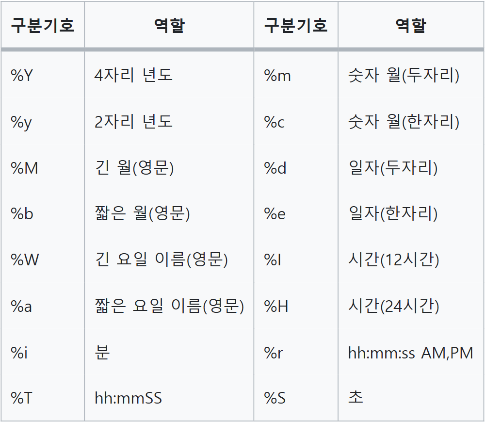

[25-W SQL 스터디] 3주차 과제
=========

> 🔍 **1. 최솟값 구하기**  
사용 함수: SUM, MAX, MIN

문제 링크: [programmers](https://school.programmers.co.kr/learn/courses/30/lessons/59038)

날짜: 25/01/22(수)

### 문제 설명
ANIMAL_INS 테이블은 동물 보호소에 들어온 동물의 정보를 담은 테이블입니다. ANIMAL_INS 테이블 구조는 다음과 같으며, ANIMAL_ID, ANIMAL_TYPE, DATETIME, INTAKE_CONDITION, NAME, SEX_UPON_INTAKE는 각각 동물의 아이디, 생물 종, 보호 시작일, 보호 시작 시 상태, 이름, 성별 및 중성화 여부를 나타냅니다.


### 문제
동물 보호소에 가장 먼저 들어온 동물은 언제 들어왔는지 조회하는 SQL 문을 작성해주세요.

### SQL 쿼리(정답)
```SQL
SELECT
    MIN(DATETIME) AS 시간
FROM ANIMAL_INS
```
### 실행 결과(정답)
```SQL
시간
-------------------
2013-10-14 15:38:00
```

### 풀이 과정 및 고민한 점
```SQL
동물 보호소에 가장 먼저 들어온 동물->MIN(DATETIME)
```

---

> 🔍 **2. 동명 동물 수 찾기**  
사용 함수: GROUP BY

문제 링크: [programmers](https://school.programmers.co.kr/learn/courses/30/lessons/59041)

날짜: 25/01/22(수)


### 문제 설명
ANIMAL_INS 테이블은 동물 보호소에 들어온 동물의 정보를 담은 테이블입니다. ANIMAL_INS 테이블 구조는 다음과 같으며, ANIMAL_ID, ANIMAL_TYPE, DATETIME, INTAKE_CONDITION, NAME, SEX_UPON_INTAKE는 각각 동물의 아이디, 생물 종, 보호 시작일, 보호 시작 시 상태, 이름, 성별 및 중성화 여부를 나타냅니다.

### 문제
동물 보호소에 들어온 동물 이름 중 두 번 이상 쓰인 이름과 해당 이름이 쓰인 횟수를 조회하는 SQL문을 작성해주세요. 이때 결과는 이름이 없는 동물은 집계에서 제외하며, 결과는 이름 순으로 조회해주세요.

### SQL 쿼리(정답)
```SQL
SELECT
    NAME,
    COUNT(ANIMAL_ID) AS COUNT
FROM ANIMAL_INS
WHERE NAME IS NOT NULL
GROUP BY NAME
HAVING COUNT >= 2
ORDER BY NAME
```
### 실행 결과(정답)
```SQL
NAME	COUNT
-------------
Lucy	3
Raven	2
```

### 풀이 과정 및 고민한 점
```SQL
1. NAME으로 GROUP BY하여 NAME, COUNT 조회

SELECT
    NAME,
    COUNT(ANIMAL_ID) AS COUNT
FROM ANIMAL_INS
GROUP BY NAME

2. NAME이 NULL이면 제외
SELECT
    NAME,
    COUNT(ANIMAL_ID) AS COUNT
FROM ANIMAL_INS
WHERE NAME IS NOT NULL
GROUP BY NAME

3. COUNT >= 2, NAME 오름차순 정렬

SELECT
    NAME,
    COUNT(ANIMAL_ID) AS COUNT
FROM ANIMAL_INS
WHERE NAME IS NOT NULL
GROUP BY NAME
HAVING COUNT >= 2
ORDER BY NAME
```

---

> 🔍 **3. 이름에 el이 들어가는 동물 찾기**  
사용 함수: String, Date

문제 링크: [programmers](https://school.programmers.co.kr/learn/courses/30/lessons/59047)

날짜: 25/01/22(수)

### 문제 설명
ANIMAL_INS 테이블은 동물 보호소에 들어온 동물의 정보를 담은 테이블입니다. ANIMAL_INS 테이블 구조는 다음과 같으며, ANIMAL_ID, ANIMAL_TYPE, DATETIME, INTAKE_CONDITION, NAME, SEX_UPON_INTAKE는 각각 동물의 아이디, 생물 종, 보호 시작일, 보호 시작 시 상태, 이름, 성별 및 중성화 여부를 나타냅니다.

### 문제
보호소에 돌아가신 할머니가 기르던 개를 찾는 사람이 찾아왔습니다. 이 사람이 말하길 할머니가 기르던 개는 이름에 'el'이 들어간다고 합니다. 동물 보호소에 들어온 동물 이름 중, 이름에 "EL"이 들어가는 개의 아이디와 이름을 조회하는 SQL문을 작성해주세요. 이때 결과는 이름 순으로 조회해주세요. 단, 이름의 대소문자는 구분하지 않습니다.

### SQL 쿼리(정답)
```SQL
SELECT
    ANIMAL_ID,
    NAME
FROM ANIMAL_INS
WHERE ANIMAL_TYPE='Dog' 
    AND NAME LIKE '%EL%'
ORDER BY NAME

```
### 실행 결과(정답)
```SQL
ANIMAL_ID	NAME
----------------
A355753	Elijah
A382192	Maxwell 2
A391858	Nellie
A414198	Shelly
```

### 풀이 과정 및 고민한 점
```SQL
1. 생물 종이 Dog이면서 이름에 'el' 포함->LIKE, 이름 기준 오름차순
SELECT
    ANIMAL_ID,
    NAME
FROM ANIMAL_INS
WHERE ANIMAL_TYPE='Dog' 
    AND NAME LIKE '%EL%'
ORDER BY NAME
```


---

> 🔍 **4. NULL 처리하기**  
사용 함수: IS NULL

문제 링크: [programmers](https://school.programmers.co.kr/learn/courses/30/lessons/59410)

날짜: 25/01/22(수)


### 문제 설명
ANIMAL_INS 테이블은 동물 보호소에 들어온 동물의 정보를 담은 테이블입니다. ANIMAL_INS 테이블 구조는 다음과 같으며, ANIMAL_ID, ANIMAL_TYPE, DATETIME, INTAKE_CONDITION, NAME, SEX_UPON_INTAKE는 각각 동물의 아이디, 생물 종, 보호 시작일, 보호 시작 시 상태, 이름, 성별 및 중성화 여부를 나타냅니다.

### 문제
입양 게시판에 동물 정보를 게시하려 합니다. 동물의 생물 종, 이름, 성별 및 중성화 여부를 아이디 순으로 조회하는 SQL문을 작성해주세요. 이때 프로그래밍을 모르는 사람들은 NULL이라는 기호를 모르기 때문에, 이름이 없는 동물의 이름은 "No name"으로 표시해 주세요.

### SQL 쿼리(정답)
```SQL
1. IFNULL

SELECT
    ANIMAL_TYPE,
    IFNULL(NAME, "No name") AS NAME,
    SEX_UPON_INTAKE
FROM ANIMAL_INS
ORDER BY ANIMAL_ID

2. CASE WHEN

SELECT
    ANIMAL_TYPE,
    CASE 
        WHEN NAME IS NULL THEN "No name"
        ELSE NAME
    END AS NAME,
    SEX_UPON_INTAKE
FROM ANIMAL_INS
ORDER BY ANIMAL_ID

```
### 실행 결과(정답)
```SQL 
ANIMAL_TYPE NAME   SEX_UPON_INTAKE
-----------------------------------
Cat         Sugar  Neutered Male
Cat         Jewel  Spayed Female
.
.
.
```

### 풀이 과정 및 고민한 점
```SQL
NULL값이면 "No name"으로 대체

1. IFNULL(컬럼명, 'NULL인 경우 대체할 값')

IFNULL(NAME, "No name") AS NAME

2. CASE WHEN

CASE 
    WHEN NAME IS NULL THEN "No name"
    ELSE NAME
END AS NAME
```

---

> 🔍 **5. DATETIME에서 DATE로 형 변환**  
사용 함수: String, Date

문제 링크: [programmers](https://school.programmers.co.kr/learn/courses/30/lessons/59414)

날짜: 25/01/22(수)

### 문제 설명
ANIMAL_INS 테이블은 동물 보호소에 들어온 동물의 정보를 담은 테이블입니다. ANIMAL_INS 테이블 구조는 다음과 같으며, ANIMAL_ID, ANIMAL_TYPE, DATETIME, INTAKE_CONDITION, NAME, SEX_UPON_INTAKE는 각각 동물의 아이디, 생물 종, 보호 시작일, 보호 시작 시 상태, 이름, 성별 및 중성화 여부를 나타냅니다.

### 문제
ANIMAL_INS 테이블에 등록된 모든 레코드에 대해, 각 동물의 아이디와 이름, 들어온 날짜1를 조회하는 SQL문을 작성해주세요. 이때 결과는 아이디 순으로 조회해야 합니다.

### SQL 쿼리(정답)
```SQL
SELECT
    ANIMAL_ID,
    NAME,
    DATE_FORMAT(DATETIME, "%Y-%m-%d") AS 날짜
FROM ANIMAL_INS
ORDER BY ANIMAL_ID
```
### 실행 결과(정답)
```SQL
ANIMAL_ID NAME   날짜
--------------------------
A349996	  Sugar	 2018-01-22
A350276	  Jewel	 2017-08-13
A350375	  Meo	 2017-03-06
```

### 풀이 과정 및 고민한 점
```SQL
날짜에서 연월일만 추출하는 방법을 고민함.

SELECT
    ANIMAL_ID,
    NAME,
    DATE_FORMAT(DATETIME, "%Y-%m-%d") AS 날짜
FROM ANIMAL_INS
ORDER BY ANIMAL_ID
```
- DATE_FORMAT(컬럼명,'%Y-%m-%d')
- DATE_FORMAT에서 사용하는 구분기호  


- MYSQL에서 사용하는 날짜 관련 함수들
    - dayofweek(date) : 날짜를 한 주의 몇번째 요일인지를 숫자로 (1 = 일, 2 = 월)
    - weekday(date) : 날짜를 한 주의 몇번째 요일인지를 숫자로 (0 = 월, 1 = 화)
    - dayofmonth(date) : 그 달의 몇 번째 날, 리턴값은 1~ 31
    - dayofyear(date) : 한 해의 몇 번째 날인지, 리턴값은 1 ~ 366
    - month(date) : 몇 월, 리턴값은 1~ 12
    - dayname(date) : 영어식 요일 이름
    - monthname(date) : 영어식 월 이름
    - quarter(date) : 분기
    - week(date) : 몇 번째 주일
    - week(date, first) : 주어진 인수로 한 주의 시작일을 지정 (0이면 일요일, 1이면 월요일을 시작으로 지정)
    - year(date) : 년도
    - hour(time) : 시간(0~23)
    - minute(time) : 분 (0~59)
    - second(time) : 초 (0~59)
    - period_add(p,n) : 주어진 달에 n개월을 더함 , 리턴값은 yyyymm
    - period_diff(p1,p2) : 주어진 두 기간 사이의 개월


---


> 🔍 **6. 가격이 제일 비싼 식품의 정보 출력하기**  
사용 함수: SUM, MAX, MIN

문제 링크: [programmers](https://school.programmers.co.kr/learn/courses/30/lessons/131115)

날짜: 25/01/22(수)

### 문제 설명
다음은 식품의 정보를 담은 FOOD_PRODUCT 테이블입니다. FOOD_PRODUCT 테이블은 다음과 같으며 PRODUCT_ID, PRODUCT_NAME, PRODUCT_CD, CATEGORY, PRICE는 식품 ID, 식품 이름, 식품 코드, 식품분류, 식품 가격을 의미합니다.

### 문제
FOOD_PRODUCT 테이블에서 가격이 제일 비싼 식품의 식품 ID, 식품 이름, 식품 코드, 식품분류, 식품 가격을 조회하는 SQL문을 작성해주세요.

### SQL 쿼리(정답)
```SQL
1. LIMIT

SELECT
    *
FROM FOOD_PRODUCT
ORDER BY PRICE DESC
LIMIT 1

2. MAX 함수+WHERE 서브쿼리

SELECT
    PRODUCT_ID,
    PRODUCT_NAME,
    PRODUCT_CD,
    CATEGORY,
    PRICE
FROM FOOD_PRODUCT
WHERE PRICE = (SELECT MAX(PRICE) AS PRICE FROM FOOD_PRODUCT)
```
### 실행 결과(정답)
```SQL
PRODUCT_ID	PRODUCT_NAME	PRODUCT_CD	CATEGORY	PRICE
------------------------------------------------------------------------
P0051	    맛있는배추김치	CD_KC00001	김치	    19000
```

### 풀이 과정 및 고민한 점
```SQL
1. LIMIT: PRICE 내림차순 정렬, 첫 행만 출력

SELECT
    *
FROM FOOD_PRODUCT
ORDER BY PRICE DESC
LIMIT 1

2. MAX 함수+WHERE 서브쿼리: 뭔가 MAX 함수를 써야할 것만 같았음.
WHERE절에서 PRICE 값이 MAX(PRICE)인 행만 선택.

SELECT
    PRODUCT_ID,
    PRODUCT_NAME,
    PRODUCT_CD,
    CATEGORY,
    PRICE
FROM FOOD_PRODUCT
WHERE PRICE = (SELECT MAX(PRICE) AS PRICE FROM FOOD_PRODUCT)
```

---

> 🔍 **7. 조건에 맞는 아이템들의 가격의 총합 구하기**  
사용 함수: SUM, MAX, MIN

문제 링크: [programmers](https://school.programmers.co.kr/learn/courses/30/lessons/273709)

날짜: 25/01/22(수)


### 문제 설명
다음은 어느 한 게임에서 사용되는 아이템들의 아이템 정보를 담은 ITEM_INFO 테이블입니다. ITEM_INFO 테이블은 다음과 같으며, ITEM_ID, ITEM_NAME, RARITY, PRICE는 각각 아이템 ID, 아이템 명, 아이템의 희귀도, 아이템의 가격을 나타냅니다.

### 문제
ITEM_INFO 테이블에서 희귀도가 'LEGEND'인 아이템들의 가격의 총합을 구하는 SQL문을 작성해 주세요. 이때 컬럼명은 'TOTAL_PRICE'로 지정해 주세요.

### SQL 쿼리(정답)
```SQL
SELECT
    SUM(PRICE) AS TOTAL_PRICE
FROM ITEM_INFO
WHERE RARITY = 'LEGEND'
```
### 실행 결과(정답)
```SQL
TOTAL_PRICE
-----------
32000
```

### 풀이 과정 및 고민한 점
```SQL
RARITY='LEGEND'인 행(WHERE 조건)의 PRICE 합계(SUM)
```

---

> 🔍 **8. 중복 제거하기**  
사용 함수: SUM, MAX, MIN

문제 링크: [programmers](https://school.programmers.co.kr/learn/courses/30/lessons/59408)

날짜: 25/01/22(수)

### 문제 설명
ANIMAL_INS 테이블은 동물 보호소에 들어온 동물의 정보를 담은 테이블입니다. ANIMAL_INS 테이블 구조는 다음과 같으며, ANIMAL_ID, ANIMAL_TYPE, DATETIME, INTAKE_CONDITION, NAME, SEX_UPON_INTAKE는 각각 동물의 아이디, 생물 종, 보호 시작일, 보호 시작 시 상태, 이름, 성별 및 중성화 여부를 나타냅니다.

### 문제
동물 보호소에 들어온 동물의 이름은 몇 개인지 조회하는 SQL 문을 작성해주세요. 이때 이름이 NULL인 경우는 집계하지 않으며 중복되는 이름은 하나로 칩니다.

### SQL 쿼리(정답)
```SQL
SELECT
    COUNT(DISTINCT(NAME)) AS count
FROM ANIMAL_INS
WHERE NAME IS NOT NULL
```
### 실행 결과(정답)
```SQL
count
-----
96
```

### 풀이 과정 및 고민한 점
```SQL
1. 이름이 NULL이면 집계하지 않음

WHERE NAME IS NOT NULL

2. 중복되는 이름은 하나로 간주함: DISTINCT

COUNT(DISTINCT(NAME)) 
```


---

> 🔍 **9. 동물 수 구하기**  
사용 함수: SUM, MAX, MIN

문제 링크: [programmers](https://school.programmers.co.kr/learn/courses/30/lessons/59406)

날짜: 25/01/22(수)


### 문제 설명
ANIMAL_INS 테이블은 동물 보호소에 들어온 동물의 정보를 담은 테이블입니다. ANIMAL_INS 테이블 구조는 다음과 같으며, ANIMAL_ID, ANIMAL_TYPE, DATETIME, INTAKE_CONDITION, NAME, SEX_UPON_INTAKE는 각각 동물의 아이디, 생물 종, 보호 시작일, 보호 시작 시 상태, 이름, 성별 및 중성화 여부를 나타냅니다.

### 문제
동물 보호소에 동물이 몇 마리 들어왔는지 조회하는 SQL 문을 작성해주세요.

### SQL 쿼리(정답)
```SQL
SELECT
    COUNT(ANIMAL_ID) AS count
FROM ANIMAL_INS
```
### 실행 결과(정답)
```SQL
count
-----
100
```

### 풀이 과정 및 고민한 점
```SQL
ANIMAL_ID는 Primary Key이므로 중복값 유무와 상관없이 COUNT 하고자 할 때 사용.
```

---

> 🔍 **10. 카테고리 별 상품 개수 구하기**  
사용 함수: String, Date

문제 링크: [programmers](https://school.programmers.co.kr/learn/courses/30/lessons/131529)

날짜: 25/01/2D()

### 문제 설명
다음은 어느 의류 쇼핑몰에서 판매중인 상품들의 정보를 담은 PRODUCT 테이블입니다. PRODUCT 테이블은 아래와 같은 구조로 되어있으며, PRODUCT_ID, PRODUCT_CODE, PRICE는 각각 상품 ID, 상품코드, 판매가를 나타냅니다.

상품 별로 중복되지 않는 8자리 상품코드 값을 가지며, 앞 2자리는 카테고리 코드를 의미합니다.

### 문제

PRODUCT 테이블에서 상품 카테고리 코드(PRODUCT_CODE 앞 2자리) 별 상품 개수를 출력하는 SQL문을 작성해주세요. 결과는 상품 카테고리 코드를 기준으로 오름차순 정렬해주세요.
### SQL 쿼리(정답)
```SQL
WITH C AS (
    SELECT
        SUBSTR(PRODUCT_CODE,1,2) AS CATEGORY,
        PRODUCT_ID
    FROM PRODUCT
)

SELECT
    CATEGORY,
    COUNT(PRODUCT_ID) AS PRODUCTS
FROM C
GROUP BY CATEGORY
ORDER BY CATEGORY
```
### 실행 결과(정답)
```SQL
CATEGORY  PRODUCTS
A2        3
A3        4
```

### 풀이 과정 및 고민한 점
```SQL
1. WITH문으로 CATEGORY 열 만들기

WITH C AS (
    SELECT
        SUBSTR(PRODUCT_CODE,1,2) AS CATEGORY,
        PRODUCT_ID
    FROM PRODUCT
)

2. COUNT(PRODUCT_ID), CATEGORY 기준 GROUP BY, 오름차순 정렬

SELECT
    CATEGORY,
    COUNT(PRODUCT_ID) AS PRODUCTS
FROM C
GROUP BY CATEGORY
ORDER BY CATEGORY
```

---


> 🔍 **11. 진료과별 총 예약 횟수 출력하기**  
사용 함수: GROUP BY

문제 링크: [programmers](https://school.programmers.co.kr/learn/courses/30/lessons/132202)

날짜: 25/01/24(금)

### 문제 설명
다음은 종합병원의 진료 예약정보를 담은 APPOINTMENT 테이블 입니다.
APPOINTMENT 테이블은 다음과 같으며 APNT_YMD, APNT_NO, PT_NO, MCDP_CD, MDDR_ID, APNT_CNCL_YN, APNT_CNCL_YMD는 각각 진료예약일시, 진료예약번호, 환자번호, 진료과코드, 의사ID, 예약취소여부, 예약취소날짜를 나타냅니다.

### 문제
APPOINTMENT 테이블에서 2022년 5월에 예약한 환자 수를 진료과코드 별로 조회하는 SQL문을 작성해주세요. 이때, 컬럼명은 '진료과 코드', '5월예약건수'로 지정해주시고 결과는 진료과별 예약한 환자 수를 기준으로 오름차순 정렬하고, 예약한 환자 수가 같다면 진료과 코드를 기준으로 오름차순 정렬해주세요.

### SQL 쿼리(정답)
```SQL
SELECT
    MCDP_CD AS 진료과코드,
    COUNT(PT_NO) AS 5월예약건수
FROM APPOINTMENT
WHERE MONTH(APNT_YMD) = 5
GROUP BY MCDP_CD
ORDER BY 5월예약건수, 진료과코드
```
### 실행 결과(정답)
```SQL
진료과코드	5월예약건수
FM	        2
GS	        2
```

### 풀이 과정 및 고민한 점
```SQL
1. APNT_YMD에서 월 추출

MONTH(APNT_YMD)

2. 진료과코드 별로 조회해야 하므로 MCDP_CD를 GROUP BY,
예약 건수는 PT_NO 카운트, MONTH=5 조건 설정, 5월예약건수, 진료과코드 오름차순 정렬

SELECT
    MCDP_CD AS 진료과코드,
    COUNT(PT_NO) AS 5월예약건수
FROM APPOINTMENT
WHERE MONTH(APNT_YMD) = 5
GROUP BY MCDP_CD
ORDER BY 5월예약건수, 진료과코드
```

---

> 🔍 **12. 문제**  
사용 함수: 

문제 링크: [programmers](문제 링크)

날짜: 25/01/2D()


### 문제 설명


### 문제


### SQL 쿼리(정답)
```SQL

```
### 실행 결과(정답)
```SQL

```

### 풀이 과정 및 고민한 점
```SQL

```

---

> 🔍 **13. 문제**  
사용 함수: 

문제 링크: [programmers](문제 링크)

날짜: 25/01/2D()

### 문제 설명


### 문제


### SQL 쿼리(정답)
```SQL

```
### 실행 결과(정답)
```SQL

```

### 풀이 과정 및 고민한 점
```SQL

```


---

> 🔍 **14. 문제**  
사용 함수: 

문제 링크: [programmers](문제 링크)

날짜: 25/01/2D()


### 문제 설명


### 문제


### SQL 쿼리(정답)
```SQL

```
### 실행 결과(정답)
```SQL

```

### 풀이 과정 및 고민한 점
```SQL

```

---

> 🔍 **15. 문제**  
사용 함수: 

문제 링크: [programmers](문제 링크)

날짜: 25/01/2D()

### 문제 설명


### 문제


### SQL 쿼리(정답)
```SQL

```
### 실행 결과(정답)
```SQL

```

### 풀이 과정 및 고민한 점
```SQL

```

---


> 🔍 **16. 문제**  
사용 함수: 

문제 링크: [programmers](문제 링크)

날짜: 25/01/2D()

### 문제 설명


### 문제


### SQL 쿼리(정답)
```SQL

```
### 실행 결과(정답)
```SQL

```

### 풀이 과정 및 고민한 점
```SQL

```

---

> 🔍 **17. 문제**  
사용 함수: 

문제 링크: [programmers](문제 링크)

날짜: 25/01/2D()


### 문제 설명


### 문제


### SQL 쿼리(정답)
```SQL

```
### 실행 결과(정답)
```SQL

```

### 풀이 과정 및 고민한 점
```SQL

```

---

> 🔍 **18. 문제**  
사용 함수: 

문제 링크: [programmers](문제 링크)

날짜: 25/01/2D()

### 문제 설명


### 문제


### SQL 쿼리(정답)
```SQL

```
### 실행 결과(정답)
```SQL

```

### 풀이 과정 및 고민한 점
```SQL

```


---

> 🔍 **19. 문제**  
사용 함수: 

문제 링크: [programmers](문제 링크)

날짜: 25/01/2D()


### 문제 설명


### 문제


### SQL 쿼리(정답)
```SQL

```
### 실행 결과(정답)
```SQL

```

### 풀이 과정 및 고민한 점
```SQL

```

---

> 🔍 **20. 문제**  
사용 함수: 

문제 링크: [programmers](문제 링크)

날짜: 25/01/2D()

### 문제 설명


### 문제


### SQL 쿼리(정답)
```SQL

```
### 실행 결과(정답)
```SQL

```

### 풀이 과정 및 고민한 점
```SQL

```

---