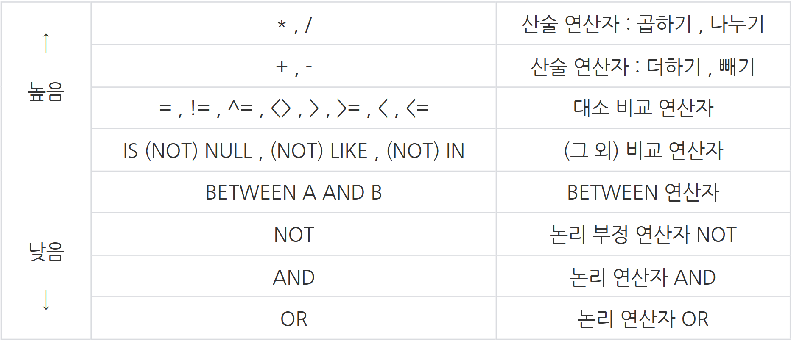
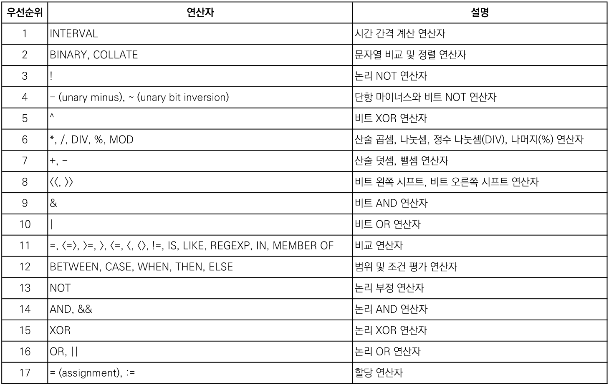
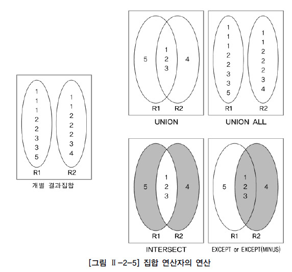

[25-W SQL 스터디] 4주차 과제
=========
## 목차
|번호|문제|
|---|-----| 
|1| [가격대 별 상품 개수 구하기](#문제1)  |
|2| [연도 별 평균 미세먼지 농도 조회하기](#문제2)  |
|3| [물고기 종류 별 잡은 수 구하기](#문제3)  |  
|4| [ROOT 아이템 구하기](#문제4)  |  
|5| [월별 잡은 물고기 수 구하기](#문제5) | 
|6| [조건에 맞는 사원 정보 조회하기](#문제6) | 
|7| [재구매가 일어난 상품과 회원 리스트 구하기](#문제7) | 
|8| [특정 물고기를 잡은 총 수 구하기](#문제8) | 
|9| [자동차 평균 대여 기간 구하기](#문제9) | 
|10| [노선별 평균 역 사이 거리 조회하기](#문제10) | 
|11| [분기별 분화된 대장균의 개체 수 구하기](#문제11) | 
|12| [업그레이드 된 아이템 구하기](#문제12) | 
|13| [연도별 대장균 크기의 편차 구하기 ](#문제13) | 
|14| [부모의 형질을 모두 가지는 대장균 찾기](#문제14) | 
|15| [자동차 대여 기록에서 장기/단기 대여 구분하기](#문제15) | 
|16| [조건에 부합하는 중고거래 댓글 조회하기](#문제16) | 
|17| [있었는데요 없었습니다](#문제17) | 
|18| [부서별 평균 연봉 조회하기](#문제18) | 
|19| [조건별로 분류하여 주문상태 출력하기](#문제19) | 
|20| [조회수가 가장 많은 중고거래 게시판의 첨부파일 조회하기](#문제20) | 
|+|[공유할 개념](#공유할-개념)|
---

## 문제1
> 🔍 **1. 가격대 별 상품 개수 구하기**  
사용 함수: GROUP BY

문제 링크: [programmers](https://school.programmers.co.kr/learn/courses/30/lessons/131530)

날짜: 25/01/28(화)

### 문제
PRODUCT 테이블에서 만원 단위의 가격대 별로 상품 개수를 출력하는 SQL 문을 작성해주세요. 이때 컬럼명은 각각 컬럼명은 PRICE_GROUP, PRODUCTS로 지정해주시고 가격대 정보는 각 구간의 최소금액(10,000원 이상 ~ 20,000 미만인 구간인 경우 10,000)으로 표시해주세요. 결과는 가격대를 기준으로 오름차순 정렬해주세요.

### SQL 쿼리(정답)
```SQL
WITH P AS (
    SELECT
        (PRICE DIV 10000) *10000 AS PRICE_GROUP,
        PRODUCT_ID
    FROM PRODUCT
)

SELECT 
    PRICE_GROUP,
    COUNT(PRODUCT_ID) AS PRODUCTS
FROM P
GROUP BY PRICE_GROUP
ORDER BY PRICE_GROUP
```
### 실행 결과(정답)
```SQL
PRICE_GROUP	PRODUCTS
--------------------
10000	    2
20000	    2
.
.
.
```

### 풀이 과정 및 고민한 점
```SQL
1. CASE WHEN으로 범위를 지정하려 했으나, 최대 금액이 명시되어 있지 않으므로 모든 PRICE에 대해 적용 가능한 방법을 고민해봄
-> PRICE/10000의 몫을 구하고 10000을 구한 것을 PRICE_GROUP으로 두고, 이를 기준으로 GROUP BY

WITH P AS (
    SELECT
        (PRICE DIV 10000) *10000 AS PRICE_GROUP,
        PRODUCT_ID
    FROM PRODUCT
)

SELECT 
    PRICE_GROUP,
    COUNT(PRODUCT_ID) AS PRODUCTS
FROM P
GROUP BY PRICE_GROUP
ORDER BY PRICE_GROUP
```

---
## 문제2
> 🔍 **2. 연도 별 평균 미세먼지 농도 조회하기**  
사용 함수: String, Date

문제 링크: [programmers](https://school.programmers.co.kr/learn/courses/30/lessons/284530)

날짜: 25/01/28(화)

### 문제
AIR_POLLUTION 테이블에서 수원 지역의 연도 별 평균 미세먼지 오염도와 평균 초미세먼지 오염도를 조회하는 SQL문을 작성해주세요. 이때, 평균 미세먼지 오염도와 평균 초미세먼지 오염도의 컬럼명은 각각 PM10, PM2.5로 해 주시고, 값은 소수 셋째 자리에서 반올림해주세요.
결과는 연도를 기준으로 오름차순 정렬해주세요.


### SQL 쿼리(정답)
```SQL
WITH A AS (
    SELECT 
        YEAR(YM) AS YEAR,
        PM_VAL1,
        PM_VAL2,
        LOCATION2
    FROM AIR_POLLUTION
)

SELECT 
    YEAR,
    ROUND(AVG(PM_VAL1),2) AS 'PM10',
    ROUND(AVG(PM_VAL2),2) AS 'PM2.5'
FROM A
WHERE LOCATION2 = '수원'
GROUP BY YEAR
ORDER BY YEAR
```
### 실행 결과(정답)
```SQL
YEAR  PM10  PM2.5
------------------
2018  41    20.25
```

### 풀이 과정 및 고민한 점
```SQL
1. YEAR 기준 GROUP BY 예정이므로 YEAR 먼저 정의

WITH A AS (
    SELECT 
        YEAR(YM) AS YEAR,
        PM_VAL1,
        PM_VAL2,
        LOCATION2
    FROM AIR_POLLUTION
)

2. 미세먼지, 초미세먼지 연도별 평균 정의. 이때 컬럼명 'PM2.5'의 '.'이 컬럼명 정의에 문제가 되므로 작은 따옴표 붙임

SELECT 
    YEAR,
    ROUND(AVG(PM_VAL1),2) AS 'PM10',
    ROUND(AVG(PM_VAL2),2) AS 'PM2.5'
FROM A
WHERE LOCATION2 = '수원'
GROUP BY YEAR
ORDER BY YEAR
```

---
## 문제3
> 🔍 **3. 물고기 종류 별 잡은 수 구하기**  
사용 함수: GROUP BY

문제 링크: [programmers](https://school.programmers.co.kr/learn/courses/30/lessons/293257)

날짜: 25/01/28(화)

### 문제
FISH_NAME_INFO에서 물고기의 종류 별 물고기의 이름과 잡은 수를 출력하는 SQL문을 작성해주세요.

물고기의 이름 컬럼명은 FISH_NAME, 잡은 수 컬럼명은 FISH_COUNT로 해주세요.
결과는 잡은 수 기준으로 내림차순 정렬해주세요.

### SQL 쿼리(정답)
```SQL
SELECT 
    COUNT(*) AS FISH_COUNT,
    N.FISH_NAME AS FISH_NAME
FROM FISH_INFO AS I
LEFT JOIN FISH_NAME_INFO AS N
ON I.FISH_TYPE = N.FISH_TYPE
GROUP BY N.FISH_NAME
ORDER BY FISH_COUNT DESC
```
### 실행 결과(정답)
```SQL
FISH_COUNT  FISH_NAME
---------------------
3           BASS
2           SNAPPER
1           ANCHOVY
```

### 풀이 과정 및 고민한 점
```SQL
1. 두 테이블 조인
SELECT 
    *
FROM FISH_INFO AS I
LEFT JOIN FISH_NAME_INFO AS N
ON I.FISH_TYPE = N.FISH_TYPE

2. FISH_NAME 기준 GROUP BY
SELECT 
    COUNT(*) AS FISH_COUNT,
    N.FISH_NAME AS FISH_NAME
FROM FISH_INFO AS I
LEFT JOIN FISH_NAME_INFO AS N
ON I.FISH_TYPE = N.FISH_TYPE
GROUP BY N.FISH_NAME
ORDER BY FISH_COUNT DESC
```


---
## 문제4
> 🔍 **4. ROOT 아이템 구하기**  
사용 함수: IS NULL

문제 링크: [programmers](https://school.programmers.co.kr/learn/courses/30/lessons/273710)

날짜: 25/01/28(화)

### 문제
ROOT 아이템을 찾아 아이템 ID(ITEM_ID), 아이템 명(ITEM_NAME)을 출력하는 SQL문을 작성해 주세요. 이때, 결과는 아이템 ID를 기준으로 오름차순 정렬해 주세요.

### SQL 쿼리(정답)
```SQL
SELECT 
    I.ITEM_ID,
    ITEM_NAME
FROM ITEM_INFO AS I
LEFT JOIN ITEM_TREE AS T
ON I.ITEM_ID = T.ITEM_ID
WHERE PARENT_ITEM_ID IS NULL
ORDER BY ITEM_ID
```

### 실행 결과(정답)
```SQL
ITEM_ID	ITEM_NAME
-----------------
0	    ITEM_A
3	    ITEM_D
```

### 풀이 과정 및 고민한 점
```SQL
1. 두 테이블 JOIN

SELECT 
    I.ITEM_ID,
    ITEM_NAME
FROM ITEM_INFO AS I
LEFT JOIN ITEM_TREE AS T
ON I.ITEM_ID = T.ITEM_ID

2. PARENT 아이템이 없는 아이템이 ROOT 아이템 => PARENT_ITEM_ID가 NULL인 행만 출력

WHERE PARENT_ITEM_ID IS NULL
```

---
## 문제5
> 🔍 **5. 월별 잡은 물고기 수 구하기**  
사용 함수: GROUP BY

문제 링크: [programmers](https://school.programmers.co.kr/learn/courses/30/lessons/293260)

날짜: 25/01/28(화)

### 문제
월별 잡은 물고기의 수와 월을 출력하는 SQL문을 작성해주세요.

잡은 물고기 수 컬럼명은 FISH_COUNT, 월 컬럼명은 MONTH로 해주세요.
결과는 월을 기준으로 오름차순 정렬해주세요.
단, 월은 숫자형태 (1~12) 로 출력하며 9 이하의 숫자는 두 자리로 출력하지 않습니다. 잡은 물고기가 없는 월은 출력하지 않습니다.

### SQL 쿼리(정답)
```SQL
SELECT 
    COUNT(ID) AS FISH_COUNT,
    MONTH(TIME) AS MONTH
FROM FISH_INFO
GROUP BY MONTH(TIME)
ORDER BY MONTH
```
### 실행 결과(정답)
```SQL
FISH_COUNT  MONTH
-----------------
2	        1
3	        3
```

### 풀이 과정 및 고민한 점
```SQL
1. TIME에서 MONTH 추출

SELECT 
    COUNT(ID) AS FISH_COUNT,
    MONTH(TIME) AS MONTH
FROM FISH_INFO
GROUP BY MONTH(TIME)
ORDER BY MONTH
```


---
## 문제6
> 🔍 **6. 조건에 맞는 사원 정보 조회하기**  
사용 함수: GROUP BY

문제 링크: [programmers](https://school.programmers.co.kr/learn/courses/30/lessons/284527)

날짜: 25/01/28(화)

### 문제
HR_DEPARTMENT, HR_EMPLOYEES, HR_GRADE 테이블에서 2022년도 한해 평가 점수가 가장 높은 사원 정보를 조회하려 합니다. 2022년도 평가 점수가 가장 높은 사원들의 점수, 사번, 성명, 직책, 이메일을 조회하는 SQL문을 작성해주세요.

2022년도의 평가 점수는 상,하반기 점수의 합을 의미하고, 평가 점수를 나타내는 컬럼의 이름은 SCORE로 해주세요.

### SQL 쿼리(정답)
```SQL
WITH GR AS (
    SELECT 
        EMP_NO,
        SUM(SCORE) AS SCORE
    FROM HR_GRADE 
    WHERE YEAR = '2022'
    GROUP BY YEAR, EMP_NO
    ORDER BY SCORE DESC
    LIMIT 1
)

SELECT
    SCORE,
    G.EMP_NO AS EMP_NO,
    EMP_NAME,
    POSITION,
    EMAIL
FROM GR AS G
LEFT JOIN HR_EMPLOYEES AS E
ON G.EMP_NO = E.EMP_NO
LEFT JOIN HR_DEPARTMENT AS D
ON E.DEPT_ID = D.DEPT_ID   

```
### 실행 결과(정답)
```SQL
SCORE  EMP_NO  EMP_NAME POSITION   EMAIL
------------------------------------------------------
181    2020002 김연주   팀원       yeonjoo_kim@grep.com
```

### 풀이 과정 및 고민한 점
```SQL
1. 처음에는 WITH문으로 조인 후 깔끔하게 MAX(SUM(SCORE))로 구하려 했으나 실패...
HR_GRADE에서 2022년에 SCORE 합이 가장 높은 사원 1명을 반환.

WITH GR AS (
    SELECT 
        EMP_NO,
        SUM(SCORE) AS SCORE
    FROM HR_GRADE 
    WHERE YEAR = '2022'
    GROUP BY YEAR, EMP_NO
    ORDER BY SCORE DESC
    LIMIT 1
)

2. 그 사원에 필요한 컬럼들을 LEFT JOIN함.

SELECT
    SCORE,
    G.EMP_NO AS EMP_NO,
    EMP_NAME,
    POSITION,
    EMAIL
FROM GR AS G
LEFT JOIN HR_EMPLOYEES AS E
ON G.EMP_NO = E.EMP_NO
LEFT JOIN HR_DEPARTMENT AS D
ON E.DEPT_ID = D.DEPT_ID   
```

---
## 문제7
> 🔍 **7. 재구매가 일어난 상품과 회원 리스트 구하기**  
사용 함수: SELECT

문제 링크: [programmers](https://school.programmers.co.kr/learn/courses/30/lessons/131536)

날짜: 25/01/28(화)


### 문제
ONLINE_SALE 테이블에서 동일한 회원이 동일한 상품을 재구매한 데이터를 구하여, 재구매한 회원 ID와 재구매한 상품 ID를 출력하는 SQL문을 작성해주세요. 결과는 회원 ID를 기준으로 오름차순 정렬해주시고 회원 ID가 같다면 상품 ID를 기준으로 내림차순 정렬해주세요.

### SQL 쿼리(정답)
```SQL
SELECT
    USER_ID,
    PRODUCT_ID
FROM ONLINE_SALE
GROUP BY USER_ID, PRODUCT_ID
HAVING COUNT(USER_ID) > 1
ORDER BY USER_ID ASC, PRODUCT_ID DESC
```
### 실행 결과(정답)
```SQL
USER_ID	PRODUCT_ID
------------------
15	    12
119	    12
```

### 풀이 과정 및 고민한 점
```SQL
1. 재구매 = COUNT(USER_ID) > 1

SELECT
    USER_ID,
    PRODUCT_ID
FROM ONLINE_SALE
GROUP BY USER_ID, PRODUCT_ID
HAVING COUNT(USER_ID) > 1
ORDER BY USER_ID ASC, PRODUCT_ID DESC
```
- HAVING 절은 GROUP BY로 그룹화된 데이터에 대해 조건을 적용한다.
---
## 문제8
> 🔍 **8. 특정 물고기를 잡은 총 수 구하기**  
사용 함수: SELECT

문제 링크: [programmers](https://school.programmers.co.kr/learn/courses/30/lessons/298518)

날짜: 25/01/28(화)

### 문제
FISH_INFO 테이블에서 잡은 BASS와 SNAPPER의 수를 출력하는 SQL 문을 작성해주세요.

컬럼명은 'FISH_COUNT`로 해주세요.

### SQL 쿼리(정답)
```SQL
SELECT 
    COUNT(ID) AS FISH_COUNT
FROM FISH_INFO AS F
LEFT JOIN FISH_NAME_INFO AS N
ON F.FISH_TYPE = N.FISH_TYPE
WHERE FISH_NAME = 'BASS' 
    OR FISH_NAME = 'SNAPPER'
```
### 실행 결과(정답)
```SQL
FISH_COUNT
----------
7
```

### 풀이 과정 및 고민한 점
```SQL
1. 두 테이블 조인
SELECT 
    COUNT(ID) AS FISH_COUNT
FROM FISH_INFO AS F
LEFT JOIN FISH_NAME_INFO AS N
ON F.FISH_TYPE = N.FISH_TYPE

2. 조건 설정-FISH_NAME이 BASS이거나 SNAPPER

WHERE FISH_NAME = 'BASS' 
    OR FISH_NAME = 'SNAPPER'
```


---
## 문제9
> 🔍 **9. 자동차 평균 대여 기간 구하기**  
사용 함수: String, Date

문제 링크: [programmers](https://school.programmers.co.kr/learn/courses/30/lessons/157342)

날짜: 25/01/28(화)


### 문제
CAR_RENTAL_COMPANY_RENTAL_HISTORY 테이블에서 평균 대여 기간이 7일 이상인 자동차들의 자동차 ID와 평균 대여 기간(컬럼명: AVERAGE_DURATION) 리스트를 출력하는 SQL문을 작성해주세요. 평균 대여 기간은 소수점 두번째 자리에서 반올림하고, 결과는 평균 대여 기간을 기준으로 내림차순 정렬해주시고, 평균 대여 기간이 같으면 자동차 ID를 기준으로 내림차순 정렬해주세요.

### SQL 쿼리(정답)
```SQL
SELECT 
    CAR_ID,
    ROUND(AVG(DATEDIFF(END_DATE, START_DATE)+1), 1) AS AVERAGE_DURATION
FROM CAR_RENTAL_COMPANY_RENTAL_HISTORY
GROUP BY CAR_ID
HAVING AVERAGE_DURATION >= 7
ORDER BY AVERAGE_DURATION DESC, CAR_ID DESC
```
### 실행 결과(정답)
```SQL
CAR_ID	AVERAGE_DURATION
------------------------
26	    101.0
22	    46.0
```

### 풀이 과정 및 고민한 점
```SQL
1. END_DATE, START_DATE의 차이 계산: DATEDIFF()
   * 차이+1을 해주어야 대여 기간이 나옴. 빌린 날도 포함되기 때문. 

ROUND(AVG(DATEDIFF(END_DATE, START_DATE)+1), 1) AS AVERAGE_DURATION

2. AVERAGE_DURATION이 7일 이상인 행 조건-HAVING
참고) MySQL에서는 HAVING에 SELECT문에서 정의한 별칭 사용 가능

SELECT 
    CAR_ID,
    ROUND(AVG(DATEDIFF(END_DATE, START_DATE)+1), 1) AS AVERAGE_DURATION
FROM CAR_RENTAL_COMPANY_RENTAL_HISTORY
GROUP BY CAR_ID
HAVING AVERAGE_DURATION >= 7
ORDER BY AVERAGE_DURATION DESC, CAR_ID DESC
```

---
## 문제10
> 🔍 **10. 노선별 평균 역 사이 거리 조회하기**  
사용 함수: GROUP BY

문제 링크: [programmers](https://school.programmers.co.kr/learn/courses/30/lessons/284531)

날짜: 25/01/28(화)

### 문제
SUBWAY_DISTANCE 테이블에서 노선별로 노선, 총 누계 거리, 평균 역 사이 거리를 노선별로 조회하는 SQL문을 작성해주세요.

총 누계거리는 테이블 내 존재하는 역들의 역 사이 거리의 총 합을 뜻합니다. 총 누계 거리와 평균 역 사이 거리의 컬럼명은 각각 TOTAL_DISTANCE, AVERAGE_DISTANCE로 해주시고, 총 누계거리는 소수 둘째자리에서, 평균 역 사이 거리는 소수 셋째 자리에서 반올림 한 뒤 단위(km)를 함께 출력해주세요.
결과는 총 누계 거리를 기준으로 내림차순 정렬해주세요.

### SQL 쿼리(정답)
```SQL
SELECT 
    ROUTE,
    CONCAT(ROUND(SUM(D_BETWEEN_DIST), 1), 'km') AS TOTAL_DISTANCE,
    CONCAT(ROUND(AVG(D_BETWEEN_DIST), 2), 'km') AS AVERAGE_DISTANCE
FROM SUBWAY_DISTANCE
GROUP BY ROUTE
ORDER BY CAST(TOTAL_DISTANCE AS UNSIGNED) DESC
```
### 실행 결과(정답)
```SQL
ROUTE	 TOTAL_DISTANCE  AVERAGE_DISTANCE
----------------------------------------
신정지선  6km	         1.5km
성수지선  5.4km	         1.35km
```

### 풀이 과정 및 고민한 점
```SQL
1. ROUTE별로 GROUP BY, D_BETWEEN_DIST의 합과 평균을 구하고->소수점 자리수를 정의하고->'km'을 붙여서 출력해야 함.

SELECT 
    ROUTE,
    CONCAT(ROUND(SUM(D_BETWEEN_DIST), 1), 'km') AS TOTAL_DISTANCE,
    CONCAT(ROUND(AVG(D_BETWEEN_DIST), 2), 'km') AS AVERAGE_DISTANCE
FROM SUBWAY_DISTANCE
GROUP BY ROUTE

2. TOTAL_DISTANCE 순으로 정렬해야 함: TOTAL_DISTANCE에는 'km'가 붙어있어 타입이 문자열로 되어있음.
-> 값의 첫 번째 문자부터 비교, 정렬이 달라짐. CAST(... AS UNSIGNED)로 정렬 시 TOTAL_DISTANCE 타입 숫자로 변환

ORDER BY CAST(TOTAL_DISTANCE AS UNSIGNED) DESC
```


---
## 문제11
> 🔍 **11. 분기별 분화된 대장균의 개체 수 구하기**  
사용 함수: String, Date

문제 링크: [programmers](https://school.programmers.co.kr/learn/courses/30/lessons/299308)

날짜: 25/01/28(화)

### 문제
각 분기(QUARTER)별 분화된 대장균의 개체의 총 수(ECOLI_COUNT)를 출력하는 SQL 문을 작성해주세요. 이때 각 분기에는 'Q' 를 붙이고 분기에 대해 오름차순으로 정렬해주세요. 대장균 개체가 분화되지 않은 분기는 없습니다.

### SQL 쿼리(정답)
```SQL
WITH Q AS (
    SELECT CONCAT(QUARTER(DIFFERENTIATION_DATE), 'Q') AS QUARTER,
    ID
    FROM ECOLI_DATA
)

SELECT
    QUARTER,
    COUNT(ID) AS ECOLI_COUNT
FROM Q
GROUP BY QUARTER
ORDER BY QUARTER
```
### 실행 결과(정답)
```SQL
QUARTER	ECOLI_COUNT
-------------------
1Q	    2
2Q	    2
3Q	    1
4Q	    1
```

### 풀이 과정 및 고민한 점
```SQL
1. QUARTER() 함수로 분기만 뽑아냄, CONCAT()으로 'Q' 붙이기, GROUP BY 해야하므로 WITH문으로 작성

WITH Q AS (
    SELECT CONCAT(QUARTER(DIFFERENTIATION_DATE), 'Q') AS QUARTER,
    ID
    FROM ECOLI_DATA
)

2. GROUP BY, COUNT 해주기

SELECT
    QUARTER,
    COUNT(ID) AS ECOLI_COUNT
FROM Q
GROUP BY QUARTER
ORDER BY QUARTER
```

---
## 문제12
> 🔍 **12. 업그레이드 된 아이템 구하기**  
사용 함수: SELECT

문제 링크: [programmers](https://school.programmers.co.kr/learn/courses/30/lessons/273711)

날짜: 25/01/28(화)


### 문제
아이템의 희귀도가 'RARE'인 아이템들의 모든 다음 업그레이드 아이템의 아이템 ID(ITEM_ID), 아이템 명(ITEM_NAME), 아이템의 희귀도(RARITY)를 출력하는 SQL 문을 작성해 주세요. 이때 결과는 아이템 ID를 기준으로 내림차순 정렬주세요.

### SQL 쿼리(정답)
```SQL
SELECT 
    I.ITEM_ID,
    ITEM_NAME,
    RARITY
FROM ITEM_INFO AS I
LEFT JOIN ITEM_TREE AS T
ON I.ITEM_ID = T.ITEM_ID
WHERE PARENT_ITEM_ID IN (SELECT ITEM_ID 
                         FROM ITEM_INFO 
                         WHERE RARITY='RARE')
ORDER BY I.ITEM_ID DESC
```
### 실행 결과(정답)
```SQL
ITEM_ID ITEM_NAME RARITY
------------------------
4       ITEM_E    RARE
3       ITEM_D    RARE
2       ITEM_C    LEGEND
1       ITEM_B    RARE
```

### 풀이 과정 및 고민한 점
```SQL
1. 두 테이블 조인

SELECT 
    I.ITEM_ID,
    ITEM_NAME,
    RARITY
FROM ITEM_INFO AS I
LEFT JOIN ITEM_TREE AS T
ON I.ITEM_ID = T.ITEM_ID

2. WHERE절 서브쿼리: PARENT_ITEM_ID가 RARITY='RARE'인 ITEM_ID와 일치하는 행

WHERE PARENT_ITEM_ID IN (SELECT ITEM_ID 
                         FROM ITEM_INFO 
                         WHERE RARITY='RARE')
```

---
## 문제13
> 🔍 **13. 연도별 대장균 크기의 편차 구하기**  
사용 함수: SUM, MAX, MIN


문제 링크: [programmers](https://school.programmers.co.kr/learn/courses/30/lessons/299310)

날짜: 25/01/28(화)

### 문제
분화된 연도(YEAR), 분화된 연도별 대장균 크기의 편차(YEAR_DEV), 대장균 개체의 ID(ID) 를 출력하는 SQL 문을 작성해주세요. 분화된 연도별 대장균 크기의 편차는 분화된 연도별 가장 큰 대장균의 크기 - 각 대장균의 크기로 구하며 결과는 연도에 대해 오름차순으로 정렬하고 같은 연도에 대해서는 대장균 크기의 편차에 대해 오름차순으로 정렬해주세요.

### SQL 쿼리(정답)
```SQL
WITH MS AS (
    SELECT 
        MAX(SIZE_OF_COLONY) AS MAX_SIZE,
        YEAR(DIFFERENTIATION_DATE) AS YEAR
    FROM ECOLI_DATA
    GROUP BY YEAR(DIFFERENTIATION_DATE)
)

SELECT 
    YEAR(DIFFERENTIATION_DATE) AS YEAR,
    M.MAX_SIZE-E.SIZE_OF_COLONY AS YEAR_DEV,
    ID
FROM ECOLI_DATA AS E
LEFT JOIN MS AS M
ON YEAR(DIFFERENTIATION_DATE) = M.YEAR
ORDER BY YEAR, YEAR_DEV
```
### 실행 결과(정답)
```SQL
YEAR  YEAR_DEV  ID
--------------------
2019   0        1
2019   8        2
2020   0        3
```

### 풀이 과정 및 고민한 점
```SQL
1. WITH문을 테이블처럼 조인하여 사용해봄.
WITH문: 연도별 MAX(SIZE_OF_COLONY) 정의

WITH MS AS (
    SELECT 
        MAX(SIZE_OF_COLONY) AS MAX_SIZE,
        YEAR(DIFFERENTIATION_DATE) AS YEAR
    FROM ECOLI_DATA
    GROUP BY YEAR(DIFFERENTIATION_DATE)
)

2. SELECT문: ECOLI_DATA에서 SIZE_OF_COLONY 가져와서 정의된 MAX(SIZE_OF_COLONY)와의 편차 구함.
조인 키: YEAR

SELECT 
    YEAR(DIFFERENTIATION_DATE) AS YEAR,
    M.MAX_SIZE-E.SIZE_OF_COLONY AS YEAR_DEV,
    ID
FROM ECOLI_DATA AS E
LEFT JOIN MS AS M
ON YEAR(DIFFERENTIATION_DATE) = M.YEAR
ORDER BY YEAR, YEAR_DEV
```


---
## 문제14
> 🔍 **14. 부모의 형질을 모두 가지는 대장균 찾기**  
사용 함수: SELECT

문제 링크: [programmers](https://school.programmers.co.kr/learn/courses/30/lessons/301647)

날짜: 25/01/28(화)


### 문제
부모의 형질을 모두 보유한 대장균의 ID(ID), 대장균의 형질(GENOTYPE), 부모 대장균의 형질(PARENT_GENOTYPE)을 출력하는 SQL 문을 작성해주세요. 이때 결과는 ID에 대해 오름차순 정렬해주세요.

### SQL 쿼리(정답)
```SQL
WITH PI AS (
    SELECT 
        ID AS P_ID,
        GENOTYPE AS P_GEN
    FROM ECOLI_DATA
)

SELECT 
    ID,
    GENOTYPE,
    P_GEN AS PARENT_GENOTYPE
FROM ECOLI_DATA AS E
LEFT JOIN PI AS P
ON E.PARENT_ID = P.P_ID
WHERE (GENOTYPE & P_GEN) = P_GEN
ORDER BY ID
```
### 실행 결과(정답)
```SQL
ID GENOTYPE PARENT_GENOTYPE
----------------------------
2  1	    1
3  3	    1
7  5	    1
8  13	    5
```

### 풀이 과정 및 고민한 점
```SQL
1. & 연산자를 사용하여 (ID의 GENOTYPE & PARENT_ID의 GENOTYPE)를 만들어야 함 -> 테이블 2개.
WITH문으로 부모 테이블 생성(P_ID: 부모 아이디, P_GEN: 부모 형질)

WITH PI AS (
    SELECT 
        ID AS P_ID,
        GENOTYPE AS P_GEN
    FROM ECOLI_DATA
)

2. 본인 형질 테이블과 부모 형질 테이블 조인

SELECT 
    ID,
    GENOTYPE,
    P_GEN AS PARENT_GENOTYPE
FROM ECOLI_DATA AS E
LEFT JOIN PI AS P
ON E.PARENT_ID = P.P_ID


3. 부모의 모든 형질이 본인 형질에 포함되는 경우, (본인 형질 & 부모 형질) = 부모 형질이어야 함.

WHERE (GENOTYPE & P_GEN) = P_GEN
```

---
## 문제15
> 🔍 **15. 자동차 대여 기록에서 장기/단기 대여 구분하기**  
사용 함수: String, Date


문제 링크: [programmers](https://school.programmers.co.kr/learn/courses/30/lessons/151138)

날짜: 25/01/28(화)

### 문제
CAR_RENTAL_COMPANY_RENTAL_HISTORY 테이블에서 대여 시작일이 2022년 9월에 속하는 대여 기록에 대해서 대여 기간이 30일 이상이면 '장기 대여' 그렇지 않으면 '단기 대여' 로 표시하는 컬럼(컬럼명: RENT_TYPE)을 추가하여 대여기록을 출력하는 SQL문을 작성해주세요. 결과는 대여 기록 ID를 기준으로 내림차순 정렬해주세요.

### SQL 쿼리(정답)
```SQL
SELECT 
    HISTORY_ID,
    CAR_ID,
    DATE_FORMAT(START_DATE, '%Y-%m-%d') AS START_DATE,
    DATE_FORMAT(END_DATE, '%Y-%m-%d') AS END_DATE,
    CASE 
        WHEN DATEDIFF(END_DATE, START_DATE)+1 >= 30 THEN '장기 대여'
        ELSE '단기 대여'
    END AS RENT_TYPE
FROM CAR_RENTAL_COMPANY_RENTAL_HISTORY
WHERE MONTH(START_DATE) = 9
ORDER BY HISTORY_ID DESC
```
### 실행 결과(정답)
```SQL
HISTORY_ID CAR_ID START_DATE  END_DATE    RENT_TYPE
---------------------------------------------------
669        25     2022-09-29  2022-10-28  장기 대여
668        13     2022-09-28  2022-09-28  단기 대여
```

### 풀이 과정 및 고민한 점
```SQL
1. CASE WHEN 사용-END_DATE, START_DATE 차이로 대여 기간 구하기: 대여시작일 포함이므로 +1

CASE 
    WHEN DATEDIFF(END_DATE, START_DATE)+1 >= 30 THEN '장기 대여'
    ELSE '단기 대여'
END AS RENT_TYPE

2. 기타 조건-MONTH(START_DATE) = 9, 날짜 DATE_FORMAT()

SELECT 
    HISTORY_ID,
    CAR_ID,
    DATE_FORMAT(START_DATE, '%Y-%m-%d') AS START_DATE,
    DATE_FORMAT(END_DATE, '%Y-%m-%d') AS END_DATE,
    CASE 
        WHEN DATEDIFF(END_DATE, START_DATE)+1 >= 30 THEN '장기 대여'
        ELSE '단기 대여'
    END AS RENT_TYPE
FROM CAR_RENTAL_COMPANY_RENTAL_HISTORY
WHERE MONTH(START_DATE) = 9
ORDER BY HISTORY_ID DESC
```


---
## 문제16
> 🔍 **16. 조건에 부합하는 중고거래 댓글 조회하기**  
사용 함수: SELECT

문제 링크: [programmers](https://school.programmers.co.kr/learn/courses/30/lessons/151138)

날짜: 25/01/28(화)

### 문제
USED_GOODS_BOARD와 USED_GOODS_REPLY 테이블에서 2022년 10월에 작성된 게시글 제목, 게시글 ID, 댓글 ID, 댓글 작성자 ID, 댓글 내용, 댓글 작성일을 조회하는 SQL문을 작성해주세요. 결과는 댓글 작성일을 기준으로 오름차순 정렬해주시고, 댓글 작성일이 같다면 게시글 제목을 기준으로 오름차순 정렬해주세요.

### SQL 쿼리(정답)
```SQL
SELECT 
    TITLE,
    B.BOARD_ID,
    REPLY_ID,
    R.WRITER_ID,
    R.CONTENTS,
    DATE_FORMAT(R.CREATED_DATE, '%Y-%m-%d') AS CREATED_DATE
FROM USED_GOODS_BOARD AS B
JOIN USED_GOODS_REPLY AS R
ON B.BOARD_ID = R.BOARD_ID
WHERE B.CREATED_DATE BETWEEN '2022-10-01' AND '2022-10-31'
ORDER BY CREATED_DATE, TITLE
```
### 실행 결과(정답)
```SQL
TITLE	BOARD_ID	REPLY_ID	WRITER_ID	CONTENTS	CREATED_DATE

반려견 배변패드 팝니다	B0001	R000000001	s2s2123	구매하겠습니다. 쪽지 드립니다.	2022-10-02
국내산 볶음참깨	B0002	R000000002	hoho1112	쪽지 주세요. 2022-10-03
```

### 풀이 과정 및 고민한 점
```SQL
1. INNER JOIN (LEFT JOIN시 댓글 없는 게시글도 출력됨)

SELECT 
    *
FROM USED_GOODS_BOARD AS B
JOIN USED_GOODS_REPLY AS R
ON B.BOARD_ID = R.BOARD_ID

2. 게시물 작성일-10월, 댓글 작성일 DATE_FORMAT()

SELECT 
    TITLE,
    B.BOARD_ID,
    REPLY_ID,
    R.WRITER_ID,
    R.CONTENTS,
    DATE_FORMAT(R.CREATED_DATE, '%Y-%m-%d') AS CREATED_DATE
FROM USED_GOODS_BOARD AS B
JOIN USED_GOODS_REPLY AS R
ON B.BOARD_ID = R.BOARD_ID
WHERE B.CREATED_DATE BETWEEN '2022-10-01' AND '2022-10-31'
ORDER BY CREATED_DATE, TITLE
```

---
## 문제17
> 🔍 **17. 있었는데요 없었습니다**  
사용 함수: JOIN

문제 링크: [programmers](https://school.programmers.co.kr/learn/courses/30/lessons/59043)

날짜: 25/01/28(화)


### 문제
관리자의 실수로 일부 동물의 입양일이 잘못 입력되었습니다. 보호 시작일보다 입양일이 더 빠른 동물의 아이디와 이름을 조회하는 SQL문을 작성해주세요. 이때 결과는 보호 시작일이 빠른 순으로 조회해야합니다.

### SQL 쿼리(정답)
```SQL
SELECT 
    I.ANIMAL_ID,
    I.NAME
FROM ANIMAL_INS AS I
JOIN ANIMAL_OUTS AS O
ON I.ANIMAL_ID = O.ANIMAL_ID
WHERE I.DATETIME > O.DATETIME
ORDER BY I.DATETIME	
```
### 실행 결과(정답)
```SQL
ANIMAL_ID NAME
-------------------
A362383   *Morado
A381217   Cherokee
```

### 풀이 과정 및 고민한 점
```SQL
1. I.DATETIME > O.DATETIME 조건 설정

SELECT 
    I.ANIMAL_ID,
    I.NAME
FROM ANIMAL_INS AS I
JOIN ANIMAL_OUTS AS O
ON I.ANIMAL_ID = O.ANIMAL_ID
WHERE I.DATETIME > O.DATETIME
ORDER BY I.DATETIME	
```

---
## 문제18
> 🔍 **18. 부서별 평균 연봉 조회하기**  
사용 함수: GROUP BY

문제 링크: [programmers](https://school.programmers.co.kr/learn/courses/30/lessons/284529)

날짜: 25/01/28(화)

### 문제
HR_DEPARTMENT와 HR_EMPLOYEES 테이블을 이용해 부서별 평균 연봉을 조회하려 합니다. 부서별로 부서 ID, 영문 부서명, 평균 연봉을 조회하는 SQL문을 작성해주세요.

평균연봉은 소수점 첫째 자리에서 반올림하고 컬럼명은 AVG_SAL로 해주세요.
결과는 부서별 평균 연봉을 기준으로 내림차순 정렬해주세요.

### SQL 쿼리(정답)
```SQL
SELECT 
    D.DEPT_ID,
    DEPT_NAME_EN,
    ROUND(AVG(SAL), 0) AS AVG_SAL
FROM HR_DEPARTMENT AS D
JOIN HR_EMPLOYEES AS E
ON D.DEPT_ID = E.DEPT_ID
GROUP BY D.DEPT_ID
ORDER BY AVG_SAL DESC
```
### 실행 결과(정답)
```SQL
DEPT_ID	DEPT_NAME_EN  AVG_SAL
D0007	Marketing	  54666667
D0006	Purchasing	  54250000
D0005	Finance	      52000000
```

### 풀이 과정 및 고민한 점
```SQL
1. 두 테이블 조인

FROM HR_DEPARTMENT AS D
JOIN HR_EMPLOYEES AS E
ON D.DEPT_ID = E.DEPT_ID

2. 평균 연봉 계산, 소수점 반올림, 부서번호 기준 GROUP BY

SELECT 
    D.DEPT_ID,
    DEPT_NAME_EN,
    ROUND(AVG(SAL), 0) AS AVG_SAL
FROM HR_DEPARTMENT AS D
JOIN HR_EMPLOYEES AS E
ON D.DEPT_ID = E.DEPT_ID
GROUP BY D.DEPT_ID
ORDER BY AVG_SAL DESC
```


---
## 문제19
> 🔍 **19. 조건별로 분류하여 주문상태 출력하기**  
사용 함수: String, Date

문제 링크: [programmers](https://school.programmers.co.kr/learn/courses/30/lessons/131113)

날짜: 25/01/28(화)

### 문제
FOOD_ORDER 테이블에서 2022년 5월 1일을 기준으로 주문 ID, 제품 ID, 출고일자, 출고여부를 조회하는 SQL문을 작성해주세요. 출고여부는 2022년 5월 1일까지 출고완료로 이 후 날짜는 출고 대기로 미정이면 출고미정으로 출력해주시고, 결과는 주문 ID를 기준으로 오름차순 정렬해주세요.

### SQL 쿼리(정답)
```SQL
SELECT 
    ORDER_ID,
    PRODUCT_ID,
    DATE_FORMAT(OUT_DATE, '%Y-%m-%d') AS OUT_DATE,
    CASE 
        WHEN OUT_DATE <= '2022-05-01' THEN '출고완료'
        WHEN OUT_DATE >= '2022-05-01' THEN '출고대기'
        WHEN OUT_DATE IS NULL THEN '출고미정'
    END AS 출고여부
FROM FOOD_ORDER
ORDER BY ORDER_ID
```
### 실행 결과(정답)
```SQL
ORDER_ID    PRODUCT_ID  OUT_DATE    출고여부
--------------------------------------------
OD00000036  P0071       2022-03-16  출고완료
OD00000037  P0072       2022-03-31  출고완료
```

### 풀이 과정 및 고민한 점
```SQL
1. CASE WHEN 사용- OUT_DATE가 '2022-05-01'보다 작으면 출고완료, 크면 출고대기, NULL값이면 출고미정

CASE 
    WHEN OUT_DATE <= '2022-05-01' THEN '출고완료'
    WHEN OUT_DATE >= '2022-05-01' THEN '출고대기'
    WHEN OUT_DATE IS NULL THEN '출고미정'
END AS 출고여부

2. DATE_FORMAT(), 주문ID 기준 정렬

SELECT 
    ORDER_ID,
    PRODUCT_ID,
    DATE_FORMAT(OUT_DATE, '%Y-%m-%d') AS OUT_DATE,
    CASE 
        WHEN OUT_DATE <= '2022-05-01' THEN '출고완료'
        WHEN OUT_DATE >= '2022-05-01' THEN '출고대기'
        WHEN OUT_DATE IS NULL THEN '출고미정'
    END AS 출고여부
FROM FOOD_ORDER
ORDER BY ORDER_ID
```

---
## 문제20
> 🔍 **20. 조회수가 가장 많은 중고거래 게시판의 첨부파일 조회하기**  
사용 함수: String, Date

문제 링크: [programmers](https://school.programmers.co.kr/learn/courses/30/lessons/164671)

날짜: 25/01/28(화)

### 문제
USED_GOODS_BOARD와 USED_GOODS_FILE 테이블에서 조회수가 가장 높은 중고거래 게시물에 대한 첨부파일 경로를 조회하는 SQL문을 작성해주세요. 첨부파일 경로는 FILE ID를 기준으로 내림차순 정렬해주세요. 기본적인 파일경로는 /home/grep/src/ 이며, 게시글 ID를 기준으로 디렉토리가 구분되고, 파일이름은 파일 ID, 파일 이름, 파일 확장자로 구성되도록 출력해주세요. 조회수가 가장 높은 게시물은 하나만 존재합니다.

### SQL 쿼리(정답)
```SQL
WITH M_V AS (
    SELECT
        BOARD_ID
    FROM USED_GOODS_BOARD
    ORDER BY VIEWS DESC
    LIMIT 1
)

SELECT 
    CONCAT('/home/grep/src/', M.BOARD_ID, '/', FILE_ID, FILE_NAME, FILE_EXT) AS FILE_PATH
FROM USED_GOODS_FILE AS F
JOIN M_V AS M
WHERE F.BOARD_ID = M.BOARD_ID
ORDER BY FILE_ID DESC
```
### 실행 결과(정답)
```SQL
FILE_PATH
-----------------------------------------
/home/grep/src/B0008/MOV_000008photo1.avi
/home/grep/src/B0008/IMG_000011photo.png
```

### 풀이 과정 및 고민한 점
```SQL
1. WITH문 사용, USED_GOODS_BOARD에서 조회수가 가장 높은 게시물 하나만 가져옴

WITH M_V AS (
    SELECT
        BOARD_ID
    FROM USED_GOODS_BOARD
    ORDER BY VIEWS DESC
    LIMIT 1
)

2. USED_GOODS_FILE 테이블을 WITH문의 테이블과 조인, FILE_PATH 정의

SELECT 
    CONCAT('/home/grep/src/', M.BOARD_ID, '/', FILE_ID, FILE_NAME, FILE_EXT) AS FILE_PATH
FROM USED_GOODS_FILE AS F
JOIN M_V AS M
WHERE F.BOARD_ID = M.BOARD_ID
ORDER BY FILE_ID DESC
```
- `WHERE F.BOARD_ID = M.BOARD_ID` 대신 `USING (BOARD_ID)`으로도 사용 가능하다.
- USING: 조인 키가 동일한 이름의 컬럼인 경우 사용 가능

---

## 공유할 개념
### SQL 연산자 우선순위



1️⃣ 연산자(operators): WHERE 절에서 주로 비교 연산이나 산술 연산을 수행하는 데 사용되는 예약어 또는 문자

2️⃣ 연산자의 우선순위는 표현식에서 연산이 수행되는 순서를 결정한다. 

3️⃣ 대략적으로 `산술 연산자 > 비교 연산자 > BETWEEN 연산자 > 논리 연산자` 순서이다.

4️⃣ 우선순위를 명시적으로 제어하기 위해서는 괄호 `()`를 사용하여 연산의 순서를 지정할 수 있다.  
> ☑️ 가독성을 위해 괄호를 잘 사용하도록 하자.

5️⃣ RDBMS마다 연산자 및 우선순위가 다를 수 있다.

*참고) MySQL 공식 문서 내 연산자 우선순위  



---

### 몰랐던 연산자들 공부
#### 🔍 LIKE 연산자와 와일드카드 '%', '_'

✏️ 와일드카드: 특정 문자 또는 문자열을 대체하거나 문자열 데이터의 패턴을 표기하는 특수 문자

- '%': 길이와 상관없이(문자 없는 경우도 포함) 모든 문자 데이터를 의미
- '_': 어떤 값이든 상관없이 한 개의 문자 데이터를 의미

```SQL
-- 두 번째 글자가 S인 이름을 가진 모든 사원 조회하기

SELECT *
FROM EMP
WHERE ENAME LIKE '%S_'
```

✏️ ESCAPE 절: 와일드카드 문자가 데이터의 일부일 경우('%'나 '_'를 포함한 데이터를 조회하기 위해서) ESCAPE 절을 사용

```SQL
-- '@' 바로 뒤의 '_'를 와일드 카드가 아닌 데이터에 포함된 문자로 인식하기

-- '@' 대신 다른 문자를 지정해서 사용 가능

SELECT *
FROM DEPT
WHERE DEPTNO LIKE 'S@_S%' ESCAPE '@'
```

✏️ 또는 백슬래시 (`\`) 를 사용
(기본적으로 백슬래시 사용이 가능하나 경우에 따라 사용 불가할 수 있음)

```SQL
-- DEPTNO에서 '%' 문자가 포함된 데이터 모두 찾기

SELECT *
FROM DEPT
WHERE DEPTNO LIKE '%\%%'
```


#### 🔍 집합 연산자



✏️ 두 개 이상의 SELECT 결과를 결합하여 하나의 결과로 반환하는 연산자. 여러 개의 쿼리 결과를 합치거나 비교할 때 사용함.

✏️ 각 SELECT 구문에 조회되는 데이터의 형태(컬럼 개수, 자료형)가 동일해야 함. 

✏️ 위 조건 만족 시, 서로 다른 테이블에서 조회하거나 조회하는 컬럼명이 다른 것은 문제가 되지 않음. 최종 출력되는 컬럼 이름은 먼저 작성한 SELECT문의 컬럼명으로 표기됨.

✏️ MySQL에서는 `UNION`, `UNION ALL`만 지원한다.


1️⃣ **UNION**

- 두 개의 SELECT 결과를 합집합 처리
- 중복된 행 제거

2️⃣ **UNION ALL**

- 두 개의 SELECT 결과를 합집합 처리 
- 중복된 행 모두 출력

3️⃣ **INTERSECT**

- 두 개의 SELECT 결과를 교집합 처리 
- 중복된 행만 출력
- MySQL에서는 `INNER JOIN`으로 대체할 수 있다.

4️⃣ **EXCEPT(MINUS)**

- 먼저 작성한 SELECT문의 결과값에서 다음 SELECT문의 결과값을 차집합 처리
- MySQL에서는 `LEFT JOIN` + `WHERE NULL` 또는 `WHERE ~ NOT IN ()` 을 사용하여 대체할 수 있다.


참고: [[SQL] WHERE 절](https://nanarin.tistory.com/229) / 
[Mysql 기초 SELECT LIKE 특수문자 이스케이프 활용](https://blog.naver.com/freedman80/223064951688)


---

## 추가 문제

> 🔍 **1. 보호소에서 중성화한 동물**  
사용 함수: JOIN


문제 링크: [programmers](https://school.programmers.co.kr/learn/courses/30/lessons/59045)

날짜: 25/02/04(화)


### 문제
보호소에서 중성화 수술을 거친 동물 정보를 알아보려 합니다. 보호소에 들어올 당시에는 중성화1되지 않았지만, 보호소를 나갈 당시에는 중성화된 동물의 아이디와 생물 종, 이름을 조회하는 아이디 순으로 조회하는 SQL 문을 작성해주세요.

### SQL 쿼리(정답)
```SQL
SELECT 
    I.ANIMAL_ID,
    I.ANIMAL_TYPE,
    I.NAME
FROM ANIMAL_INS AS I
JOIN ANIMAL_OUTS AS O
USING (ANIMAL_ID)
WHERE SEX_UPON_INTAKE NOT REGEXP('Spayed|Neutered') AND
    SEX_UPON_OUTCOME REGEXP('Spayed|Neutered')
ORDER BY I.ANIMAL_ID
```
### 실행 결과(정답)
```SQL
ANIMAL_ID	ANIMAL_TYPE	NAME
A382192	Dog	Maxwell 2
A410330	Dog	Chewy
```

### 풀이 과정 및 고민한 점
```SQL
1. USING

2. REGEXP
```

