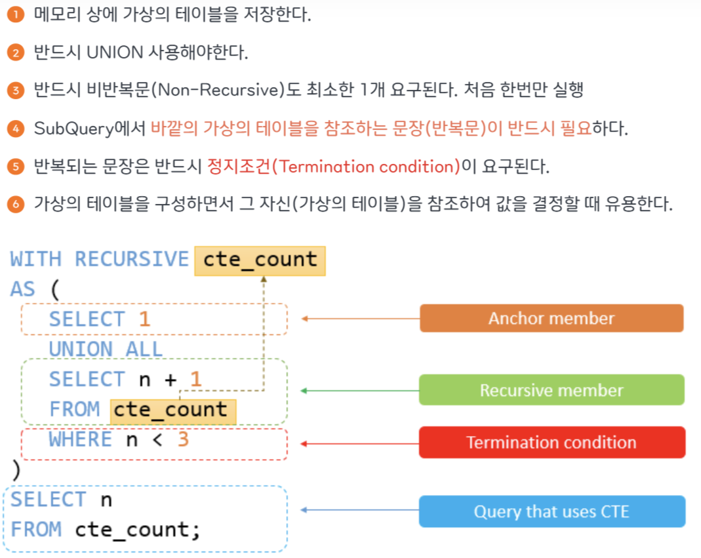
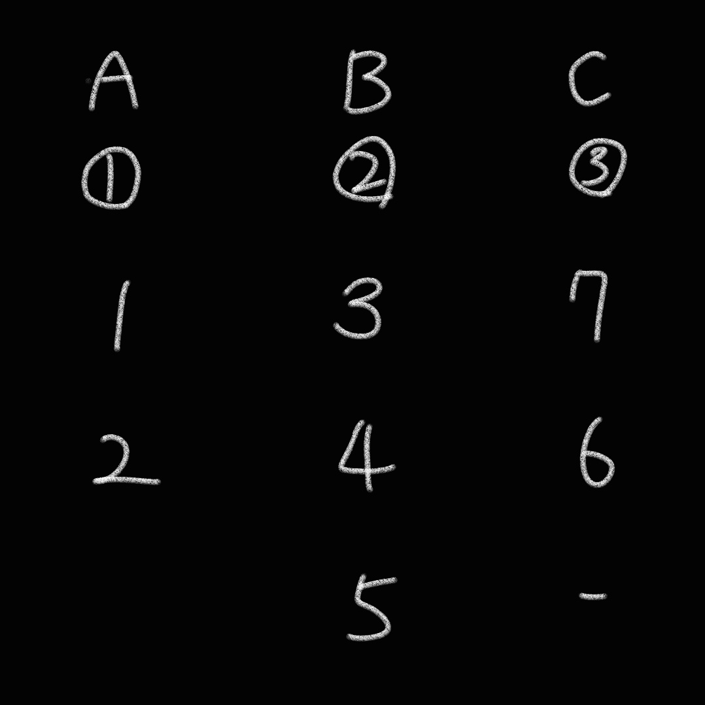
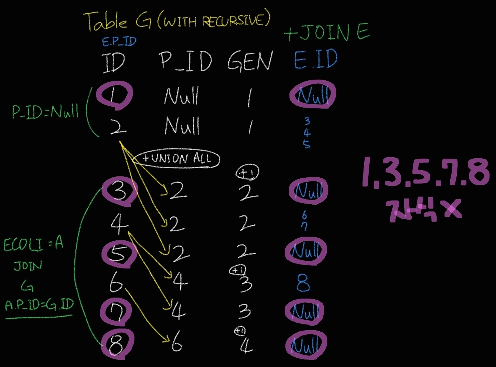

[25-W SQL 스터디] 7주차 과제
=========
## 목차

|번호|문제|✔️|
|---|-----|---|
|1| [오프라인/온라인 판매 데이터 통합하기](#문제1) |  |
|2| [입양 시각 구하기(2)](#문제2)  | ⭐ |
|3| [특정 세대의 대장균 찾기](#문제3)  |  |  
|4| [자동차 대여 기록 별 대여 금액 구하기](#문제4)  |  |  
|5| [FrontEnd 개발자 찾기](#문제5) | ⭐ | 
|6| [특정 기간동안 대여 가능한 자동차들의 대여비용 구하기](#문제6) |  | 
|7| [언어별 개발자 분류하기](#문제7) | ⭐ | 
|8| [멸종위기의 대장균 찾기](#문제8) | ⭐ | 
---

## 문제1
> 🔍 **1. 오프라인/온라인 판매 데이터 통합하기**  
사용 함수: SELECT

문제 링크: [programmers](https://school.programmers.co.kr/learn/courses/30/lessons/131537)

날짜: 25/02/24(월)


### 문제
ONLINE_SALE 테이블과 OFFLINE_SALE 테이블에서 2022년 3월의 오프라인/온라인 상품 판매 데이터의 판매 날짜, 상품ID, 유저ID, 판매량을 출력하는 SQL문을 작성해주세요. OFFLINE_SALE 테이블의 판매 데이터의 USER_ID 값은 NULL 로 표시해주세요. 결과는 판매일을 기준으로 오름차순 정렬해주시고 판매일이 같다면 상품 ID를 기준으로 오름차순, 상품ID까지 같다면 유저 ID를 기준으로 오름차순 정렬해주세요.

### SQL 쿼리(정답)
```SQL
SELECT 
    DATE_FORMAT(SALES_DATE, '%Y-%m-%d') AS SALES_DATE,
    PRODUCT_ID,
    NULL AS USER_ID,
    SALES_AMOUNT
FROM OFFLINE_SALE
WHERE EXTRACT(YEAR_MONTH FROM SALES_DATE) = 202203

UNION ALL

SELECT 
    DATE_FORMAT(SALES_DATE, '%Y-%m-%d') AS SALES_DATE,
    PRODUCT_ID,
    USER_ID,
    SALES_AMOUNT
FROM ONLINE_SALE
WHERE EXTRACT(YEAR_MONTH FROM SALES_DATE) = 202203

ORDER BY SALES_DATE, PRODUCT_ID, USER_ID;
```
### 실행 결과(정답)
```SQL
SALES_DATE	PRODUCT_ID	USER_ID	SALES_AMOUNT
---------------------------------------------
2022-03-01	3	98	1
2022-03-01	27	70	1
2022-03-03	1	68	1
```

### 풀이 과정 및 고민한 점
```SQL
1. 온라인+오프라인 판매 데이터 출력하기: 두 테이블을 행 기준으로 합쳐야 함.

SELECT *
FROM OFFLINE_SALE

UNION ALL

SELECT *
FROM ONLINE_SALE

2. 공통 열은 그대로 조회, OFFLINE_SALE 테이블에는 NULL로 구성된 USER_ID 열 만들기

SELECT 
    DATE_FORMAT(SALES_DATE, '%Y-%m-%d') AS SALES_DATE,
    PRODUCT_ID,
    NULL AS USER_ID,
    SALES_AMOUNT
FROM OFFLINE_SALE
WHERE EXTRACT(YEAR_MONTH FROM SALES_DATE) = 202203

UNION ALL

SELECT 
    DATE_FORMAT(SALES_DATE, '%Y-%m-%d') AS SALES_DATE,
    PRODUCT_ID,
    USER_ID,
    SALES_AMOUNT
FROM ONLINE_SALE
WHERE EXTRACT(YEAR_MONTH FROM SALES_DATE) = 202203
```

---
## 문제2
> 🔍 **2. 입양 시각 구하기(2)**  
사용 함수: GROUP BY

문제 링크: [programmers](https://school.programmers.co.kr/learn/courses/30/lessons/59413)

날짜: 25/02/24(월)


### 문제
보호소에서는 몇 시에 입양이 가장 활발하게 일어나는지 알아보려 합니다. 0시부터 23시까지, 각 시간대별로 입양이 몇 건이나 발생했는지 조회하는 SQL문을 작성해주세요. 이때 결과는 시간대 순으로 정렬해야 합니다.

### SQL 쿼리(정답)
```SQL
WITH RECURSIVE H AS (
    SELECT 0 AS HOUR
    UNION ALL
    SELECT HOUR + 1 
    FROM H 
    WHERE HOUR < 23
)

SELECT 
    H.HOUR, 
    COALESCE(COUNT(A.ANIMAL_ID), 0) AS COUNT
FROM H
LEFT JOIN ANIMAL_OUTS A 
ON H.HOUR = HOUR(A.DATETIME)
GROUP BY H.HOUR
ORDER BY H.HOUR
```
### 실행 결과(정답)
```SQL
HOUR	COUNT
0	0
1	0
2	0
3	0
4	0
5	0
6	0
7	3
8	1
9	1
10	2
11	13
12	10
13	14
14	9
15	7
16	10
17	12
18	16
19	2
20	0
21	0
22	0
23	0
```

### 풀이 과정 및 고민한 점
```SQL
1. 처음에는 단순히 GROUP BY로 실행하였으나, COUNT=0인 행이 조회되지 않음.

2. 0~23의 값을 가지는 HOUR라는 가상 테이블을 만듦: WITH RECURSIVE

WITH RECURSIVE H AS (
    SELECT 0 AS HOUR
    UNION ALL
    SELECT HOUR + 1 
    FROM H 
    WHERE HOUR < 23
)
-- HOUR이 0인 행 생성, 생성된 값에 1씩 더하여 22가 될 때까지 반복

3. 원래 테이블을 HOUR 테이블에 LEFT JOIN

SELECT 
    H.HOUR, 
    COALESCE(COUNT(A.ANIMAL_ID), 0) AS COUNT
FROM H
LEFT JOIN ANIMAL_OUTS A 
ON H.HOUR = HOUR(A.DATETIME)
GROUP BY H.HOUR
ORDER BY H.HOUR
```
**✏️ WITH RECURSIVE** | 재귀 쿼리



출처: [[MYSQL] 📚 RECURSIVE (재귀 쿼리)](https://inpa.tistory.com/entry/MYSQL-%F0%9F%93%9A-RECURSIVE-%EC%9E%AC%EA%B7%80-%EC%BF%BC%EB%A6%AC)

---
## 문제3
> 🔍 **3. 특정 세대의 대장균 찾기**  
사용 함수: SELECT

문제 링크: [programmers](https://school.programmers.co.kr/learn/courses/30/lessons/301650)

날짜: 25/02/24(월)

### 문제
3세대의 대장균의 ID(ID) 를 출력하는 SQL 문을 작성해주세요. 이때 결과는 대장균의 ID 에 대해 오름차순 정렬해주세요.

### SQL 쿼리(정답)
```SQL
SELECT C.ID
FROM ECOLI_DATA AS A
JOIN ECOLI_DATA AS B 
ON A.ID = B.PARENT_ID
JOIN ECOLI_DATA AS C 
ON B.ID = C.PARENT_ID
WHERE A.PARENT_ID IS NULL
ORDER BY C.ID
```
### 실행 결과(정답)
```SQL
ID
6
7
```

### 풀이 과정 및 고민한 점
```SQL
1. 같은 테이블을 3번 조인하여 3세대 id 조회

SELECT C.ID
FROM ECOLI_DATA AS A
JOIN ECOLI_DATA AS B 
ON A.ID = B.PARENT_ID
JOIN ECOLI_DATA AS C 
ON B.ID = C.PARENT_ID

2. 이때 1세대인 id에 조인해야 함

WHERE A.PARENT_ID IS NULL
```



---
## 문제4
> 🔍 **4. 자동차 대여 기록 별 대여 금액 구하기**  
사용 함수: String, Date

문제 링크: [programmers](https://school.programmers.co.kr/learn/courses/30/lessons/151141)

날짜: 25/02/24(월)


### 문제
CAR_RENTAL_COMPANY_CAR 테이블과 CAR_RENTAL_COMPANY_RENTAL_HISTORY 테이블과 CAR_RENTAL_COMPANY_DISCOUNT_PLAN 테이블에서 자동차 종류가 '트럭'인 자동차의 대여 기록에 대해서 대여 기록 별로 대여 금액(컬럼명: FEE)을 구하여 대여 기록 ID와 대여 금액 리스트를 출력하는 SQL문을 작성해주세요. 결과는 대여 금액을 기준으로 내림차순 정렬하고, 대여 금액이 같은 경우 대여 기록 ID를 기준으로 내림차순 정렬해주세요.

### SQL 쿼리(정답)
```SQL
SELECT 
    HISTORY_ID,
    ROUND(CASE 
        WHEN (DATEDIFF(END_DATE, START_DATE)+1) >= 90 
            THEN DAILY_FEE*(DATEDIFF(END_DATE, START_DATE)+1)
            *(SELECT (100-DISCOUNT_RATE)*0.01 FROM CAR_RENTAL_COMPANY_DISCOUNT_PLAN WHERE DURATION_TYPE = '90일 이상' AND CAR_TYPE = '트럭')
        WHEN (DATEDIFF(END_DATE, START_DATE)+1) >= 30 
            THEN DAILY_FEE*(DATEDIFF(END_DATE, START_DATE)+1)
            *(SELECT (100-DISCOUNT_RATE)*0.01 FROM CAR_RENTAL_COMPANY_DISCOUNT_PLAN WHERE DURATION_TYPE = '30일 이상' AND CAR_TYPE = '트럭')
        WHEN (DATEDIFF(END_DATE, START_DATE)+1) >= 7 
            THEN DAILY_FEE*(DATEDIFF(END_DATE, START_DATE)+1)
            *(SELECT (100-DISCOUNT_RATE)*0.01 FROM CAR_RENTAL_COMPANY_DISCOUNT_PLAN WHERE DURATION_TYPE = '7일 이상' AND CAR_TYPE = '트럭')
        ELSE DAILY_FEE*(DATEDIFF(END_DATE, START_DATE)+1)
    END, 0) AS FEE
FROM CAR_RENTAL_COMPANY_CAR AS C
JOIN CAR_RENTAL_COMPANY_RENTAL_HISTORY AS H
USING (CAR_ID) 
WHERE CAR_TYPE = '트럭'
ORDER BY FEE DESC, HISTORY_ID DESC
```
### 실행 결과(정답)
```SQL
HISTORY_ID	FEE
724	6336960
681	5356240
630	4791360
```

### 풀이 과정 및 고민한 점
```SQL
1. 대여일수가 90일/30일/7일일 때

DATEDIFF(END_DATE, START_DATE)+1 >= n

2. 일일요금*대여일수*(1-할인율)

DAILY_FEE*(DATEDIFF(END_DATE, START_DATE)+1)
*(SELECT (100-DISCOUNT_RATE)*0.01 FROM CAR_RENTAL_COMPANY_DISCOUNT_PLAN WHERE DURATION_TYPE = 'n일 이상' AND CAR_TYPE = '트럭')
```
,,더 효율적인 방법이 있지 않을까?

---
## 문제5
> 🔍 **5. FrontEnd 개발자 찾기**  
사용 함수: JOIN 

문제 링크: [programmers](https://school.programmers.co.kr/learn/courses/30/lessons/276035)

날짜: 25/02/24(월)

### 문제
DEVELOPERS 테이블에서 Front End 스킬을 가진 개발자의 정보를 조회하려 합니다. 조건에 맞는 개발자의 ID, 이메일, 이름, 성을 조회하는 SQL 문을 작성해 주세요.

결과는 ID를 기준으로 오름차순 정렬해 주세요.

### SQL 쿼리(정답)
```SQL
SELECT 
    ID,
    EMAIL,
    FIRST_NAME,
    LAST_NAME
FROM DEVELOPERS AS D
JOIN SKILLCODES AS C
ON (D.SKILL_CODE & C.CODE) > 0
WHERE CATEGORY IN ('Front End')
GROUP BY ID, EMAIL, FIRST_NAME, LAST_NAME
ORDER BY ID
```
### 실행 결과(정답)
```SQL
ID	EMAIL	FIRST_NAME	LAST_NAME
D161	carsen_garza@grepp.co	Carsen	Garza
D162	cade_cunningham@grepp.co	Cade	Cunningham
D165	jerami_edwards@grepp.co	Jerami	Edwards
```

### 풀이 과정 및 고민한 점
```SQL
1. 오답쿼리) 샘플 데이터에 대해서만 정답 처리

SELECT 
    ID,
    EMAIL,
    FIRST_NAME,
    LAST_NAME
FROM DEVELOPERS AS D
JOIN SKILLCODES AS C
ON (D.SKILL_CODE & C.CODE) > 0
WHERE CATEGORY IN ('Front End')
ORDER BY ID

2. (지난 문제처럼) 조인 시 한 개발자가 프론트엔드에 해당하는 여러 스킬을 가지고 있는 경우 여러 행으로 출력되는 것이라 추측, 그룹바이로 중복 없애버림

SELECT 
    ID,
    EMAIL,
    FIRST_NAME,
    LAST_NAME
FROM DEVELOPERS AS D
JOIN SKILLCODES AS C
ON (D.SKILL_CODE & C.CODE) > 0
WHERE CATEGORY IN ('Front End')
GROUP BY ID, EMAIL, FIRST_NAME, LAST_NAME
ORDER BY ID

2-1. DISTINCT로도 가능!

SELECT DISTINCT
    ID,
    EMAIL,
    FIRST_NAME,
    LAST_NAME
FROM DEVELOPERS AS D
JOIN SKILLCODES AS C
ON (D.SKILL_CODE & C.CODE) > 0
WHERE CATEGORY IN ('Front End')
ORDER BY ID
```

**✏️ ON 조건**

JOIN시 사용되는 ON에는 추가적인 조건을 걸 수 있다.

- ON: JOIN 전에(하면서) 조건을 필터링->성능 더 좋음
- WHERE: JOIN 후에 조건을 필터링->불필요한 데이터까지 조인한 후 필터링하므로 비용 증가

- LEFT JOIN시 차이가 드러남:
```SQL
-- ON 절에서 조건: c.country = Korea가 아닌 행은 NULL로 표시됨
SELECT o.order_id, o.amount, c.customer_name, c.country
FROM orders o
LEFT JOIN customers c 
    ON o.customer_id = c.customer_id 
    AND c.country = 'Korea';

-- WHERE 절에서 조건: c.country = Korea가 아닌 행 모두 필터링
SELECT o.order_id, o.amount, c.customer_name, c.country
FROM orders o
LEFT JOIN customers c 
    ON o.customer_id = c.customer_id 
WHERE c.country = 'Korea';
```

---
## 문제6
> 🔍 **6. 특정 기간동안 대여 가능한 자동차들의 대여비용 구하기**  
사용 함수: JOIN

문제 링크: [programmers](https://school.programmers.co.kr/learn/courses/30/lessons/157339)

날짜: 25/02/24(월)

### 문제
CAR_RENTAL_COMPANY_CAR 테이블과 CAR_RENTAL_COMPANY_RENTAL_HISTORY 테이블과 CAR_RENTAL_COMPANY_DISCOUNT_PLAN 테이블에서 자동차 종류가 '세단' 또는 'SUV' 인 자동차 중 2022년 11월 1일부터 2022년 11월 30일까지 대여 가능하고 30일간의 대여 금액이 50만원 이상 200만원 미만인 자동차에 대해서 자동차 ID, 자동차 종류, 대여 금액(컬럼명: FEE) 리스트를 출력하는 SQL문을 작성해주세요. 결과는 대여 금액을 기준으로 내림차순 정렬하고, 대여 금액이 같은 경우 자동차 종류를 기준으로 오름차순 정렬, 자동차 종류까지 같은 경우 자동차 ID를 기준으로 내림차순 정렬해주세요.

### SQL 쿼리(정답)
```SQL
WITH RENTED AS (
    SELECT CAR_ID
    FROM CAR_RENTAL_COMPANY_RENTAL_HISTORY
    WHERE 
        (START_DATE < '2022-11-01' AND END_DATE > '2022-11-30')
        OR (EXTRACT(YEAR_MONTH FROM START_DATE) = '202211')
        OR (EXTRACT(YEAR_MONTH FROM END_DATE) = '202211')
)

SELECT DISTINCT CAR_ID, CAR_TYPE, FEE
FROM (
    SELECT
        CAR_ID,
        CAR_TYPE,
        ROUND(CASE 
            WHEN CAR_TYPE = '세단' 
              THEN DAILY_FEE*30*(SELECT (100-DISCOUNT_RATE)*0.01 FROM CAR_RENTAL_COMPANY_DISCOUNT_PLAN WHERE DURATION_TYPE = '30일 이상' AND CAR_TYPE = '세단')
            WHEN CAR_TYPE = 'SUV' 
              THEN DAILY_FEE*30*(SELECT (100-DISCOUNT_RATE)*0.01 FROM CAR_RENTAL_COMPANY_DISCOUNT_PLAN WHERE DURATION_TYPE = '30일 이상' AND CAR_TYPE = 'SUV')
        END, 0) AS FEE
    FROM CAR_RENTAL_COMPANY_CAR AS C
    JOIN CAR_RENTAL_COMPANY_RENTAL_HISTORY AS H
    USING (CAR_ID) 
) AS A
WHERE FEE BETWEEN 500000 AND 2000000 
AND CAR_ID NOT IN (SELECT CAR_ID FROM RENTED)
ORDER BY FEE DESC, CAR_TYPE ASC, CAR_ID DESC
```

### 실행 결과(정답)
```SQL
CAR_ID	CAR_TYPE	FEE
3	세단	1518000
23	세단	1380000
```

### 풀이 과정 및 고민한 점
```SQL
1. 대여 불가한 자동차 id의 조건 구하기

1) 11월 전에 대여 시작하여 11월 이후 대여 종료: START_DATE < '2022-11-01' AND END_DATE > '2022-11-30'
2) 대여시작일이 11월: EXTRACT(YEAR_MONTH FROM START_DATE) = '202211'
3) 대여종료일이 11월: EXTRACT(YEAR_MONTH FROM END_DATE) = '202211'
...
WHERE CAR_ID NOT IN (SELECT CAR_ID FROM RENTED)

2. 요금: 일일요금*30일*(1-해당 차종 할인율)

DAILY_FEE*30*(SELECT (100-DISCOUNT_RATE)*0.01 FROM CAR_RENTAL_COMPANY_DISCOUNT_PLAN WHERE DURATION_TYPE = '30일 이상'

3. 요금이 50만원~200만원 사이

WHERE FEE BETWEEN 500000 AND 2000000 
```

---
## 문제7
> 🔍 **7. 언어별 개발자 분류하기**  
사용 함수: GROUP BY

문제 링크: [programmers](https://school.programmers.co.kr/learn/courses/30/lessons/276036)

날짜: 25/02/24(월)

### 문제
DEVELOPERS 테이블에서 GRADE별 개발자의 정보를 조회하려 합니다. GRADE는 다음과 같이 정해집니다.

A : Front End 스킬과 Python 스킬을 함께 가지고 있는 개발자  
B : C# 스킬을 가진 개발자  
C : 그 외의 Front End 개발자  
GRADE가 존재하는 개발자의 GRADE, ID, EMAIL을 조회하는 SQL 문을 작성해 주세요.

결과는 GRADE와 ID를 기준으로 오름차순 정렬해 주세요.

### SQL 쿼리(정답)
```SQL
SELECT *
FROM (
    SELECT 
        CASE 
            WHEN (SKILL_CODE & (
                SELECT SUM(CODE) 
                FROM SKILLCODES 
                WHERE CATEGORY = 'Front End'
            ))>0 AND
            (SKILL_CODE & (
                SELECT CODE
                FROM SKILLCODES 
                WHERE NAME = 'Python'
            ))>0 THEN 'A'

            WHEN SKILL_CODE & (
                SELECT CODE
                FROM SKILLCODES 
                WHERE NAME = 'C#'
            ) THEN 'B'

            WHEN SKILL_CODE & (
                SELECT SUM(CODE) 
                FROM SKILLCODES 
                WHERE CATEGORY = 'Front End'
            ) THEN 'C' 
        END AS GRADE,
        ID,
        EMAIL
    FROM DEVELOPERS
) AS D
WHERE GRADE IS NOT NULL
ORDER BY GRADE, ID
```
### 실행 결과(정답)
```SQL
GRADE	ID	EMAIL
A	D162	cade_cunningham@grepp.co
A	D165	jerami_edwards@grepp.co
B	D164	kelly_grant@grepp.co
C	D161	carsen_garza@grepp.co
```

### 풀이 과정 및 고민한 점
```SQL
1. A : Front End 스킬과 Python 스킬을 함께 가지고 있는 개발자
-- 카테고리를 필터링하려는 경우, CODE를 SUM하여 SKILL_CODE와 연산해주어야 서브쿼리에서 다중 행이 반환되는 문제가 없어짐(CODE가 2의 제곱수이기 때문에 가능)

(SKILL_CODE & (
    SELECT SUM(CODE) 
    FROM SKILLCODES 
    WHERE CATEGORY = 'Front End'
    ))>0 AND
(SKILL_CODE & (
    SELECT CODE
    FROM SKILLCODES 
    WHERE NAME = 'Python'
    ))>0             

2. B : C# 스킬을 가진 개발자

SKILL_CODE & (
    SELECT CODE
        FROM SKILLCODES 
        WHERE NAME = 'C#'
    )

3. C : 그 외의 Front End 개발자
-- 파이썬 스킬도 가진 프론트엔드 개발자는 위에서 필터링되었으므로 별도 조건 걸지 X

SKILL_CODE & (
    SELECT SUM(CODE) 
        FROM SKILLCODES 
        WHERE CATEGORY = 'Front End'
    )

4. GRADE에서 정의하지 않은 행들(NULL) 필터링

WHERE GRADE IS NOT NULL
```
그룹바이 문제인데 그룹바이를 안 써도 되는가...

---
## 문제8
> 🔍 **8. 멸종위기의 대장균 찾기**  
사용 함수: SELECT

문제 링크: [programmers](https://school.programmers.co.kr/learn/courses/30/lessons/301651)

날짜: 25/02/24(월)


### 문제
각 세대별 자식이 없는 개체의 수(COUNT)와 세대(GENERATION)를 출력하는 SQL문을 작성해주세요. 이때 결과는 세대에 대해 오름차순 정렬해주세요. 단, 모든 세대에는 자식이 없는 개체가 적어도 1개체는 존재합니다.

### SQL 쿼리(정답)
```SQL
WITH RECURSIVE G AS (
    SELECT
        ID,
        PARENT_ID,
        1 AS GENERATION
    FROM ECOLI_DATA
    WHERE PARENT_ID IS NULL
    
    UNION ALL
    
    SELECT
        A.ID,
        A.PARENT_ID,
        G.GENERATION + 1
    FROM ECOLI_DATA AS A
    JOIN G
    ON A.PARENT_ID = G.ID
)

SELECT 
    COUNT(G.ID) AS COUNT, 
    GENERATION
FROM G
LEFT JOIN ECOLI_DATA AS E
ON G.ID = E.PARENT_ID
WHERE E.PARENT_ID IS NULL
GROUP BY GENERATION
ORDER BY GENERATION
```
### 실행 결과(정답)
```SQL
COUNT	GENERATION
1	1
2	2
1	3
1	4
```

### 풀이 과정 및 고민한 점
```SQL
1. 오답쿼리) 4세대까지만 정의하여 샘플 데이터에 대해서만 정답 처리된 듯함.

SELECT 
    COUNT(*) AS COUNT,
    CASE 
        WHEN B.ID IS NULL THEN 1
        WHEN C.ID IS NULL THEN 2
        WHEN D.ID IS NULL THEN 3
        ELSE 4
    END AS GENERATION
FROM ECOLI_DATA AS A
LEFT JOIN ECOLI_DATA AS B 
ON A.ID = B.PARENT_ID
LEFT JOIN ECOLI_DATA AS C 
ON B.ID = C.PARENT_ID
LEFT JOIN ECOLI_DATA AS D 
ON C.ID = D.PARENT_ID
WHERE A.PARENT_ID IS NULL
GROUP BY GENERATION
ORDER BY GENERATION

2. 동적으로 계산 가능한 방법으로 구해야 함 -> WITH RECURSIVE(재귀 쿼리)

WITH RECURSIVE G AS (
    SELECT
        ID,
        PARENT_ID,
        1 AS GENERATION
    FROM ECOLI_DATA
    WHERE PARENT_ID IS NULL
    
    UNION ALL
    
    SELECT
        A.ID,
        A.PARENT_ID,
        G.GENERATION + 1
    FROM ECOLI_DATA AS A
    JOIN G
    ON A.PARENT_ID = G.ID
)

SELECT 
    COUNT(G.ID) AS COUNT, 
    GENERATION
FROM G
LEFT JOIN ECOLI_DATA AS E
ON G.ID = E.PARENT_ID
WHERE E.PARENT_ID IS NULL
GROUP BY GENERATION
ORDER BY GENERATION
```
- 세부 설명
